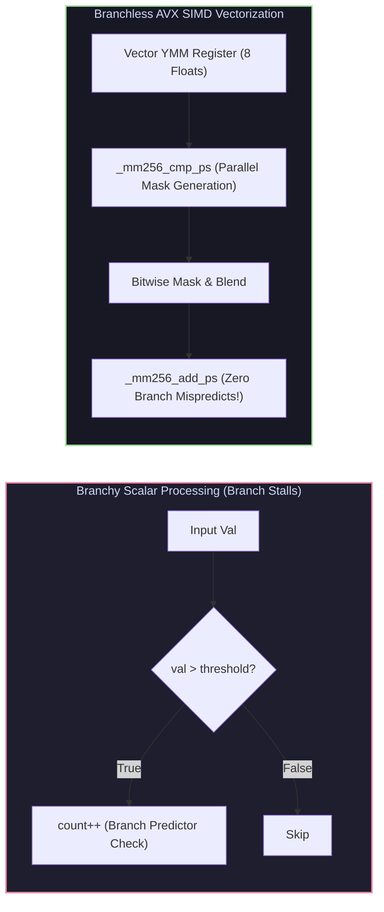

# Bit Leapery, Compiler Vectorization & AVX SIMD Intrinsics

## 1. Bit Leapery & Branchless Programming

Low-level bit manipulation ("Bit Leapery") eliminates conditional branch instructions from inner loop kernels, preventing branch misprediction penalties and enabling data-parallel execution.



### 1.1 Essential Bit Operations
1. **Branchless Absolute Value**:
   ```cpp
   int sign_mask = val >> 31; // 0x00000000 if positive, 0xFFFFFFFF if negative
   int abs_val = (val ^ sign_mask) - sign_mask;
   ```
2. **de Bruijn Sequence Constant-Time Log2 / CTZ**:
   Maps the lowest set bit mask `x & (-x)` to a 5-bit integer via a precomputed 32-entry lookup array multiplied by de Bruijn constant `0x077CB531U`.

---

## 2. Compiler Optimizations & Vectorization Diagnostics

Modern compilers (GCC/Clang) transform C/C++ loops using several key optimization passes:

### 2.1 Compiler Flags Matrix
* `-O3`: Enables high-level loop transformations (vectorization, unrolling, loop interchange).
* `-march=native`: Generates targeted hardware instructions (AVX2, AVX-512, FMA) for the host CPU.
* `-ftree-vectorize`: Enables auto-vectorization pass.
* `-fopt-info-vec-optimized`: Emits compiler diagnostic logs detailing which loops were successfully auto-vectorized.

### 2.2 Vectorization Inhibitors
A loop fails to auto-vectorize if it contains:
* **Loop-Carried Pointer Aliasing**: Solved by qualifying array parameters with `restrict` or C++ `__restrict`.
* **Non-Contiguous Memory Accesses**: Stride $> 1$ or pointer chasing.
* **Data-Dependent Control Flow**: Solved by converting `if/else` to branchless ternary expressions or vector masks.

---

## 3. AVX2 & AVX-512 SIMD Vector Intrinsics

AVX2 expands 128-bit SSE registers into 256-bit `YMM` registers, enabling simultaneous execution across 8 single-precision floats or 4 double-precision floats.

```
                    256-Bit YMM Vector Register Layout
+----------+----------+----------+----------+----------+----------+----------+----------+
| Float 7  | Float 6  | Float 5  | Float 4  | Float 3  | Float 2  | Float 1  | Float 0  |
| [255:224]| [223:192]| [191:160]| [159:128]| [127:96] | [95:64]  | [63:32]  | [31:0]   |
+----------+----------+----------+----------+----------+----------+----------+----------+
```

---

## 4. Production-Grade C++ Engine: Bit Hacks vs AVX-256 Vectorization

The following C++ engine implements bitwise parallel popcount and AVX-256 SIMD Fused Multiply-Add (FMA) processing:

```cpp
#include <iostream>
#include <vector>
#include <chrono>
#include <numeric>
#include <immintrin.h>
#include <cstdint>

class BitHackAndSIMDEngine {
public:
    // 1. Bit-Parallel Population Count (SWAR Algorithm)
    static uint32_t ParallelPopCount32(uint32_t v) {
        v = v - ((v >> 1) & 0x55555555);                    // Pairwise 2-bit sums
        v = (v & 0x33333333) + ((v >> 2) & 0x33333333);     // Nibble 4-bit sums
        v = (v + (v >> 4)) & 0x0F0F0F0F;                    // Byte 8-bit sums
        return (v * 0x01010101) >> 24;                     // Total sum in top byte
    }

    // 2. Hardware Population Count Intrinsic
    static uint32_t HardwarePopCount32(uint32_t v) {
        return __builtin_popcount(v);
    }

    // 3. Scalar Dot Product
    static float ScalarDotProduct(const float* a, const float* b, size_t n) {
        float sum = 0.0f;
        for (size_t i = 0; i < n; ++i) {
            sum += a[i] * b[i];
        }
        return sum;
    }

    // 4. AVX-256 FMA Vectorized Dot Product
    static float AVX2DotProduct(const float* __restrict a, const float* __restrict b, size_t n) {
        __m256 acc0 = _mm256_setzero_ps();
        __m256 acc1 = _mm256_setzero_ps();

        size_t i = 0;
        // Unroll 2x for 16 floats per cycle
        for (; i + 15 < n; i += 16) {
            __m256 va0 = _mm256_loadu_ps(a + i);
            __m256 vb0 = _mm256_loadu_ps(b + i);
            acc0 = _mm256_fmadd_ps(va0, vb0, acc0);

            __m256 va1 = _mm256_loadu_ps(a + i + 8);
            __m256 vb1 = _mm256_loadu_ps(b + i + 8);
            acc1 = _mm256_fmadd_ps(va1, vb1, acc1);
        }

        __m256 combined = _mm256_add_ps(acc0, acc1);

        // Horizontal sum of 8 floats in YMM register
        alignas(32) float temp[8];
        _mm256_storeu_ps(temp, combined);

        float total_sum = 0.0f;
        for (int k = 0; k < 8; ++k) total_sum += temp[k];

        // Cleanup remaining elements
        for (; i < n; ++i) total_sum += a[i] * b[i];

        return total_sum;
    }
};

int main() {
    constexpr size_t N = 10'000'000;
    std::vector<float> a(N, 1.5f);
    std::vector<float> b(N, 2.0f);

    std::cout << "Testing Popcount Bit Hacks..." << std::endl;
    uint32_t sample = 0b1011011101010111;
    std::cout << "SWAR Popcount: " << BitHackAndSIMDEngine::ParallelPopCount32(sample) << std::endl;
    std::cout << "HW Popcount:   " << BitHackAndSIMDEngine::HardwarePopCount32(sample) << std::endl;

    std::cout << "\nBenchmarking Scalar vs AVX2 FMA Dot Product (N = " << N << ")..." << std::endl;

    auto t0 = std::chrono::high_resolution_clock::now();
    float s_res = BitHackAndSIMDEngine::ScalarDotProduct(a.data(), b.data(), N);
    auto t1 = std::chrono::high_resolution_clock::now();
    double s_time = std::chrono::duration<double, std::milli>(t1 - t0).count();

    auto t2 = std::chrono::high_resolution_clock::now();
    float v_res = BitHackAndSIMDEngine::AVX2DotProduct(a.data(), b.data(), N);
    auto t3 = std::chrono::high_resolution_clock::now();
    double v_time = std::chrono::duration<double, std::milli>(t3 - t2).count();

    std::cout << "Scalar Result: " << s_res << " | Time: " << s_time << " ms" << std::endl;
    std::cout << "AVX2   Result: " << v_res << " | Time: " << v_time << " ms" << std::endl;
    std::cout << "Speedup Factor: " << (s_time / v_time) << "x" << std::endl;

    return 0;
}
```

---

## 5. Summary & Verification

1. **Branchless Execution**: Eliminates control-flow stalls and pipeline flushes caused by unpredictable branch directions.
2. **AVX Vector Throughput**: Achieves 4x-8x speedups over scalar execution by packing 8 float operations into a single instruction.
3. **Compiler Alignment**: Qualification with `__restrict` enables safety guarantees for SIMD auto-vectorization.
