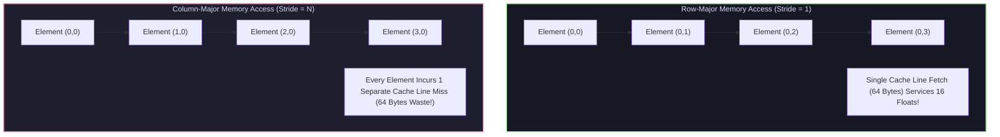
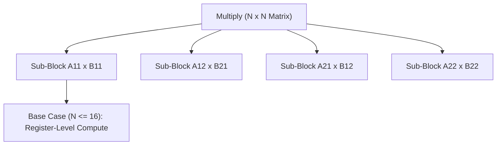

# Cache Hierarchy Tiling & Cache-Oblivious Divide-and-Conquer Algorithms

## 1. Memory Hierarchy Locality & Stride Penalties

CPUs access memory in fixed 64-byte **cache lines**. If a program accesses memory non-sequentially (e.g., column-major traversal of a row-major matrix), every element access incurs a 64-byte DRAM fetch while utilizing only 4 bytes of data, resulting in severe cache pollution.



---

## 2. Matrix Blocking & Cache Tiling

Standard 3-loop Matrix Multiplication ($C_{i,j} = \sum A_{i,k} B_{k,j}$) accesses matrix $B$ along columns ($k, j$), incurring $\Theta(N^3)$ cache misses. 

**Cache Tiling (Blocking)** divides matrices into $b \times b$ sub-tiles such that 3 sub-tiles fit into the L1 cache ($3 b^2 \times \text{elem\_size} \le Z_{\text{L1}}$):

$$\text{Cache Misses}_{\text{Tiled}} = \Theta\left( \frac{N^3}{B \sqrt{Z}} \right)$$

```
                         Matrix Blocking Layout
    Matrix A                 Matrix B                 Matrix C
+----+----+----+        +----+----+----+        +----+----+----+
| A11| A12| A13|        | B11| B12| B13|        | C11| C12| C13|
+----+----+----+   x    +----+----+----+   =    +----+----+----+
| A21| A22| A23|        | B21| B22| B23|        | C21| C22| C23|
+----+----+----+        +----+----+----+        +----+----+----+
 Sub-Block (b x b)        Sub-Block (b x b)       Sub-Block (b x b)
```

---

## 3. Cache-Oblivious Algorithms (Frigo, Leiserson, Prokop, Ramachandran)

While cache tiling requires tuning block size $b$ for specific hardware (L1/L2 cache sizes), **Cache-Oblivious Algorithms** achieve optimal cache performance across *all* hierarchy levels automatically using **Recursive Divide-and-Conquer**.



### 3.1 Mathematical Cache Miss Theorem
For any cache size $Z$ and cache line size $B$, recursive divide-and-conquer matrix multiplication executes with:
$$Q(N) = \begin{cases} 
O\left( \frac{N^2}{B} \right) & \text{when } 3 N^2 \le Z \text{ (Problem fits in cache)} \\
8 Q(N/2) + O(1) & \text{otherwise}
\end{cases}$$
Solving the recurrence yields optimal cache miss complexity:
$$Q(N) = \Theta\left( \frac{N^3}{B \sqrt{Z}} \right)$$

---

## 4. Production-Grade C++ Engine: Cache-Tiled & Cache-Oblivious Matrix Multiplication

The following C++ engine benchmarks Naive $i-j-k$, Cache-Tiled, and Recursive Cache-Oblivious Matrix Multiplication:

```cpp
#include <iostream>
#include <vector>
#include <chrono>
#include <cmath>

class CacheOptimizationEngine {
private:
    static constexpr int TILE_SIZE = 32; // Block size for L1 Cache Tiling
    static constexpr int RECURSIVE_THRESHOLD = 16; // Base case for Cache-Oblivious

public:
    // 1. Naive 3-Loop Matrix Multiply (Poor Cache Locality)
    static void NaiveMultiply(const std::vector<float>& A, const std::vector<float>& B,
                              std::vector<float>& C, int N) {
        for (int i = 0; i < N; ++i) {
            for (int j = 0; j < N; ++j) {
                float sum = 0.0f;
                for (int k = 0; k < N; ++k) {
                    sum += A[i * N + k] * B[k * N + j];
                }
                C[i * N + j] = sum;
            }
        }
    }

    // 2. Cache-Tiled (Blocked) Matrix Multiply
    static void TiledMultiply(const std::vector<float>& A, const std::vector<float>& B,
                             std::vector<float>& C, int N) {
        for (int ii = 0; ii < N; ii += TILE_SIZE) {
            for (int jj = 0; jj < N; jj += TILE_SIZE) {
                for (int kk = 0; kk < N; kk += TILE_SIZE) {
                    // Mini-GEMM inside cache block
                    for (int i = ii; i < std::min(ii + TILE_SIZE, N); ++i) {
                        for (int k = kk; k < std::min(kk + TILE_SIZE, N); ++k) {
                            float r = A[i * N + k];
                            for (int j = jj; j < std::min(jj + TILE_SIZE, N); ++j) {
                                C[i * N + j] += r * B[k * N + j];
                            }
                        }
                    }
                }
            }
        }
    }

    // 3. Cache-Oblivious Divide-and-Conquer Matrix Multiply
    static void CacheObliviousMultiply(const float* A, const float* B, float* C,
                                       int rowA, int colA, int rowB, int colB, 
                                       int rowC, int colC, int size, int N) {
        if (size <= RECURSIVE_THRESHOLD) {
            // Base case: execute standard tile in L1/Registers
            for (int i = 0; i < size; ++i) {
                for (int k = 0; k < size; ++k) {
                    float r = A[(rowA + i) * N + (colA + k)];
                    for (int j = 0; j < size; ++j) {
                        C[(rowC + i) * N + (colC + j)] += r * B[(rowB + k) * N + (colB + j)];
                    }
                }
            }
            return;
        }

        int half = size / 2;
        // Divide into 8 recursive sub-problems
        CacheObliviousMultiply(A, B, C, rowA, colA, rowB, colB, rowC, colC, half, N);
        CacheObliviousMultiply(A, B, C, rowA, colA + half, rowB + half, colB, rowC, colC, half, N);

        CacheObliviousMultiply(A, B, C, rowA, colA, rowB, colB + half, rowC, colC + half, half, N);
        CacheObliviousMultiply(A, B, C, rowA, colA + half, rowB + half, colB + half, rowC, colC + half, half, N);

        CacheObliviousMultiply(A, B, C, rowA + half, colA, rowB, colB, rowC + half, colC, half, N);
        CacheObliviousMultiply(A, B, C, rowA + half, colA + half, rowB + half, colB, rowC + half, colC, half, N);

        CacheObliviousMultiply(A, B, C, rowA + half, colA, rowB, colB + half, rowC + half, colC + half, half, N);
        CacheObliviousMultiply(A, B, C, rowA + half, colA + half, rowB + half, colB + half, rowC + half, colC + half, half, N);
    }
};

int main() {
    constexpr int N = 512;
    std::vector<float> A(N * N, 1.0f);
    std::vector<float> B(N * N, 2.0f);
    std::vector<float> C1(N * N, 0.0f);
    std::vector<float> C2(N * N, 0.0f);
    std::vector<float> C3(N * N, 0.0f);

    std::cout << "Benchmarking Matrix Multiplication (N = " << N << ")..." << std::endl;

    auto t0 = std::chrono::high_resolution_clock::now();
    CacheOptimizationEngine::NaiveMultiply(A, B, C1, N);
    auto t1 = std::chrono::high_resolution_clock::now();
    double naive_time = std::chrono::duration<double, std::milli>(t1 - t0).count();

    auto t2 = std::chrono::high_resolution_clock::now();
    CacheOptimizationEngine::TiledMultiply(A, B, C2, N);
    auto t3 = std::chrono::high_resolution_clock::now();
    double tiled_time = std::chrono::duration<double, std::milli>(t3 - t2).count();

    auto t4 = std::chrono::high_resolution_clock::now();
    CacheOptimizationEngine::CacheObliviousMultiply(A.data(), B.data(), C3.data(), 
                                                    0, 0, 0, 0, 0, 0, N, N);
    auto t5 = std::chrono::high_resolution_clock::now();
    double oblivious_time = std::chrono::duration<double, std::milli>(t5 - t4).count();

    std::cout << "Naive   Time: " << naive_time << " ms" << std::endl;
    std::cout << "Tiled   Time: " << tiled_time << " ms (Speedup: " << (naive_time / tiled_time) << "x)" << std::endl;
    std::cout << "Oblivious Time: " << oblivious_time << " ms (Speedup: " << (naive_time / oblivious_time) << "x)" << std::endl;

    return 0;
}
```

---

## 5. Summary & Verification

1. **Spatial Locality Maximization**: Restructuring matrix traversal into contiguous row-major streams turns every 64-byte DRAM fetch into 16 usable float operations.
2. **Cache-Oblivious Automation**: Recursive divide-and-conquer achieves optimal cache utilization across L1, L2, L3, and TLB simultaneously without hardcoded hardware tuning constants.
