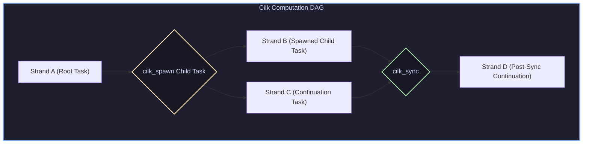
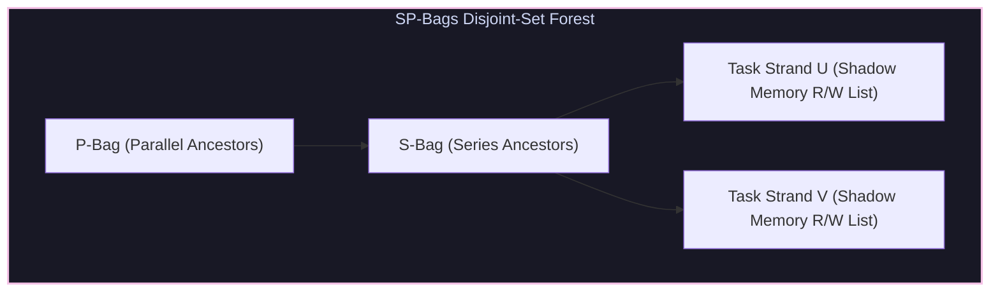

# Cilk Work-Span Concurrency, SP-Bags Race Detection & Performance Profiling

## 1. Cilk Concurrency Model & Work/Span Analysis

The Cilk multithreaded language model (Leiserson et al.) abstracts hardware thread creation into dynamic task spawning (`cilk_spawn`, `cilk_sync`), represented as a **Directed Acyclic Graph (DAG)** of strand computations.



### 1.1 Metrics & Structural Invariants
* **Work ($T_1$)**: Total time spent across all strands executed sequentially on 1 core.
* **Span ($T_\infty$)**: Critical path duration along the longest path of dependent nodes in the DAG.
* **Work-Stealing Scheduler**: Idle worker threads steal the *oldest* unexecuted task frame from the top of an active worker's de-queue, guaranteeing provably optimal execution:
  $$T_P \le \frac{T_1}{P} + O(T_\infty)$$

---

## 2. Deterministic Race Detection: SP-Bags Algorithm

Data races occur when two parallel strands access the same memory location concurrently, and at least one access is a write.

### 2.1 Cilksan & Series-Parallel (SP) Relationships
In a Cilk DAG, two strands $u$ and $v$ are either:
1. **Series ($u \prec v$ or $v \prec u$)**: One strand executes before the other due to explicit control dependencies or `cilk_sync`.
2. **Parallel ($u \parallel v$)**: Both strands execute concurrently without synchronization.



The **SP-Bags Algorithm** maintains Disjoint-Set forests (S-Bags and P-Bags) to evaluate $u \parallel v$ queries in nearly $O(1)$ time ($\alpha(N)$ inverse Ackermann complexity) using shadow memory tracking.

---

## 3. Performance Profiling Methodology: `perf` & Flame Graphs

```
Raw CPU PMU Counters  -->  perf record (Sampling)  -->  Stack Folding  -->  Flame Graph SVG
(Cycles, Cache Misses)       (-F 99 -g -- ./app)         (stackcollapse)      (Visual Bottlenecks)
```

* **Width of Bar**: Proportional to total CPU time spent in that function and its callees.
* **Top Line**: Direct leaf functions consuming active CPU execution cycles (Hotspots).

---

## 4. Production-Grade C++ Engine: Cilk Task Graph & SP-Bags Race Detector

The following C++ engine builds a dynamic task graph, calculates Work ($T_1$) and Span ($T_\infty$), and performs SP-Bags data race analysis:

```cpp
#include <iostream>
#include <vector>
#include <memory>
#include <algorithm>
#include <unordered_map>
#include <cstdint>

struct Strand {
    int id;
    int execution_cost; // Cycles
    std::vector<int> predecessors;
    std::vector<uint64_t> reads;
    std::vector<uint64_t> writes;
};

class CilkWorkSpanAnalyzer {
private:
    std::vector<Strand> strands;
    std::unordered_map<uint64_t, int> last_writer;
    std::unordered_map<uint64_t, std::vector<int>> last_readers;

public:
    void AddStrand(const Strand& s) {
        strands.push_back(s);
    }

    // 1. Calculate Total Work (T1)
    int CalculateWork() const {
        int work = 0;
        for (const auto& s : strands) work += s.execution_cost;
        return work;
    }

    // 2. Calculate Critical Path Span (Tinf)
    int CalculateSpan() const {
        std::vector<int> dp(strands.size(), 0);
        int max_span = 0;

        for (size_t i = 0; i < strands.size(); ++i) {
            int prev_max = 0;
            for (int pred : strands[i].predecessors) {
                prev_max = std::max(prev_max, dp[pred]);
            }
            dp[i] = prev_max + strands[i].execution_cost;
            max_span = std::max(max_span, dp[i]);
        }
        return max_span;
    }

    // 3. Simplified SP-Bags Parallel Relationship Check
    bool AreParallel(int u, int v) const {
        // BFS / DFS Reachability check for series dependency u -> v or v -> u
        std::vector<bool> visited(strands.size(), false);
        std::vector<int> q = {u};
        visited[u] = true;

        while (!q.empty()) {
            int curr = q.back(); q.pop_back();
            if (curr == v) return false; // Series u -> v

            for (size_t i = 0; i < strands.size(); ++i) {
                if (std::find(strands[i].predecessors.begin(), strands[i].predecessors.end(), curr) != strands[i].predecessors.end()) {
                    if (!visited[i]) { visited[i] = true; q.push_back(i); }
                }
            }
        }
        return true; // No reachability means strands u and v execute in Parallel (u || v)
    }

    // 4. Data Race Detection Engine
    void DetectDataRaces() {
        std::cout << "\n=== Running SP-Bags Data Race Detector ===" << std::endl;
        bool race_found = false;

        for (size_t i = 0; i < strands.size(); ++i) {
            for (size_t j = i + 1; j < strands.size(); ++j) {
                if (AreParallel(i, j)) {
                    // Check for RAW / WAR / WAW hazards
                    for (uint64_t w1 : strands[i].writes) {
                        for (uint64_t w2 : strands[j].writes) {
                            if (w1 == w2) {
                                std::cout << "[DATA RACE DETECTED] WAW Hazard on Address 0x" 
                                          << std::hex << w1 << " between Parallel Strands #" 
                                          << std::dec << i << " and #" << j << std::endl;
                                race_found = true;
                            }
                        }
                        for (uint64_t r2 : strands[j].reads) {
                            if (w1 == r2) {
                                std::cout << "[DATA RACE DETECTED] RAW Hazard on Address 0x" 
                                          << std::hex << w1 << " between Parallel Strands #" 
                                          << std::dec << i << " and #" << j << std::endl;
                                race_found = true;
                            }
                        }
                    }
                }
            }
        }
        if (!race_found) std::cout << "No Data Races Detected! Parallelism is Safe." << std::endl;
    }
};

int main() {
    CilkWorkSpanAnalyzer analyzer;

    // Strand 0: Parent setup
    analyzer.AddStrand({0, 10, {}, {}, {0x1000}});

    // Strand 1 & Strand 2 spawned in parallel (cilk_spawn)
    analyzer.AddStrand({1, 50, {0}, {0x1000}, {0x2000}});
    analyzer.AddStrand({2, 40, {0}, {}, {0x2000}}); // DATA RACE on 0x2000!

    // Strand 3: Sync continuation (cilk_sync)
    analyzer.AddStrand({3, 15, {1, 2}, {0x2000}, {}});

    int work = analyzer.CalculateWork();
    int span = analyzer.CalculateSpan();

    std::cout << "Total Work  (T1)  : " << work << " cycles" << std::endl;
    std::cout << "Critical Span (Tinf): " << span << " cycles" << std::endl;
    std::cout << "Parallelism (T1/Tinf): " << (double)work / span << "x" << std::endl;

    analyzer.DetectDataRaces();
    return 0;
}
```

---

## 5. Summary & Key Engineering Takeaways

1. **Work ($T_1$) & Span ($T_\infty$) Bounds**: Parallelism $P = T_1 / T_\infty$ determines maximum hardware scaling limits regardless of physical core count.
2. **Dynamic Race Detection**: Cilksan SP-bags tracks series-parallel relationships dynamically to detect races in $O(1)$ time per memory access.
3. **Flame Graphs**: Sampling profiling via `perf` pinpoints exact hotspot functions occupying leaf execution frames.
