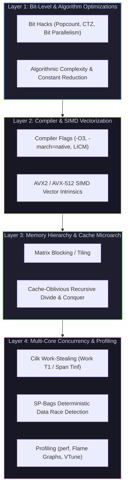

# MIT 6.1060 (6.172): Performance Engineering of Software Systems

Welcome to the **MIT 6.1060 (formerly 6.172) Masterclass Module**. This module covers low-level bit hacks, compiler optimization analysis, AVX SIMD vectorization, cache blocking and cache-oblivious algorithms, Cilk work/span task concurrency, SP-bags data race detection, and Linux performance profiling (`perf`, Flame Graphs, VTune).

---

## 1. The 4-Layer Performance Engineering Stack

---

## 2. Module Navigation Map

| File | Description | Core Topics |
| :--- | :--- | :--- |
| **[`00_mit61060_cheatsheet.md`](00_mit61060_cheatsheet.md)** | 30-Second Performance Cheatsheet | Work ($T_1$) / Span ($T_\infty$) laws, Greedy Scheduler bounds, Cache-Oblivious $O(N^3/\sqrt{Z})$ miss equations, Bit Hacks cheatsheet, `perf` command matrix. |
| **[`01_bitleapery_gcc_vectorization_and_avx.md`](01_bit_hacks_compiler_optimizations_and_simd/01_bitleapery_gcc_vectorization_and_avx.md)** | Bit Hacks, Compiler Tuning & AVX SIMD | Bit Leapery, Branchless programming, GCC/Clang vectorization flags, AVX2 FMA vector intrinsics, Complete C++ Bit/SIMD Engine, Mermaid sequence diagram. |
| **[`02_matrix_tiling_and_divide_conquer_funnelsort.md`](02_cache_tiling_and_cache_oblivious_algorithms/02_matrix_tiling_and_divide_conquer_funnelsort.md)** | Cache Tiling & Cache-Oblivious Algorithms | Stride access penalties, L1/L2 matrix blocking, Cache-Oblivious divide & conquer matrix operations, Complete C++ Tiling Benchmark Engine, Mermaid memory layout diagram. |
| **[`03_cilk_concurrency_sp_bags_and_profiling.md`](03_cilk_work_span_analysis_and_race_detection/03_cilk_concurrency_sp_bags_and_profiling.md)** | Cilk Concurrency, SP-Bags & Profiling | Cilk DAG model, Work ($T_1$), Span ($T_\infty$), Work-Stealing scheduler, Cilksan SP-Bags race detection algorithm, `perf` & Flame Graphs, Complete C++ Work/Span Engine, Mermaid DAG diagram. |

---

## 3. Key Performance Engineering Laws

1. **Work ($T_1$) & Span ($T_\infty$) Law**: The execution time on $P$ processors is bounded by $T_P \ge T_1 / P$ (Work Law) and $T_P \ge T_\infty$ (Span Law).
2. **Greedy Scheduler Bound**: For any Cilk computation, a greedy work-stealing scheduler achieves:
   $$T_P \le \frac{T_1}{P} + T_\infty$$
3. **Cache-Oblivious Optimality**: Recursive divide-and-conquer algorithms achieve optimal cache miss complexity $O(N^3 / \sqrt{Z})$ across *all* levels of the memory hierarchy without tuning parameters for specific cache sizes $Z$.
