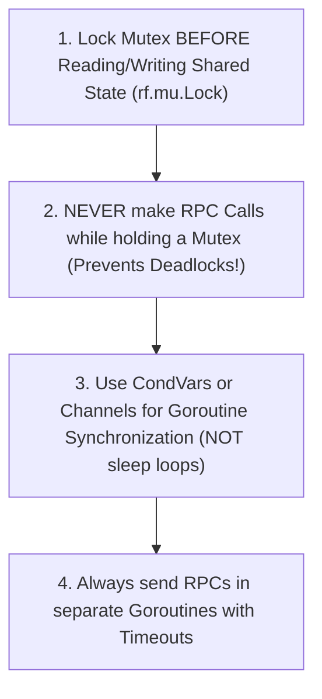

# 00. MIT 6.5840 Cheatsheet & Paper Studies Matrix

A high-density reference guide summarizing landmark distributed systems research papers, Raft consensus invariants, and Go concurrency best practices from MIT 6.5840 (6.824).

---

## 📜 MIT 6.5840 Landmark Paper Studies Matrix

| Paper | Primary Innovation / Focus | Key Mechanism | Trade-off / Limitation |
| :--- | :--- | :--- | :--- |
| **MapReduce (Google 2004)** | Parallel data processing on commodity clusters | Master/Worker RPC model, Map & Reduce tasks, Intermediate disk spill | Not real-time; batch execution only |
| **GFS (Google File System 2003)** | Scalable distributed file storage for large files | Single Master, Chunkservers (64MB chunks), Primary/Secondary mutation lease | Optimized for sequential appends; weak consistency on random writes |
| **VMware FT (2010)** | Fault-tolerant VM replication via primary-backup | Deterministic Replay over logging channel, CPU instruction log | Limited to single-core VMs due to non-deterministic CPU multi-threading |
| **Raft (Ongaro & Ousterhout 2014)** | Understandable consensus algorithm | Strong leader election, log replication, snapshotting | Leader bottleneck for writes |
| **ZooKeeper (Yahoo! 2010)** | Coordination service for distributed systems | Zab protocol, Linearizable writes, FIFO client order, Watchers | Reads served from local replicas may return slightly stale data |
| **Google Spanner (2012)** | Globally-distributed linearizable database | TrueTime API (GPS + Rubidium atomic clocks), 2PC over Paxos | Requires specialized hardware (atomic clocks) for tight $\epsilon$ bound |
| **Frangipani (1997)** | Distributed lock-based file system | Distributed lock manager with write-ahead logging | Lock acquisition overhead across nodes |
| **Bitcoin (Nakamoto 2008)** | Permissionless Byzantine consensus | Proof of Work (PoW), Nakamoto longest-chain rule | High latency (10-min block time), energy-intensive computation |

---

## 🛡️ Raft Consensus Invariants & Safety Rules

To guarantee correctness during network partitions and node crashes, Raft enforces 5 strict invariants:

1. **Election Safety**: At most one leader can be elected per term.
2. **Leader Append-Only**: A leader never overwrites or truncates its log entries; it only appends new entries.
3. **Log Matching**: If two logs contain an entry with the same index and term, then the logs are identical in all entries up through the given index.
4. **Leader Completeness**: If a log entry is committed in a given term, that entry will be present in the logs of the leaders for all higher-numbered terms.
5. **State Machine Safety**: If a server has applied a log entry at a given index to its state machine, no other server will ever apply a different log entry for the same index.

---

## 🐹 Go Concurrency Rules in MIT 6.5840 Labs

### 💡 Common Deadlock Pitfalls in Raft Labs
- **Deadlock Pattern**: Goroutine A holds `rf.mu.Lock()` and calls `Call("Raft.AppendEntries", ...)`. Node B receives RPC, attempts to grab `rf.mu.Lock()`, but is waiting for Goroutine A. **System Deadlocks!**
- **Remedy**: Copy necessary state (term, candidateId, lastLogIndex) into local variables, release `rf.mu.Unlock()`, and then issue the RPC.
