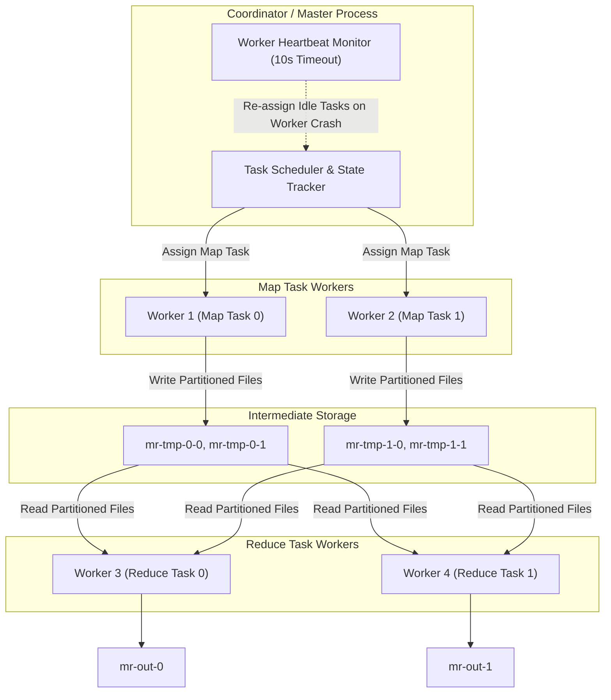
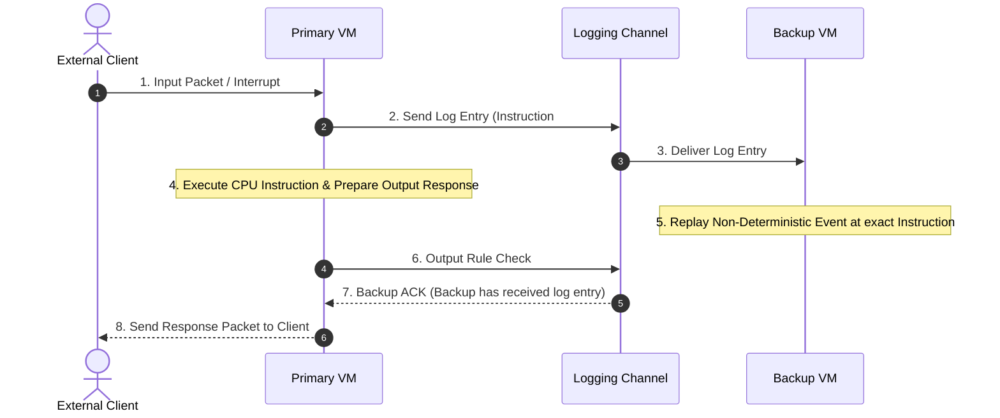

# 01. MapReduce & VMware FT Primary-Backup Replication

This chapter examines MIT 6.5840 Lab 1 (MapReduce distributed task coordination) and primary-backup state replication via VMware FT's Deterministic Replay protocol.

---

## 🗺️ MIT 6.5840 Lab 1: MapReduce Execution Architecture



---

## 🖥️ VMware FT Primary-Backup Replication

VMware FT replicates a primary virtual machine to a backup node across the network by recording and replaying **non-deterministic events** (interrupts, network packet arrivals, timer reads).



> **VMware FT Output Rule**: The Primary VM cannot send an output to the external world until the Backup VM has acknowledged receiving the corresponding log entry. This guarantees that if the Primary crashes, the Backup can take over without dropping or duplicating responses.

---

## 🐹 Production Go Implementation: MapReduce Coordinator & Worker Scheduler

```go
package mapreduce

import (
	"fmt"
	"net"
	"net/rpc"
	"sync"
	"time"
)

type TaskType int

const (
	MapTask TaskType = iota
	ReduceTask
	WaitTask
	ExitTask
)

type TaskStatus int

const (
	Idle TaskStatus = iota
	InProgress
	Completed
)

type Task struct {
	ID        int
	Type      TaskType
	Filename  String
	NReduce   int
	NMap      int
	Status    TaskStatus
	StartTime time.Time
}

type GetTaskArgs struct {
	WorkerID int
}

type GetTaskReply struct {
	Task Task
}

type ReportTaskArgs struct {
	WorkerID int
	TaskID   int
	Type     TaskType
}

type ReportTaskReply struct {
	Success bool
}

// Coordinator manages MapReduce task state and worker RPCs
type Coordinator struct {
	mu          sync.Mutex
	mapTasks    []Task
	reduceTasks []Task
	nMap        int
	nReduce     int
	isDone      bool
}

func MakeCoordinator(files []string, nReduce int) *Coordinator {
	c := Coordinator{
		nMap:        len(files),
		nReduce:     nReduce,
		mapTasks:    make([]Task, len(files)),
		reduceTasks: make([]Task, nReduce),
	}

	for i, file := range files {
		c.mapTasks[i] = Task{
			ID:       i,
			Type:     MapTask,
			Filename: file,
			NReduce:  nReduce,
			NMap:     len(files),
			Status:   Idle,
		}
	}

	for i := 0; i < nReduce; i++ {
		c.reduceTasks[i] = Task{
			ID:      i,
			Type:    ReduceTask,
			NReduce: nReduce,
			NMap:    len(files),
			Status:  Idle,
		}
	}

	c.server()
	return &c
}

func (c *Coordinator) GetTask(args *GetTaskArgs, reply *GetTaskReply) error {
	c.mu.Lock()
	defer c.mu.Unlock()

	// 1. Assign Map Tasks
	allMapDone := true
	for i := range c.mapTasks {
		if c.mapTasks[i].Status == Idle {
			c.mapTasks[i].Status = InProgress
			c.mapTasks[i].StartTime = time.Now()
			reply.Task = c.mapTasks[i]
			return nil
		}
		if c.mapTasks[i].Status == InProgress {
			if time.Since(c.mapTasks[i].StartTime) > 10*time.Second {
				// Worker timed out - re-assign task
				c.mapTasks[i].StartTime = time.Now()
				reply.Task = c.mapTasks[i]
				return nil
			}
			allMapDone = false
		}
	}

	if !allMapDone {
		reply.Task = Task{Type: WaitTask}
		return nil
	}

	// 2. Assign Reduce Tasks
	allReduceDone := true
	for i := range c.reduceTasks {
		if c.reduceTasks[i].Status == Idle {
			c.reduceTasks[i].Status = InProgress
			c.reduceTasks[i].StartTime = time.Now()
			reply.Task = c.reduceTasks[i]
			return nil
		}
		if c.reduceTasks[i].Status == InProgress {
			if time.Since(c.reduceTasks[i].StartTime) > 10*time.Second {
				c.reduceTasks[i].StartTime = time.Now()
				reply.Task = c.reduceTasks[i]
				return nil
			}
			allReduceDone = false
		}
	}

	if !allReduceDone {
		reply.Task = Task{Type: WaitTask}
		return nil
	}

	c.isDone = true
	reply.Task = Task{Type: ExitTask}
	return nil
}

func (c *Coordinator) ReportTask(args *ReportTaskArgs, reply *ReportTaskReply) error {
	c.mu.Lock()
	defer c.mu.Unlock()

	if args.Type == MapTask {
		if c.mapTasks[args.TaskID].Status == InProgress {
			c.mapTasks[args.TaskID].Status = Completed
		}
	} else if args.Type == ReduceTask {
		if c.reduceTasks[args.TaskID].Status == InProgress {
			c.reduceTasks[args.TaskID].Status = Completed
		}
	}
	reply.Success = true
	return nil
}

func (c *Coordinator) Done() bool {
	c.mu.Lock()
	defer c.mu.Unlock()
	return c.isDone
}

func (c *Coordinator) server() {
	rpc.Register(c)
	rpc.HandleHTTP()
	l, err := net.Listen("tcp", ":1234")
	if err != nil {
		fmt.Println("listen error:", err)
		return
	}
	go func() {
		for !c.Done() {
			time.Sleep(100 * time.Millisecond)
		}
		l.Close()
	}()
}
```
