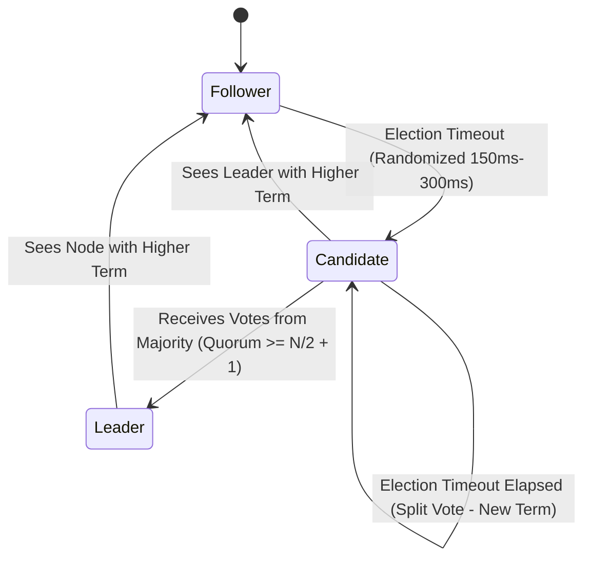

# 02. Raft Consensus & Fault-Tolerant Key-Value Service

This chapter covers MIT 6.5840 Labs 2 & 3: implementing the **Raft Consensus Protocol** from scratch in Go and building a Fault-Tolerant Key-Value Storage Service on top of Raft.

---

## 🗳️ Raft Finite State Machine & Log Replication



### 📜 Raft Log Structure

```
 Index:    1      2      3      4      5      6
        +------+------+------+------+------+------+
 Term:  |  1   |  1   |  1   |  2   |  2   |  3   |
 Log:   |SET X=1|SET Y=2|SET Z=3|SET X=4|SET Y=5|SET Z=6|
        +------+------+------+------+------+------+
```

---

## 🔑 MIT 6.5840 Lab 3: Fault-Tolerant Key-Value Service Layout

```mermaid
flowchart TD
    subgraph ClientLayer ["KV Client"]
        Client["kv.Get('x') / kv.Put('x', 'val')"]
    end

    subgraph ServiceLayer ["Fault-Tolerant KV Server Node"]
        KVSrv["KV Server (Duplicate Table: ClientId -> SeqNum)"]
        RaftNode["Raft Peer (Term N, Log Array)"]
        Persister["Snapshot Persister (RocksDB / Disk)"]
    end

    Client -->|RPC Put(Key, Val, ClientId, SeqNum)| KVSrv
    KVSrv -->|Check Duplicate Table| DupCheck{"Duplicate Request?"}
    
    DupCheck -->|Yes| ReturnCached["Return Cached Response Immediately"]
    DupCheck -->|No| StartRaft["rf.Start(OpCommand)"]
    
    StartRaft --> RaftNode
    RaftNode -.->|ApplyMsg over applyCh| KVSrv
    KVSrv -->|Update In-Memory DB & Duplicate Table| StateDB["In-Memory Map: map[string]string"]
    KVSrv -.->|If State Size > MaxRaftState| Snapshot["rf.Snapshot(index, snapshotBytes)"]
    Snapshot --> Persister
```

---

## 🐹 Production Go Implementation: Raft Consensus Core Engine

```go
package raft

import (
	"math/rand"
	"sync"
	"time"
)

type NodeState int

const (
	Follower NodeState = iota
	Candidate
	Leader
)

type LogEntry struct {
	Term    int
	Index   int
	Command interface{}
}

type RequestVoteArgs struct {
	Term         int
	CandidateID  int
	LastLogIndex int
	LastLogTerm  int
}

type RequestVoteReply struct {
	Term        int
	VoteGranted bool
}

type AppendEntriesArgs struct {
	Term         int
	LeaderID     int
	PrevLogIndex int
	PrevLogTerm  int
	Entries      []LogEntry
	LeaderCommit int
}

type AppendEntriesReply struct {
	Term    int
	Success bool
}

type Raft struct {
	mu        sync.Mutex
	peers     []*rpcClient // RPC connection handles
	persister *Persister
	me        int
	dead      int32

	currentTerm int
	votedFor    int
	log         []LogEntry
	state       NodeState

	commitIndex int
	lastApplied int

	lastHeartbeat time.Time
	applyCh       chan ApplyMsg
}

type ApplyMsg struct {
	CommandValid bool
	Command      interface{}
	CommandIndex int
}

func (rf *Raft) RequestVote(args *RequestVoteArgs, reply *RequestVoteReply) {
	rf.mu.Lock()
	defer rf.mu.Unlock()

	reply.VoteGranted = false

	// Rule 1: Reject if term < currentTerm
	if args.Term < rf.currentTerm {
		reply.Term = rf.currentTerm
		return
	}

	if args.Term > rf.currentTerm {
		rf.currentTerm = args.Term
		rf.state = Follower
		rf.votedFor = -1
	}

	reply.Term = rf.currentTerm

	// Rule 2: Check if votedFor is null or candidateId, AND candidate log is up-to-date
	lastLogIndex := len(rf.log) - 1
	lastLogTerm := rf.log[lastLogIndex].Term

	logUpToDate := false
	if args.LastLogTerm > lastLogTerm {
		logUpToDate = true
	} else if args.LastLogTerm == lastLogTerm && args.LastLogIndex >= lastLogIndex {
		logUpToDate = true
	}

	if (rf.votedFor == -1 || rf.votedFor == args.CandidateID) && logUpToDate {
		rf.votedFor = args.CandidateID
		rf.lastHeartbeat = time.Now()
		reply.VoteGranted = true
	}
}

func (rf *Raft) AppendEntries(args *AppendEntriesArgs, reply *AppendEntriesReply) {
	rf.mu.Lock()
	defer rf.mu.Unlock()

	reply.Success = false

	if args.Term < rf.currentTerm {
		reply.Term = rf.currentTerm
		return
	}

	if args.Term > rf.currentTerm {
		rf.currentTerm = args.Term
		rf.state = Follower
		rf.votedFor = -1
	}

	rf.lastHeartbeat = time.Now()
	reply.Term = rf.currentTerm

	// Consistency Check: Check if log has entry at PrevLogIndex matching PrevLogTerm
	if args.PrevLogIndex >= len(rf.log) || rf.log[args.PrevLogIndex].Term != args.PrevLogTerm {
		return
	}

	// Append any new entries not already in log
	rf.log = append(rf.log[:args.PrevLogIndex+1], args.Entries...)

	// Update commitIndex
	if args.LeaderCommit > rf.commitIndex {
		rf.commitIndex = min(args.LeaderCommit, len(rf.log)-1)
	}

	reply.Success = true
}

func (rf *Raft) ticker() {
	for !rf.killed() {
		rf.mu.Lock()
		state := rf.state
		lastHB := rf.lastHeartbeat
		rf.mu.Unlock()

		// Randomized election timeout between 150ms and 300ms
		timeout := time.Duration(150+rand.Intn(150)) * time.Millisecond

		if state != Leader && time.Since(lastHB) > timeout {
			rf.startElection()
		}

		time.Sleep(50 * time.Millisecond)
	}
}

func (rf *Raft) startElection() {
	rf.mu.Lock()
	rf.state = Candidate
	rf.currentTerm++
	rf.votedFor = rf.me
	rf.lastHeartbeat = time.Now()
	term := rf.currentTerm
	me := rf.me
	lastLogIndex := len(rf.log) - 1
	lastLogTerm := rf.log[lastLogIndex].Term
	rf.mu.Unlock()

	votes := 1

	for peer := range rf.peers {
		if peer == me {
			continue
		}
		go func(p int) {
			args := RequestVoteArgs{
				Term:         term,
				CandidateID:  me,
				LastLogIndex: lastLogIndex,
				LastLogTerm:  lastLogTerm,
			}
			var reply RequestVoteReply
			if rf.sendRequestVote(p, &args, &reply) {
				rf.mu.Lock()
				defer rf.mu.Unlock()

				if reply.Term > rf.currentTerm {
					rf.currentTerm = reply.Term
					rf.state = Follower
					rf.votedFor = -1
					return
				}

				if rf.state == Candidate && reply.VoteGranted && reply.Term == rf.currentTerm {
					votes++
					if votes > len(rf.peers)/2 {
						rf.state = Leader
						// Send initial heartbeats immediately
						go rf.sendHeartbeats()
					}
				}
			}
		}(peer)
	}
}

func (rf *Raft) sendHeartbeats() {
	// Implementation sends empty AppendEntries RPCs to all peers
}

func min(a, b int) int {
	if a < b {
		return a
	}
	return b
}

func (rf *Raft) sendRequestVote(server int, args *RequestVoteArgs, reply *RequestVoteReply) bool {
	return true // RPC invocation stub
}

func (rf *Raft) killed() bool {
	return false
}

type rpcClient struct{}
type Persister struct{}
```
