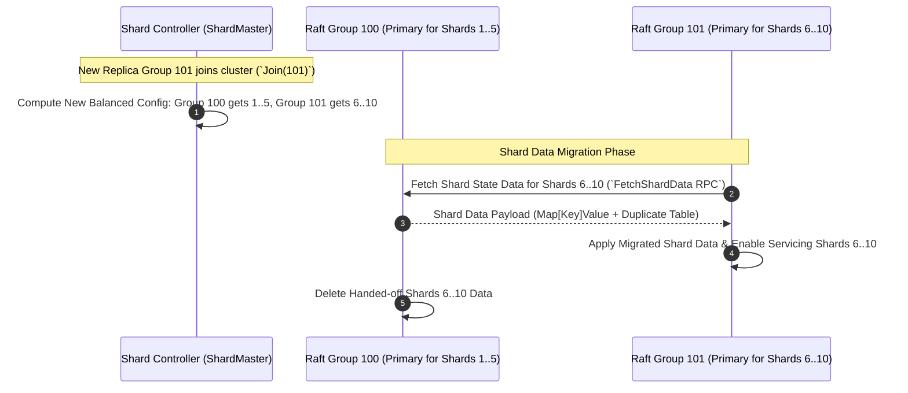
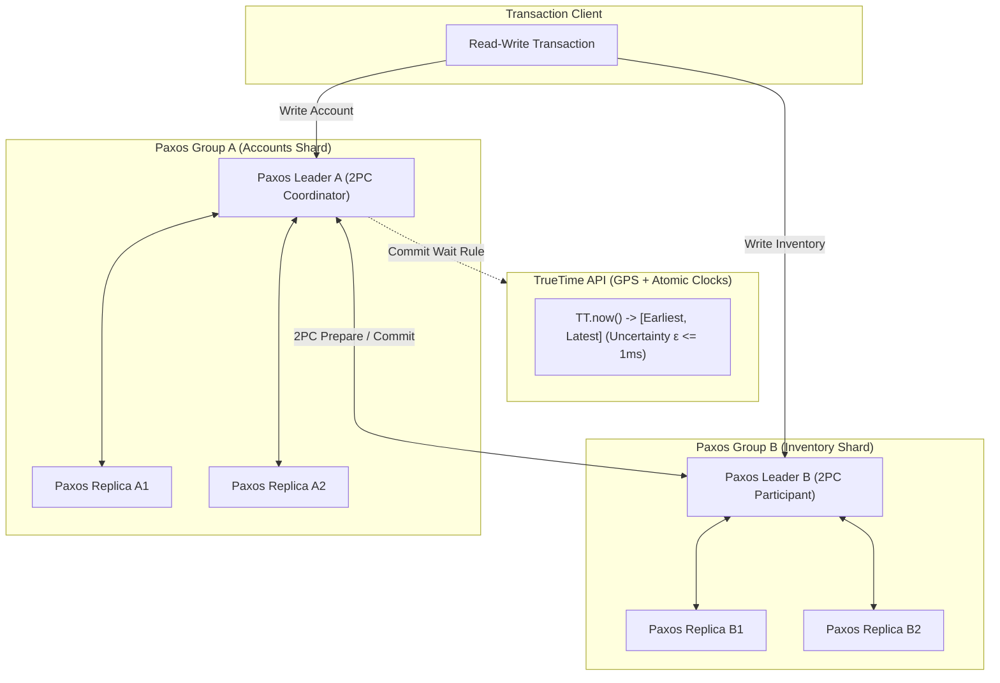

# 03. Sharded KV Service, ZooKeeper & Google Spanner

This chapter covers MIT 6.5840 Lab 4 (Sharded Fault-Tolerant Key-Value Storage), Apache ZooKeeper linearizability, and Google Spanner's TrueTime distributed transactions.

---

## 🔀 MIT 6.5840 Lab 4: Sharded KV Architecture

Lab 4 splits key-value storage across multiple Raft replica groups. A centralized **Shard Controller** (also backed by Raft) manages configuration mapping: `ShardID -> ReplicaGroupID`.



---

## 🌐 Google Spanner: TrueTime & 2PC Over Paxos

Spanner provides globally linearizable read-write transactions using **Two-Phase Commit (2PC)** across independent Paxos groups and physical atomic clocks via **TrueTime**.



### ⏱️ TrueTime Commit Wait Rule
To guarantee that transaction $T_2$ receives a commit timestamp $s_2 > s_1$ if $T_2$ starts after $T_1$ commits:
1. Leader picks commit timestamp $s = \text{TT.now}().\text{latest}$.
2. Leader waits until $\text{TT.now}().\text{earliest} > s$ before releasing client locks.

---

## 🐹 Production Go Implementation: Shard Controller Rebalancer Engine

```go
package shardmaster

import (
	"sort"
)

const NShards = 10

type Config struct {
	Num    int              // Config number
	Shards [NShards]int     // ShardID -> GID
	Groups map[int][]string // GID -> Replica Group Servers
}

/**
 * Rebalances shard assignments evenly across all active Replica Groups (GIDs).
 */
func RebalanceShards(groups map[int][]string, currentShards [NShards]int) [NShards]int {
	var newShards [NShards]int
	gids := make([]int, 0, len(groups))

	for gid := range groups {
		gids = append(gids, gid)
	}

	// Sort GIDs to ensure deterministic rebalancing across all nodes
	sort.Ints(gids)

	if len(gids) == 0 {
		// No active groups: unassign all shards (GID 0)
		return newShards
	}

	// Count current shard distribution per GID
	gidShardCount := make(map[int]int)
	for _, gid := range gids {
		gidShardCount[gid] = 0
	}

	for _, gid := range currentShards {
		if _, exists := gidShardCount[gid]; exists {
			gidShardCount[gid]++
		}
	}

	targetPerGroup := NShards / len(gids)
	remainder := NShards % len(gids)

	newShards = currentShards

	// 1. Unassign shards from removed groups or groups exceeding quota
	for i := 0; i < NShards; i++ {
		gid := newShards[i]
		count, exists := gidShardCount[gid]
		
		if !exists || count > targetPerGroup+1 || (count > targetPerGroup && remainder == 0) {
			newShards[i] = 0 // Unassign
			if exists {
				gidShardCount[gid]--
			}
		}
	}

	// 2. Assign unassigned shards (GID 0) to under-allocated groups
	for i := 0; i < NShards; i++ {
		if newShards[i] == 0 {
			// Find group with minimum assigned shards
			minGid := gids[0]
			minCount := gidShardCount[minGid]

			for _, gid := range gids {
				if gidShardCount[gid] < minCount {
					minGid = gid
					minCount = gidShardCount[gid]
				}
			}

			newShards[i] = minGid
			gidShardCount[minGid]++
		}
	}

	return newShards
}
```
