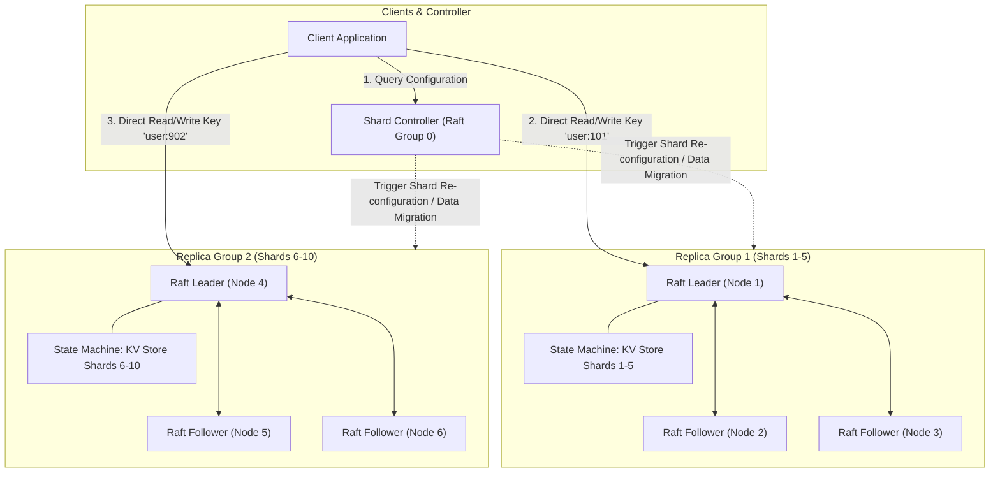

# MIT 6.5840 (formerly 6.824) — Distributed Systems

A masterclass on distributed systems engineering based on the world-renowned MIT 6.5840 course taught by Professor Robert Morris. Covers MapReduce, VMware FT, Raft Consensus (Labs 1–4), Fault-Tolerant Key-Value Stores, Sharded Storage Clusters, ZooKeeper linearizability, and Google Spanner.

---

## 📐 Table of Contents

| Section | Subject | Key Concepts |
| :--- | :--- | :--- |
| **00. Cheatsheet** | [MIT 6.5840 Cheatsheet](00_mit_65840_cheatsheet.md) | Paper Studies Matrix (GFS, Raft, Spanner, ZooKeeper, VMware FT), Raft Invariants, Go Concurrency Rules |
| **01. MapReduce & Primary-Backup** | [MapReduce & VMware FT](01_mapreduce_and_primary_backup/01_mapreduce_and_vmware_ft.md) | **Lab 1**: MapReduce Master/Worker Architecture, Task Allocation & Worker Heartbeats, VMware FT Deterministic Replay |
| **02. Raft & KV Service** | [Raft Consensus & Fault-Tolerant KV](02_raft_consensus_and_kv_service/02_raft_consensus_and_fault_tolerant_kv.md) | **Labs 2 & 3**: Raft Leader Election, Log Replication, Persistence, Snapshotting (`InstallSnapshot`), Duplicate Detection (`ClientId` + `SeqNum`) |
| **03. Sharded KV & Paper Studies** | [Sharded KV, ZooKeeper & Spanner](03_sharded_kv_and_distributed_paper_studies/03_sharded_kv_zookeeper_and_spanner.md) | **Lab 4**: Shard Controller & Re-configurations, Data Migration between Raft Groups, ZooKeeper Linearizability, Spanner TrueTime & 2PC |

---

## 🏗️ MIT 6.5840 Lab 4: Sharded Fault-Tolerant Key-Value Architecture

---

## 🎯 Core Engineering Principles of MIT 6.5840

1. **State Machine Replication (SMR)**: Replicate identical log entries in identical order across all nodes to achieve fault-tolerant state machines.
2. **Linearizability (External Consistency)**: System behavior must match a single sequential execution where every read returns the value of the most recent write in real time.
3. **RPC Idempotency & Deduplication**: Networks drop and duplicate RPCs. Servers must track `ClientId` and monotonically increasing `SequenceNum` to reject duplicate executions.
4. **Log Compaction & Snapshots**: Unbounded WAL logs exhaust disk space and slow down recovery. Periodically snapshot application state to truncate logs safely.
5. **No Shared Memory Across Network**: Nodes communicate strictly via message passing (RPCs). Memory locks apply only within local Go goroutine process boundaries.
