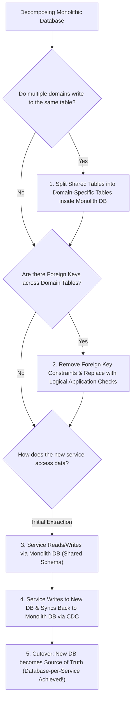

# 00. Monolith to Microservices Migration Cheatsheet

A high-density reference guide summarizing refactoring patterns, database splitting decision trees, and fallback strategies for migrating monolithic architectures.

---

## 📋 Migration Pattern Reference Matrix

| Pattern Name | Primary Goal | Implementation Mechanism | Typical Risk Level |
| :--- | :--- | :--- | :--- |
| **Strangler Fig** | Incrementally migrate features by intercepting HTTP requests at the edge. | API Gateway / NGINX / Envoy path routing (`/payments` $\rightarrow$ Microservice). | **Low** (Easy rollback via gateway routing). |
| **Branch by Abstraction** | Replace monolithic internal component while keeping monolith running. | Extract Interface $\rightarrow$ Build New Implementation $\rightarrow$ Feature Flag toggle. | **Low** (Code-level abstraction with feature flag). |
| **Parallel Run** | Verify correctness of new service against old monolith in production. | Ingress proxy duplicates traffic to both old & new code; compares responses asynchronously. | **Very Low** (New service responses are discarded). |
| **Transactional Outbox** | Atomically update database & publish domain events without 2PC. | Write business data + Outbox event to same DB transaction; CDC/Relayer reads outbox table. | **Medium** (Requires outbox relayer/CDC daemon). |
| **Change Data Capture (CDC)** | Stream database state changes without modifying application code. | Transaction log tailing (Debezium / Kafka Connect) reads DB WAL binary logs. | **Medium** (Operational Kafka/Debezium overhead). |
| **Database View Wrapping** | Hide monolith DB schema changes during initial service extraction. | Expose a virtual Database View while underlying tables are refactored. | **Low** (Temporary abstraction layer). |
| **Saga Pattern** | Manage distributed transactions across split microservice databases. | Orchestrated or Choreographed compensating transactions. | **High** (Requires non-trivial compensation logic). |

---

## 🗄️ Database Decomposition Decision Tree

---

## 🛡️ Migration Risk & Fallback Checklist

1. **Canary Traffic Shifting**: Never switch $100\%$ of traffic instantly. Shift traffic gradually ($1\% \rightarrow 5\% \rightarrow 25\% \rightarrow 100\%$).
2. **Dual Writes / Backward Synchronization**: Ensure data written by the new microservice is synced back to the monolith database during canary phase so you can instantly fall back to the monolith if the new service fails.
3. **Automated Diffing (Parallel Run)**: For financial or calculation-heavy logic, log response discrepancies between monolith and microservice before switching traffic.
4. **Distributed Tracing Alignment**: Ensure W3C `traceparent` headers flow seamlessly through the API Gateway, Monolith, and new Microservices to maintain end-to-end trace visibility during the migration phase.
