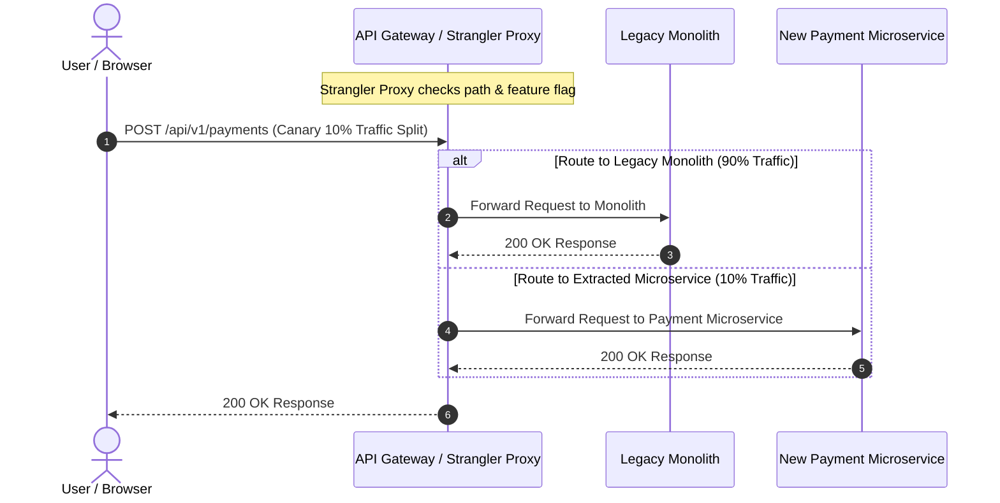
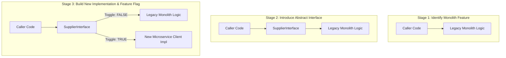
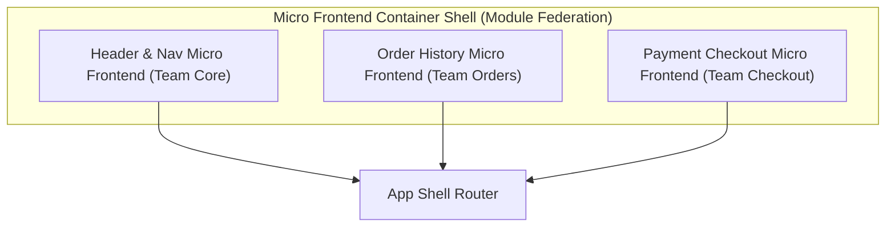

# 01. Strangler Fig & Code Decomposition Patterns

This chapter details code-level refactoring patterns for decomposing monolithic applications: the Strangler Fig pattern, Branch by Abstraction, Parallel Run verification, and Micro Frontends.

---

## 🌿 Strangler Fig Pattern Mechanics

Named after the strangler fig tree that grows around an existing host tree, this pattern incrementally replaces monolithic features with microservices at the HTTP/API Gateway boundary.



---

## 🌿 Branch by Abstraction Pattern

When decomposing code **inside** the monolith before moving it out into a separate process, use **Branch by Abstraction**:



---

## ☕ Production Java Implementation: Branch by Abstraction with Dual-Run Verification

```java
package com.example.migration.pattern;

import java.util.Objects;
import java.util.function.Supplier;

/**
 * Branch by Abstraction implementation featuring Feature Toggles and Parallel Run diff verification.
 */
public class PaymentProcessingSupplier {

    public interface PaymentService {
        PaymentResponse processPayment(PaymentRequest request);
    }

    public record PaymentRequest(String accountId, long amountCents, String currency) {}
    public record PaymentResponse(boolean success, String transactionId, String errorMessage) {}

    private final PaymentService legacyMonolithService;
    private final PaymentService newMicroserviceClient;
    private final FeatureToggleService featureToggleService;

    public PaymentProcessingSupplier(
            PaymentService legacyMonolithService,
            PaymentService newMicroserviceClient,
            FeatureToggleService featureToggleService) {
        this.legacyMonolithService = Objects.requireNonNull(legacyMonolithService);
        this.newMicroserviceClient = Objects.requireNonNull(newMicroserviceClient);
        this.featureToggleService = Objects.requireNonNull(featureToggleService);
    }

    public PaymentResponse processPayment(PaymentRequest request) {
        boolean useNewService = featureToggleService.isFeatureEnabled("use-extracted-payment-microservice");
        boolean runParallelVerification = featureToggleService.isFeatureEnabled("enable-parallel-run-verification");

        if (runParallelVerification) {
            // Parallel Run: Execute legacy synchronously, execute new service asynchronously & compare diff
            PaymentResponse legacyResp = legacyMonolithService.processPayment(request);
            
            CompletableFuture.runAsync(() -> {
                try {
                    PaymentResponse newResp = newMicroserviceClient.processPayment(request);
                    compareResponses(request, legacyResp, newResp);
                } catch (Exception e) {
                    System.err.println("[PARALLEL RUN ERROR] New Microservice threw exception: " + e.getMessage());
                }
            });

            return legacyResp; // Always return safe legacy response during Parallel Run phase
        }

        if (useNewService) {
            return newMicroserviceClient.processPayment(request);
        } else {
            return legacyMonolithService.processPayment(request);
        }
    }

    private void compareResponses(PaymentRequest req, PaymentResponse legacy, PaymentResponse newSvc) {
        if (legacy.success() != newSvc.success()) {
            System.err.printf("[PARALLEL RUN MISMATCH] Account %s: Legacy success=%b, New success=%b%n",
                    req.accountId(), legacy.success(), newSvc.success());
        } else {
            System.out.println("[PARALLEL RUN MATCH] Account " + req.accountId() + " verified successfully!");
        }
    }

    public interface FeatureToggleService {
        boolean isFeatureEnabled(String featureName);
    }
}
```

---

## 🎨 UI Micro Frontends Decomposition

Just as backends are split into microservices, complex monolithic single-page applications (SPAs) can be decomposed into **Micro Frontends**.



### Composition Strategies
1. **Page-Based Composition**: The API Gateway routes entire page requests (`/orders` vs `/checkout`) to independent micro frontend web bundles.
2. **Component-Based Composition (Webpack Module Federation / Web Components)**: Multiple team-owned components co-exist on the same page, dynamically loaded at runtime.
