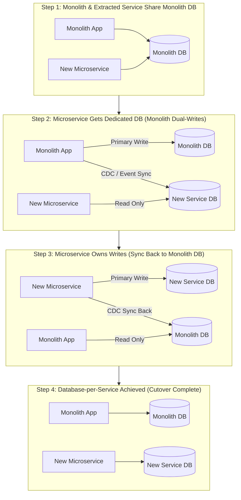
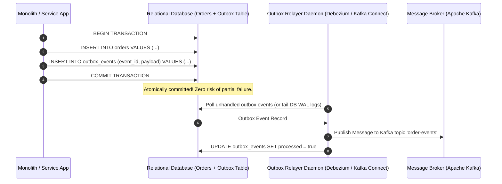

# 02. Database Decomposition, Outbox Pattern & Sagas

This chapter covers database refactoring patterns: breaking foreign key dependencies, executing the 5-step database split, implementing the Transactional Outbox Pattern with Change Data Capture (CDC), and managing distributed consistency with Sagas.

---

## 🗄️ The 5-Step Database Split Pattern

Splitting a monolithic database into database-per-service without downtime requires a multi-stage migration:



---

## 📮 Transactional Outbox Pattern & Change Data Capture (CDC)

Updating a database and publishing a message queue event in separate operations risks data inconsistency if the app crashes after database commit but before publishing the event.

The **Transactional Outbox Pattern** solves this by writing the domain event to an `outbox` table in the **same database transaction** as the business data mutation.



---

## ☕ Production Java Implementation: Transactional Outbox Relayer Daemon

```java
package com.example.migration.outbox;

import java.sql.*;
import java.util.ArrayList;
import java.util.List;
import java.util.concurrent.Executors;
import java.util.concurrent.ScheduledExecutorService;
import java.util.concurrent.TimeUnit;

/**
 * Transactional Outbox Relayer that polls unhandled outbox records and broadcasts to Message Broker.
 */
public class TransactionalOutboxRelayer {

    public record OutboxEvent(long id, String aggregateType, String aggregateId, String eventType, String payload) {}

    public interface MessageBrokerClient {
        void publish(String topic, String key, String payload);
    }

    private final DataSource dataSource;
    private final MessageBrokerClient messageBrokerClient;
    private final ScheduledExecutorService scheduler = Executors.newSingleThreadScheduledExecutor();

    public TransactionalOutboxRelayer(DataSource dataSource, MessageBrokerClient messageBrokerClient) {
        this.dataSource = dataSource;
        this.messageBrokerClient = messageBrokerClient;
    }

    public void start(long pollIntervalMillis) {
        scheduler.scheduleWithFixedDelay(this::processOutboxEvents, 0, pollIntervalMillis, TimeUnit.MILLISECONDS);
        System.out.println("[OUTBOX RELAYER] Started polling outbox events...");
    }

    private void processOutboxEvents() {
        try (Connection conn = dataSource.getConnection()) {
            conn.setAutoCommit(false); // Begin transaction for outbox lock & update

            List<OutboxEvent> pendingEvents = fetchPendingEvents(conn);

            for (OutboxEvent event : pendingEvents) {
                try {
                    // Publish to Kafka / RabbitMQ broker
                    messageBrokerClient.publish(event.eventType(), event.aggregateId(), event.payload());
                    
                    // Mark outbox entry as processed
                    markEventProcessed(conn, event.id());
                } catch (Exception e) {
                    System.err.printf("[OUTBOX ERROR] Failed to publish event %d: %s%n", event.id(), e.getMessage());
                    // Skip marking processed so it will be retried on next poll cycle
                }
            }

            conn.commit(); // Commit processed status updates
        } catch (SQLException e) {
            System.err.println("[OUTBOX SQL ERROR] Transaction failed: " + e.getMessage());
        }
    }

    private List<OutboxEvent> fetchPendingEvents(Connection conn) throws SQLException {
        String sql = "SELECT id, aggregate_type, aggregate_id, event_type, payload FROM outbox_events WHERE processed = false ORDER BY id ASC LIMIT 50 FOR UPDATE SKIP LOCKED";
        List<OutboxEvent> list = new ArrayList<>();

        try (PreparedStatement stmt = conn.prepareStatement(sql);
             ResultSet rs = stmt.executeQuery()) {
            while (rs.next()) {
                list.add(new OutboxEvent(
                    rs.getLong("id"),
                    rs.getString("aggregate_type"),
                    rs.getString("aggregate_id"),
                    rs.getString("event_type"),
                    rs.getString("payload")
                ));
            }
        }
        return list;
    }

    private void markEventProcessed(Connection conn, long eventId) throws SQLException {
        String sql = "UPDATE outbox_events SET processed = true, processed_at = CURRENT_TIMESTAMP WHERE id = ?";
        try (PreparedStatement stmt = conn.prepareStatement(sql)) {
            stmt.setLong(1, eventId);
            stmt.executeUpdate();
        }
    }

    public void stop() {
        scheduler.shutdown();
    }
}
```
