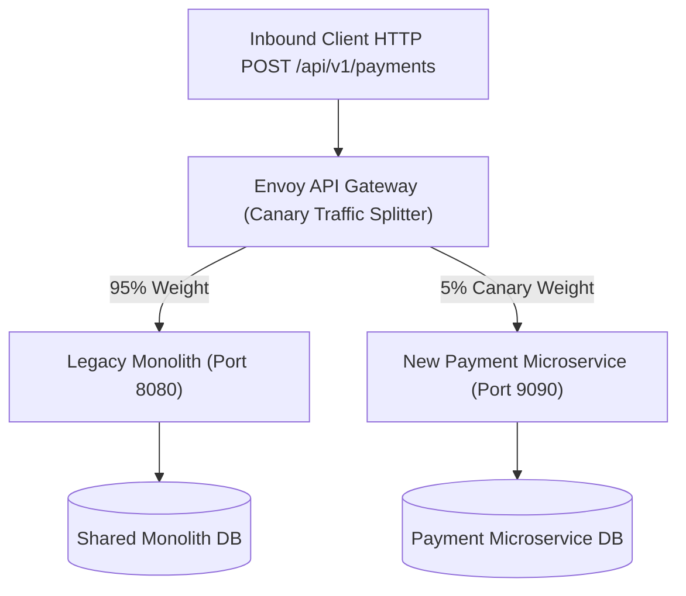

# 03. Communication, Canary Traffic Routing & Observability

This chapter covers inter-service communication strategies, API Gateway canary traffic routing, Protobuf/Avro schema evolution, and maintaining cross-boundary distributed tracing during monolithic migrations.

---

## 🚦 API Gateway Canary Traffic Routing

When migrating features from a monolith to a new microservice, use an **API Gateway (Envoy / NGINX / Kong)** to dynamically shift traffic percentages without changing client applications.



---

## 🐍 Production Python Implementation: Canary Weighted Traffic Router Simulation

```python
import random
import time
from typing import Dict, Any

class CanaryTrafficRouter:
    """Production Canary Traffic Router for splitting requests between Monolith and Microservice."""

    def __init__(self, monolith_endpoint: str, microservice_endpoint: str, canary_weight_percent: float = 5.0):
        self.monolith_endpoint = monolith_endpoint
        self.microservice_endpoint = microservice_endpoint
        self.canary_weight_percent = max(0.0, min(100.0, canary_weight_percent))
        self.stats = {"monolith": 0, "microservice": 0}

    def set_canary_weight(self, percent: float):
        """Dynamically adjusts the canary percentage (e.g. 0% -> 5% -> 25% -> 100%)."""
        self.canary_weight_percent = max(0.0, min(100.0, percent))
        print(f"[ROUTER] Canary traffic weight updated to {self.canary_weight_percent}%")

    def route_request(self, request_payload: Dict[str, Any]) -> Dict[str, Any]:
        """Routes inbound request based on random roll against canary weight."""
        roll = random.uniform(0.0, 100.0)

        if roll < self.canary_weight_percent:
            self.stats["microservice"] += 1
            return self._forward_to_microservice(request_payload)
        else:
            self.stats["monolith"] += 1
            return self._forward_to_monolith(request_payload)

    def _forward_to_monolith(self, payload: Dict[str, Any]) -> Dict[str, Any]:
        return {"status": 200, "source": "Monolith", "endpoint": self.monolith_endpoint, "payload": payload}

    def _forward_to_microservice(self, payload: Dict[str, Any]) -> Dict[str, Any]:
        return {"status": 200, "source": "Extracted-Microservice", "endpoint": self.microservice_endpoint, "payload": payload}

    def print_stats(self):
        total = self.stats["monolith"] + self.stats["microservice"]
        if total == 0:
            return
        m_pct = (self.stats["monolith"] / total) * 100
        s_pct = (self.stats["microservice"] / total) * 100
        print(f"[STATS] Total Requests: {total} | Monolith: {self.stats['monolith']} ({m_pct:.1f}%) | Microservice: {self.stats['microservice']} ({s_pct:.1f}%)")


# Simulation Demonstration
if __name__ == "__main__":
    router = CanaryTrafficRouter("http://monolith:8080/payments", "http://payment-svc:9090/payments", canary_weight_percent=10.0)

    for i in range(1000):
        router.route_request({"user_id": f"usr_{i}", "amount": 99.99})

    router.print_stats()
```

---

## 🔍 Cross-Boundary Distributed Tracing

During a migration, a single user request may hop from the API Gateway to the Monolith, which calls an extracted Microservice over gRPC or Kafka. End-to-end tracing relies on propagating **W3C Trace Context** (`traceparent` header).

```mermaid
sequenceDiagram
    autonumber
    participant Client as Web Client
    participant GW as API Gateway
    participant Monolith as Legacy Monolith
    participant MicroSvc as Extracted Order Microservice
    participant Collector as OpenTelemetry Collector

    Client->>GW: POST /api/v1/orders
    Note over GW: Generate Trace ID: 4bf92f3577b3...
    
    GW->>Monolith: POST /api/v1/orders (traceparent: 00-4bf92f35...-span1-01)
    
    Note over Monolith: Process User Profile check inside Monolith
    Monolith->>MicroSvc: gRPC CreateOrder() (traceparent: 00-4bf92f35...-span2-01)
    
    MicroSvc-->>Monolith: gRPC Response
    Monolith-->>GW: HTTP 200 OK
    GW-->>Client: HTTP 200 OK
    
    GW-.->|Export Span 1| Collector
    Monolith-.->|Export Span 2| Collector
    MicroSvc-.->|Export Span 3| Collector
```

---

## 📜 Schema Evolution & Backwards Compatibility Rules

When microservices communicate via Protocol Buffers (gRPC) or Apache Avro (Kafka), schemas change independently across service deployments.

### Mandatory Rules for Schema Evolution:
1. **Never change existing field numeric tags**: In Protobuf, field numbers (`string name = 1;`) define binary identity. Changing a tag breaks all existing callers.
2. **Never delete required fields**: Add new fields as `optional` (or nullable).
3. **Use default values for new fields**: Ensures old clients reading messages produced by newer microservices ignore unknown fields gracefully.
