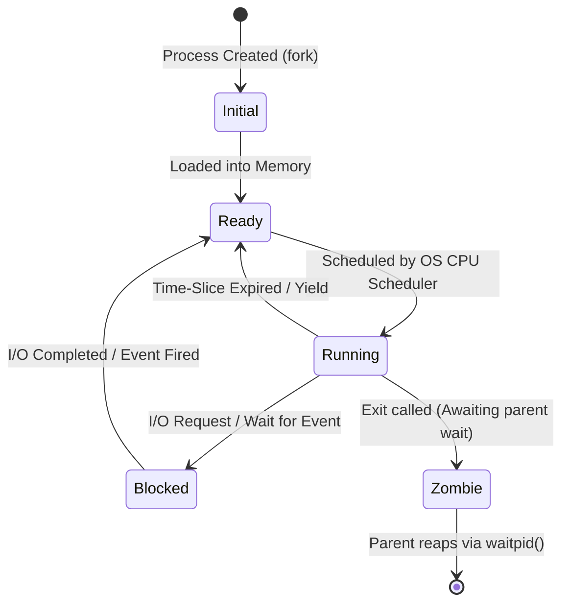

# OSTEP 30-Second Interview & Operating Systems Cheatsheet

---

## ⚡ Core OS Equations & Quick Formulas

### 1. Paging Math
$$\text{Virtual Address Bits} = \text{VPN Bits} + \text{Offset Bits}$$
$$\text{Offset Bits} = \log_2(\text{Page Size in Bytes})$$
$$\text{Number of Pages} = 2^{\text{VPN Bits}}$$
$$\text{Single-Level Page Table Size} = \text{Number of Pages} \times \text{PTE Size in Bytes}$$

### 2. Multi-Level Paging Index Breakdown (32-bit Address, 4KB Pages, 4-byte PTEs)
- Offset = 12 bits ($\log_2(4096) = 12$).
- VPN = 20 bits ($32 - 12 = 20$).
- Page Directory Index (PDI) = Top 10 bits of VPN.
- Page Table Index (PTI) = Bottom 10 bits of VPN.

---

## 📊 Process State Transition Diagram

---

## 🛠 POSIX System Calls Quick Reference

| Category | System Call | Purpose |
|---|---|---|
| **Process** | `fork()` | Creates an exact child process copy (returns 0 to child, PID to parent). |
| | `execvp(prog, args)` | Overwrites current process image with new program executable. |
| | `waitpid(pid, &status, options)` | Reaps zombie child process and collects exit status. |
| **Memory** | `mmap(addr, len, prot, flags, fd, offset)` | Maps files or anonymous memory pages into virtual address space. |
| | `mprotect(addr, len, prot)` | Changes memory protection permissions (READ/WRITE/EXEC). |
| **Threads** | `pthread_create(&thread, attr, func, arg)` | Spawns a new POSIX thread in same address space. |
| | `pthread_join(thread, &retval)` | Waits for POSIX thread termination and collects return pointer. |
| | `pthread_mutex_lock(&mutex)` | Acquires mutual exclusion lock (blocks if held). |
| **I/O & FS** | `open(path, flags, mode)` | Opens file and returns integer File Descriptor (FD). |
| | `fsync(fd)` | Flushes dirty OS page cache blocks to physical disk storage. |
| | `epoll_wait(epfd, events, max, timeout)` | Waits for non-blocking I/O readiness events across thousands of sockets. |

---

## 🧠 MLFQ (Multi-Level Feedback Queue) 5 Rules

1. **Rule 1**: If Priority(A) > Priority(B), A runs (B doesn't).
2. **Rule 2**: If Priority(A) = Priority(B), A & B run in Round Robin (RR) time-slices.
3. **Rule 3**: When a job enters the system, it is placed at the top priority.
4. **Rule 4**: Once a job uses up its time allotment at a given level (regardless of how many times it yielded the CPU), its priority is reduced (moves down one queue).
5. **Rule 5**: After some time period $S$, move all the jobs in the system to the top priority queue (**Priority Boost** to prevent starvation).
