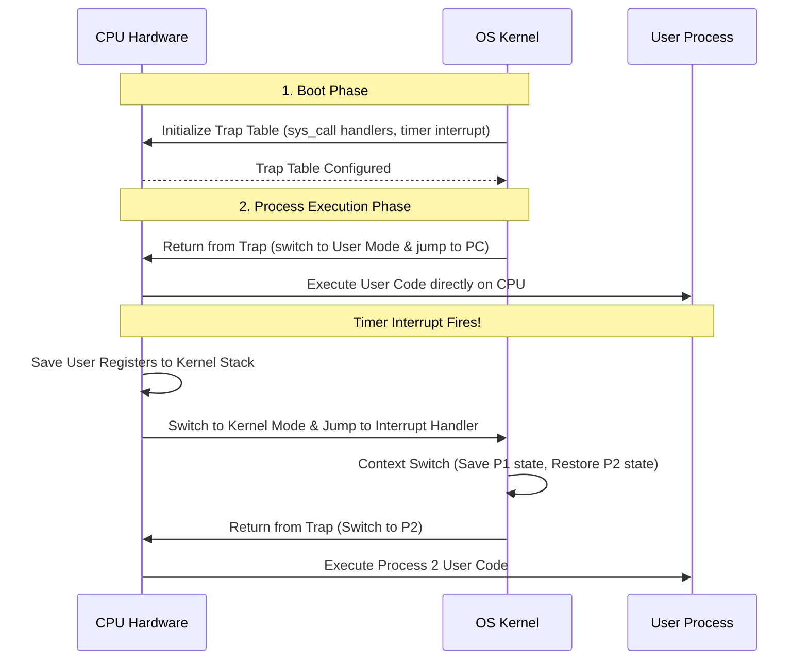

# Chapter 1: CPU Virtualization, Processes & The Process API

The OS creates the illusion of infinite CPUs by virtualizing the physical CPU across multiple active processes using **time-sharing** and **Limited Direct Execution (LDE)**.

---

## 📌 Process Abstraction & Process Control Block (PCB)

A **process** is a running program in execution. Its state comprises:
- **Memory Address Space**: Instructions, static data, heap, and call stack.
- **Registers**: Program Counter (PC), Stack Pointer (SP), General-purpose registers.
- **I/O Information**: Open File Descriptors (FD table).

### XV6 Kernel `proc` Struct (PCB Representation)
```c
struct proc {
  uint sz;                     // Size of process memory (bytes)
  pde_t* pgdir;                // Page table pointer
  char *kstack;                // Bottom of kernel stack for this process
  enum procstate state;        // Process state (UNUSED, EMBRYO, SLEEPING, RUNNABLE, RUNNING, ZOMBIE)
  int pid;                     // Process ID
  struct proc *parent;         // Parent process
  struct trapframe *tf;        // Trap frame for current syscall/interrupt
  struct context *context;     // Context switch register state (swtch.S)
  struct file *ofile[NOFILE];  // Open files table
};
```

---

## 📌 Limited Direct Execution (LDE) Protocol

To achieve high performance, the OS runs user code directly on the physical CPU. But to maintain control, it uses **hardware modes** (User Mode vs Kernel Mode) and **Timer Interrupts**.



---

## 📌 Process API Code (`fork`, `exec`, `wait`)

```c
#include <stdio.h>
#include <stdlib.h>
#include <unistd.h>
#include <sys/wait.h>

int main() {
    int rc = fork();
    if (rc < 0) {
        // Fork failed
        fprintf(stderr, "fork failed\n");
        exit(1);
    } else if (rc == 0) {
        // Child Process
        printf("Child process (pid:%d)\n", (int) getpid());
        char *myargs[3];
        myargs[0] = "ls";
        myargs[1] = "-la";
        myargs[2] = NULL;
        execvp(myargs[0], myargs); // Overwrites child memory with /bin/ls!
    } else {
        // Parent Process
        int wc = waitpid(rc, NULL, 0); // Reaps zombie child!
        printf("Parent (pid:%d) finished waiting for child (pid:%d)\n", (int) getpid(), rc);
    }
    return 0;
}
```
