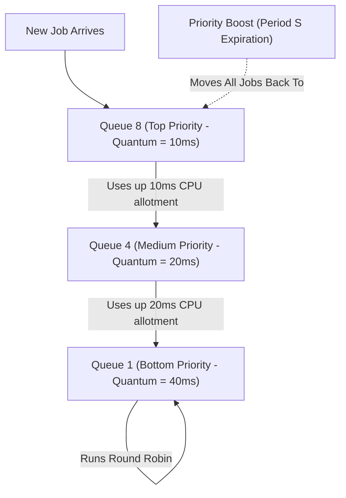

# Chapter 2: CPU Scheduling

CPU schedulers determine which process to run next. Metrics include **Turnaround Time** ($T_{\text{turnaround}} = T_{\text{completion}} - T_{\text{arrival}}$) and **Response Time** ($T_{\text{response}} = T_{\text{first\_run}} - T_{\text{arrival}}$).

---

## 📊 Scheduling Policy Comparison

| Algorithm | Preemptive? | Optimizes For | Major Flaw |
|---|---|---|---|
| **FIFO** (First-In, First-Out) | No | Simplicity | Convoy Effect (short jobs stuck behind long jobs) |
| **SJF** (Shortest Job First) | No | Turnaround Time | Convoy Effect if long job arrives first |
| **STCF** (Shortest Time-to-Completion First) | Yes | Turnaround Time | High Response Time for interactive jobs |
| **Round Robin (RR)** | Yes | Response Time | Poor Turnaround Time when job lengths are equal |
| **MLFQ** (Multi-Level Feedback Queue) | Yes | Balance (Turnaround + Response) | Requires tuning allotment $S$ & priority boost |
| **Lottery Scheduling** | Yes | Proportional Share | Non-deterministic short-term fairness |

---

## 📌 Multi-Level Feedback Queue (MLFQ) Deep Dive

MLFQ learns process behavior without a priori knowledge of job execution length. Interactive jobs (short CPU bursts, frequent I/O) stay at high priority; CPU-bound jobs drop to lower priority queues.



---

## 📌 Proportional Share: Lottery & Stride Scheduling

### Lottery Scheduling (Probabilistic Fairness)
Tickets represent a process's share of CPU time. If Process A has 75 tickets and Process B has 25 tickets, Process A gets 75% of CPU cycles probabilistically over time.

### Stride Scheduling (Deterministic Exact Fairness)
- $\text{Stride} = \frac{\text{Large Constant}}{\text{Tickets}}$ (e.g. $\frac{10000}{100} = 100$, $\frac{10000}{50} = 200$).
- Track $Pass$ counter. Run job with smallest $Pass$ value, then $Pass += Stride$.

```c
// Stride Scheduler Loop
Process *select_next_job(Process *processes, int n) {
    Process *best = NULL;
    for (int i = 0; i < n; i++) {
        if (best == NULL || processes[i].pass < best->pass) {
            best = &processes[i];
        }
    }
    best->pass += best->stride; // Increment pass by stride
    return best;
}
```
