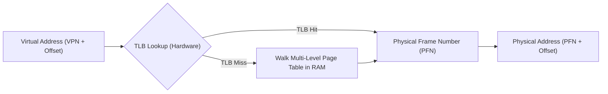
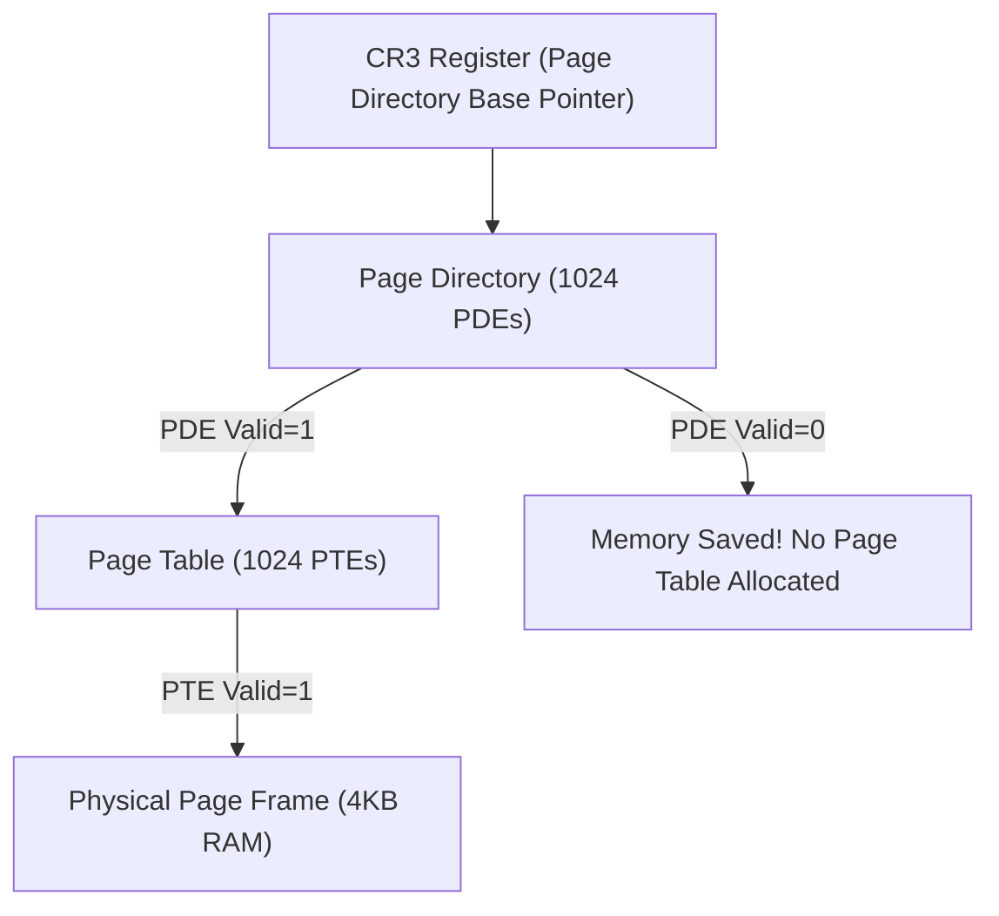

# Chapter 3: Memory Virtualization, Paging & Multi-Level Page Tables

The OS creates the illusion that every process owns a contiguous, private memory address space ($0 \to 2^{64}-1$).

---

## 📌 Virtual to Physical Address Translation



---

## 📌 Multi-Level Page Tables

Single-level page tables for a 32-bit address space with 4KB pages require $2^{20} = 1,048,576$ entries (4MB per process!). Multi-level page tables tree structure eliminates unallocated address space ranges.



### 32-Bit Address Translation Example
- Virtual Address: `0x20004004` $\to$ Binary `0010000000 0000000100 000000000100`
- **Page Directory Index (PDI)** = Top 10 bits (`0010000000` = Decimal 128)
- **Page Table Index (PTI)** = Middle 10 bits (`0000000100` = Decimal 4)
- **Offset** = Bottom 12 bits (`0x004` = 4 bytes offset inside physical frame)

---

## 📌 TLB (Translation Lookaside Buffer) & Hardware MMU

The **TLB** is a fast hardware associative cache inside the CPU MMU that stores recent VPN-to-PFN translations.

```c
// Hardware MMU Pseudo-code for Address Translation
int translate(int virtual_address) {
    int vpn = (virtual_address & VPN_MASK) >> SHIFT;
    int offset = virtual_address & OFFSET_MASK;
    
    int tlb_entry = tlb_lookup(vpn);
    if (tlb_entry != TLB_MISS) { // TLB Hit!
        if (tlb_entry.protection & READ_EXEC) {
            return (tlb_entry.pfn << SHIFT) | offset;
        } else {
            raise_exception(PROTECTION_FAULT);
        }
    } else { // TLB Miss!
        int pde_addr = CR3 + (vpn >> 10) * sizeof(PDE);
        int pde = load_physical(pde_addr);
        if (!(pde & VALID_BIT)) raise_exception(PAGE_FAULT);
        
        int pte_addr = (pde & PFN_MASK) + (vpn & 0x3FF) * sizeof(PTE);
        int pte = load_physical(pte_addr);
        if (!(pte & VALID_BIT)) raise_exception(PAGE_FAULT);
        
        tlb_insert(vpn, pte.pfn, pte.protection);
        return (pte.pfn << SHIFT) | offset;
    }
}
```
