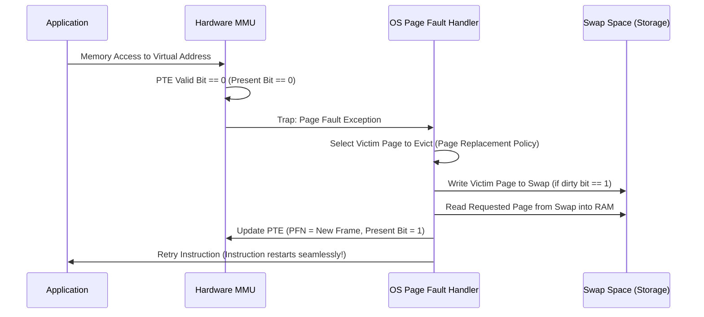
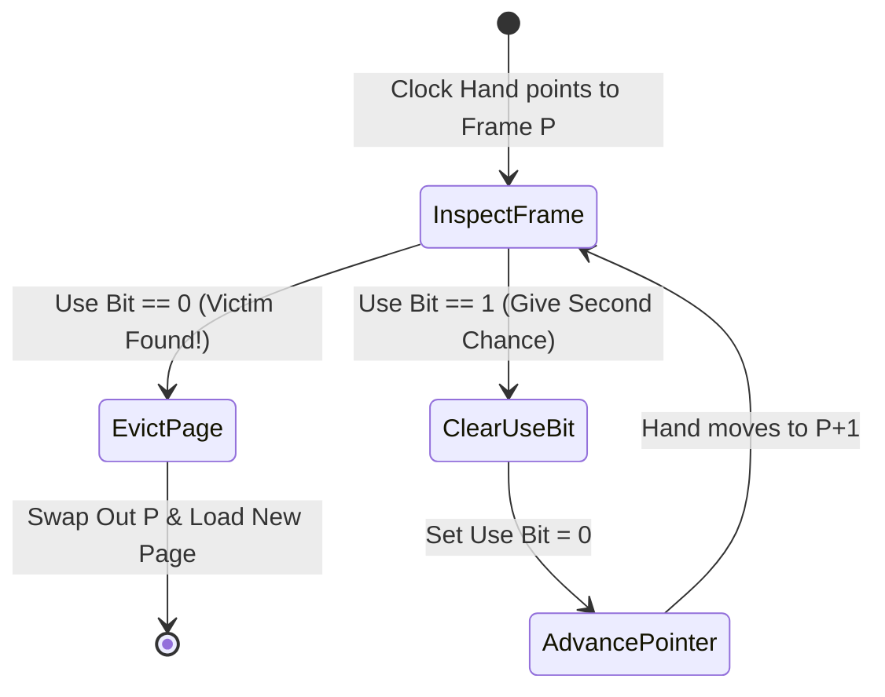

# Chapter 4: Page Replacement Policies & Swapping

When physical RAM is full, the OS swaps inactive physical pages out to storage (**Swap Space**) to free physical frames for active processes.

---

## 📌 Page Fault Handling Flow



---

## 📌 Page Replacement Algorithms

### 1. LRU (Least Recently Used) vs FIFO vs Random
- **FIFO**: Simple, but suffers from Belady's Anomaly (increasing frames can increase page faults!).
- **LRU**: Evicts the page accessed furthest in the past. Requires expensive timestamp tracking on every memory access.
- **Clock Algorithm (Second Chance)**: High-performance approximation of LRU using a 1-bit hardware **Use Bit** (Accessed Bit).

---

## 📌 The Clock Algorithm (Second Chance)

The OS maintains a circular list of physical page frames and a clock hand pointer.



```c
// Clock Algorithm Pseudo-code
int clock_hand = 0;
int select_victim_frame(PageFrame frames[], int num_frames) {
    while (1) {
        if (frames[clock_hand].use_bit == 1) {
            frames[clock_hand].use_bit = 0; // Give second chance, clear use bit!
        } else {
            int victim = clock_hand;
            clock_hand = (clock_hand + 1) % num_frames; // Advance hand
            return victim; // Victim selected!
        }
        clock_hand = (clock_hand + 1) % num_frames;
    }
}
```

---

## 📌 Thrashing

When the combined Working Set of active processes exceeds total physical RAM capacity, the system spends 99% of CPU time swapping pages in and out of disk rather than executing progress (**Thrashing**).

**Solution**: Out-Of-Memory (OOM) Killer or Process Suspension.
