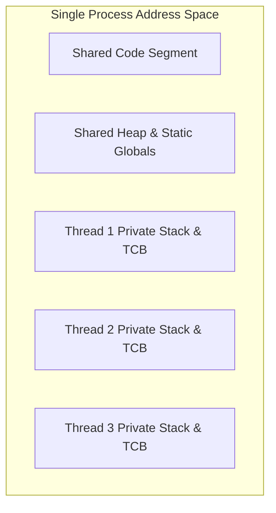
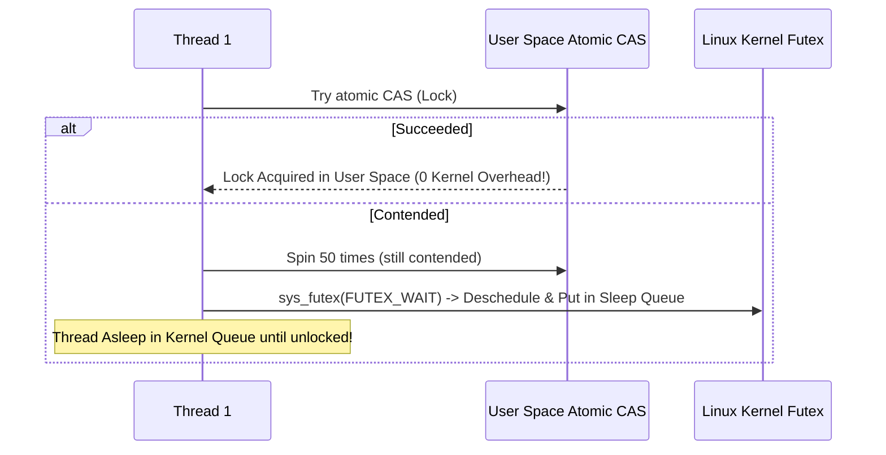

# Chapter 5: Threads, Locks & Hardware Atomic Primitives

A **thread** is an independent execution context sharing the same memory address space (heap, static data, open file descriptors), but having its own private stack and registers.

---

## 📌 Thread vs Process Memory Layout



---

## 📌 POSIX Threads (`pthread`) C Code Example

```c
#include <stdio.h>
#include <pthread.h>

static volatile int counter = 0;
pthread_mutex_t lock = PTHREAD_MUTEX_INITIALIZER;

void *worker(void *arg) {
    for (int i = 0; i < 1000000; i++) {
        pthread_mutex_lock(&lock);
        counter++; // Critical Section protected by mutex
        pthread_mutex_unlock(&lock);
    }
    return NULL;
}

int main() {
    pthread_t p1, p2;
    pthread_create(&p1, NULL, worker, NULL);
    pthread_create(&p2, NULL, worker, NULL);
    pthread_join(p1, NULL);
    pthread_join(p2, NULL);
    printf("Final Counter = %d (Expected 2000000)\n", counter);
    return 0;
}
```

---

## 📌 Hardware Lock Implementations: TAS, CAS, Ticket Lock & Futex

### 1. Test-And-Set (Spin Lock)
```c
// Atomic hardware instruction:
int TestAndSet(int *old_ptr, int new_val) {
    int old = *old_ptr;
    *old_ptr = new_val;
    return old;
}

typedef struct { int flag; } lock_t;

void lock(lock_t *lock) {
    while (TestAndSet(&lock->flag, 1) == 1)
        ; // Spin wait (Burns CPU cycles!)
}

void unlock(lock_t *lock) {
    lock->flag = 0;
}
```

### 2. Compare-And-Swap (CAS Lock)
```c
int CompareAndSwap(int *ptr, int expected, int new_val) {
    int actual = *ptr;
    if (actual == expected) *ptr = new_val;
    return actual;
}
```

### 3. Linux Futex (Two-Phase Hybrid Lock)
Spinning in user space wastes CPU time; sleeping in kernel space incurs context switch overhead. Linux **Futex** (`sys_futex`) combines both:
1. **Phase 1 (User Space Spin)**: Spin 10-100 iterations trying atomic CAS in user space.
2. **Phase 2 (Kernel Futex Sleep)**: If still locked, invoke `futex(addr, FUTEX_WAIT, val)` to put thread on kernel sleep queue.


