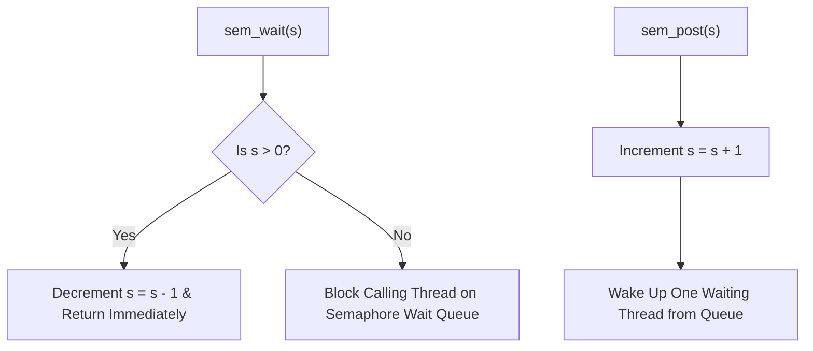

# Chapter 6: Condition Variables & Semaphores

Synchronization primitives for signaling state transitions and managing shared resources.

---

## 📌 Condition Variables & Bounded Buffer Problem

A **Condition Variable** (`pthread_cond_t`) is an explicit queue of threads waiting for a state predicate to become true.

```c
#include <pthread.h>

#define MAX 10
int buffer[MAX];
int fill_ptr = 0, use_ptr = 0, count = 0;

pthread_mutex_t mutex = PTHREAD_MUTEX_INITIALIZER;
pthread_cond_t empty  = PTHREAD_COND_INITIALIZER;
pthread_cond_t fill   = PTHREAD_COND_INITIALIZER;

void put(int val) {
    buffer[fill_ptr] = val;
    fill_ptr = (fill_ptr + 1) % MAX;
    count++;
}

int get() {
    int tmp = buffer[use_ptr];
    use_ptr = (use_ptr + 1) % MAX;
    count--;
    return tmp;
}

void *producer(void *arg) {
    for (int i = 0; i < 100; i++) {
        pthread_mutex_lock(&mutex);
        while (count == MAX) { // ALWAYS USE WHILE LOOP!
            pthread_cond_wait(&empty, &mutex); // Releases mutex & sleeps!
        }
        put(i);
        pthread_cond_signal(&fill); // Signal consumer
        pthread_mutex_unlock(&mutex);
    }
    return NULL;
}

void *consumer(void *arg) {
    for (int i = 0; i < 100; i++) {
        pthread_mutex_lock(&mutex);
        while (count == 0) { // ALWAYS USE WHILE LOOP!
            pthread_cond_wait(&fill, &mutex);
        }
        int val = get();
        pthread_cond_signal(&empty); // Signal producer
        pthread_mutex_unlock(&mutex);
    }
    return NULL;
}
```

---

## 📌 Semaphores (Dijkstra's `sem_t`)

A **Semaphore** is an object with an integer value initialized to a positive count, manipulated via two atomic operations: `sem_wait()` (P / decrement) and `sem_post()` (V / increment).



### 1. Binary Semaphore (Mutex)
Initialized to 1:
```c
sem_t mutex;
sem_init(&mutex, 0, 1); // Binary mutex initialization

sem_wait(&mutex);
// Critical Section...
sem_post(&mutex);
```

### 2. Reader-Writer Lock with Semaphores
```c
typedef struct {
    sem_t lock;      // Binary mutex for reader count update
    sem_t writelock; // Mutex for writer exclusive access
    int readers;     // Number of active readers
} rwlock_t;

void rwlock_acquire_readlock(rwlock_t *rw) {
    sem_wait(&rw->lock);
    rw->readers++;
    if (rw->readers == 1) sem_wait(&rw->writelock); // First reader locks writers out!
    sem_post(&rw->lock);
}

void rwlock_release_readlock(rwlock_t *rw) {
    sem_wait(&rw->lock);
    rw->readers--;
    if (rw->readers == 0) sem_post(&rw->writelock); // Last reader allows writers back in!
    sem_post(&rw->lock);
}
```
