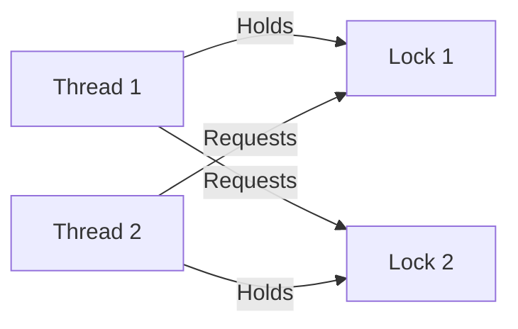
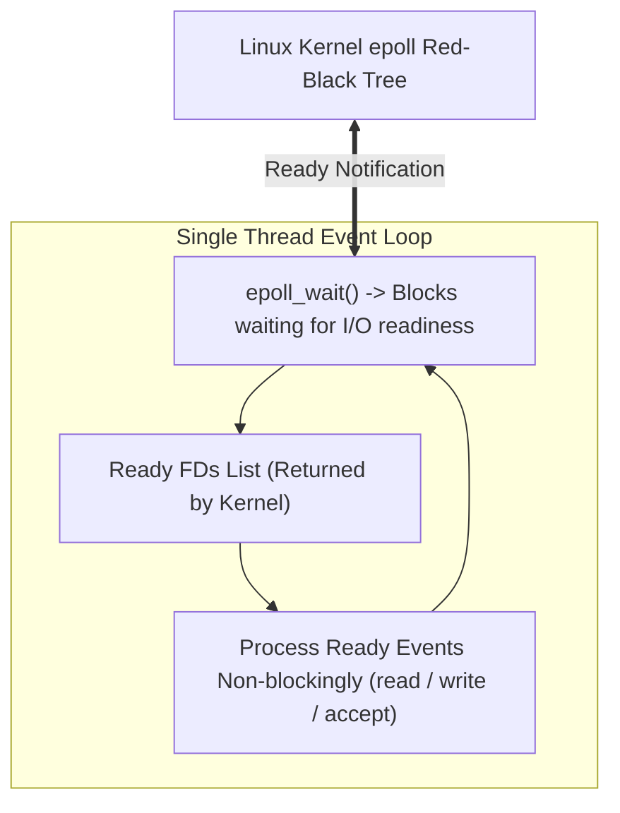

# Chapter 7: Concurrency Bugs & Event-Driven Concurrency (`epoll`)

Analysis of non-deadlock & deadlock concurrency bugs, followed by event-based non-blocking I/O architectures.

---

## 📌 Non-Deadlock & Deadlock Bugs

### 1. Atomicity Violation Bug
- **Symptom**: Code assumes a sequence of reads/writes is atomic when it is not.
- **Fix**: Wrap access in a lock.

### 2. Order Violation Bug
- **Symptom**: Code assumes Thread A runs before Thread B without explicit ordering enforcement.
- **Fix**: Use condition variable or semaphore signaling.

### 3. Deadlock's 4 Necessary Conditions
1. **Mutual Exclusion**: Threads claim exclusive control of resources.
2. **Hold-and-Wait**: Threads hold resources while waiting for additional resources.
3. **No Preemption**: Resources cannot be forcibly taken from a thread.
4. **Circular Wait**: A closed loop of threads exists, each waiting for a resource held by the next.



---

## 📌 Event-Based Concurrency & Linux `epoll` Architecture

Thread-per-connection architectures fail at scale (100,000 connections crash the OS due to memory and context switching overhead). **Event-Driven Architectures** use a single-threaded Event Loop backed by Linux `epoll`.



### High-Performance `epoll` C Code Pattern

```c
#include <sys/epoll.h>
#include <unistd.h>
#include <fcntl.h>

#define MAX_EVENTS 1024

void run_event_loop(int listen_fd) {
    int epoll_fd = epoll_create1(0);
    struct epoll_event ev, events[MAX_EVENTS];

    ev.events = EPOLLIN | EPOLLET; // Edge-triggered read event
    ev.data.fd = listen_fd;
    epoll_ctl(epoll_fd, EPOLL_CTL_ADD, listen_fd, &ev);

    while (1) {
        int nfds = epoll_wait(epoll_fd, events, MAX_EVENTS, -1); // Block until readiness
        for (int n = 0; n < nfds; n++) {
            if (events[n].data.fd == listen_fd) {
                // Accept new connection
                int conn_fd = accept(listen_fd, NULL, NULL);
                fcntl(conn_fd, F_SETFL, O_NONBLOCK); // Set non-blocking!
                ev.events = EPOLLIN | EPOLLET;
                ev.data.fd = conn_fd;
                epoll_ctl(epoll_fd, EPOLL_CTL_ADD, conn_fd, &ev);
            } else {
                // Handle I/O non-blockingly
                char buf[512];
                int bytes = read(events[n].data.fd, buf, sizeof(buf));
                // Process request without blocking...
            }
        }
    }
}
```
