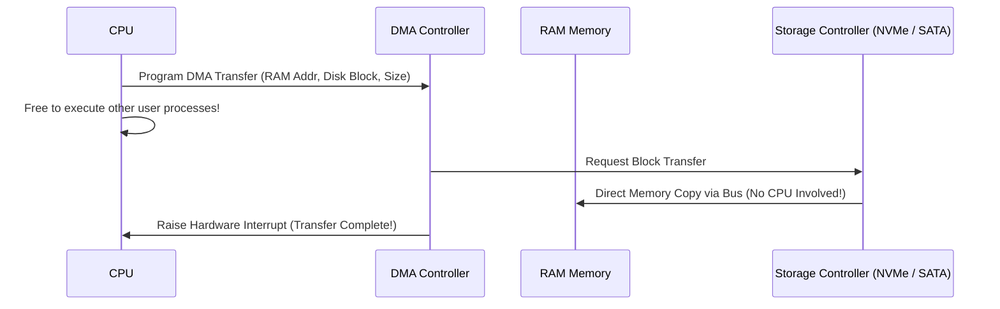
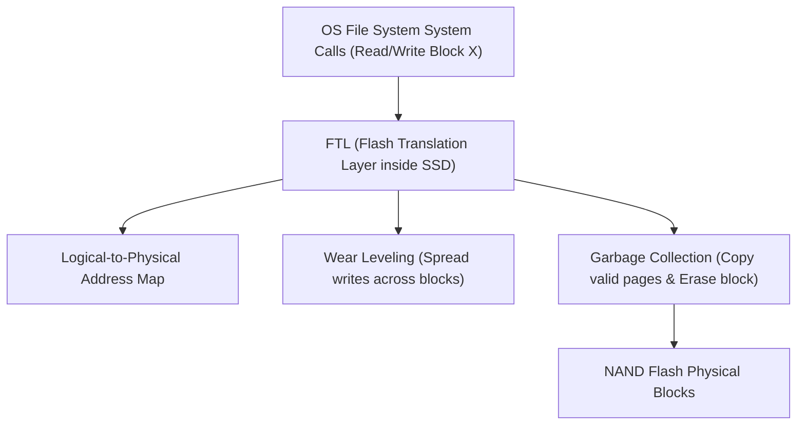

# Chapter 8: I/O Devices, Hard Disk Drives & SSDs

Persistence requires transferring data reliably between RAM and physical non-volatile storage devices.

---

## 📌 Hardware I/O Architecture & DMA (Direct Memory Access)

Without DMA, the CPU must manually copy every byte between RAM and device registers (**Programmed I/O / PIO**), wasting CPU cycles. With **DMA**, the CPU delegates the data transfer to a DMA controller.

---

## 📌 Hard Disk Drive (HDD) Mechanics & Scheduling

- **HDD Geometry**: Read/Write heads fly nanometers above spinning magnetic platters.
- **Latency Formula**: $T_{\text{I/O}} = T_{\text{seek}} + T_{\text{rotational}} + T_{\text{transfer}}$.

### Disk Scheduling Algorithms
1. **SSTF (Shortest Seek Time First)**: Chooses request closest to current track position (may cause starvation for distant tracks).
2. **SCAN (Elevator Algorithm)**: Sweeps back and forth across tracks servicing requests in sweep direction.
3. **C-SCAN (Circular SCAN)**: Sweeps in one direction only, then returns to beginning (uniform wait time).

---

## 📌 Solid State Drives (SSDs) & Flash Translation Layer (FTL)

SSDs use NAND flash memory with no moving parts:
- **Read**: Fast page-level read (4KB - 16KB).
- **Write**: Page-level write, but **can only write to erased pages**!
- **Erase**: Performed at **Block level** (128 - 512 pages per block).

