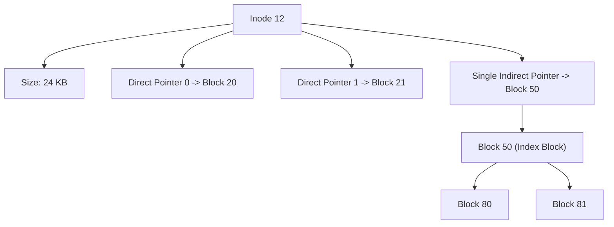

# Chapter 9: Files, Directories & VSFS (Very Simple File System)

File systems organize raw disk blocks into human-readable files, directories, and metadata structures.

---

## 📌 File APIs & File Descriptors (`open`, `read`, `write`, `fsync`)

```c
#include <fcntl.h>
#include <unistd.h>
#include <stdio.h>

int main() {
    int fd = open("output.txt", O_WRONLY | O_CREAT | O_TRUNC, 0644);
    if (fd < 0) return 1;

    write(fd, "Hello OSTEP!\n", 13);
    
    // Force dirty page cache blocks to physical disk storage:
    fsync(fd); 
    
    close(fd);
    return 0;
}
```

---

## 📌 VSFS (Very Simple File System) Disk Layout

```mermaid
flowchart LR
    subgraph Disk Block Layout (e.g. 64 Blocks of 4KB)
        S["Block 0: Superblock"]
        iB["Block 1: Inode Bitmap"]
        dB["Block 2: Data Bitmap"]
        Inodes["Blocks 3..7: Inode Table"]
        Data["Blocks 8..63: Data Blocks"]
    end
```

### 1. Inode Structure (Index Node)
An **Inode** contains all metadata about a file (except its name):
- File size, permissions, owner UID, timestamps.
- **Direct Pointers**: 12 direct block pointers.
- **Single Indirect Pointer**: Points to a disk block containing 1024 direct block pointers.
- **Double Indirect Pointer**: Points to a block of indirect pointers.



### 2. Directory Entry Layout
A **Directory** is simply a special file containing a list of `(name, inode_number)` pairs:

| Inode Number | Record Length | Name Length | Name |
|---|---|---|---|
| 5 | 12 | 1 | `.` |
| 2 | 12 | 2 | `..` |
| 12 | 16 | 6 | `foo.txt` |
