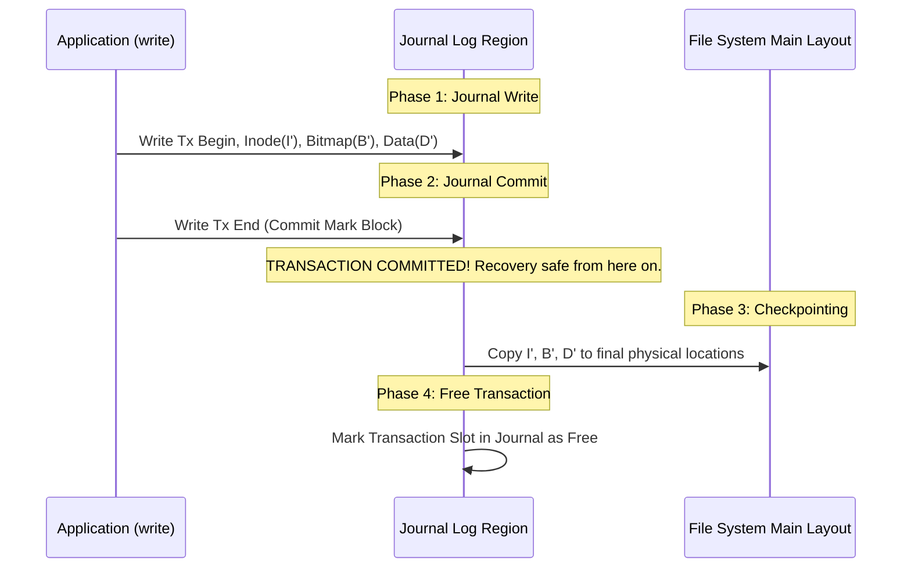

# Chapter 10: Crash Consistency & Journaling (WAL)

Handling system crashes or power outages during multi-block file system updates.

---

## 📌 The Crash Consistency Problem

Appending a block to an existing file requires updating 3 distinct disk blocks:
1. **Inode ($I$)**: Update size and add new block pointer.
2. **Data Bitmap ($B$)**: Mark new block as allocated.
3. **Data Block ($D$)**: Write new user data contents.

If a power failure occurs halfway through these 3 writes, the file system enters an inconsistent corrupted state!

---

## 📌 Journaling (Write-Ahead Logging / WAL)

Instead of overwriting file system structures directly, the OS writes the planned updates to a dedicated sequential **Journal (Log)** region first before applying them to the final location (**Check-pointing**).

### Crash Recovery Protocol
- **Crash before Tx End Commit Mark**: Discard transaction from Journal (No corruption).
- **Crash after Tx End Commit Mark**: Replay transaction blocks from Journal to main file system (**Redo Logging**).

---

## 📌 Log-Structured File Systems (LFS)

Traditional file systems (ext3/VSFS) suffer from random write performance degradation on HDDs/SSDs.

**Log-Structured File System (LFS)** converts ALL writes (inodes, directory entries, data blocks) into sequential buffer appends to a continuous log in memory, periodically flushing massive sequential chunks to disk!

- Uses **Inode Map (imap)** to track dynamic physical locations of inodes.
- Uses **Segment Cleaner** (Garbage Collector) to reclaim fragmented old blocks.
