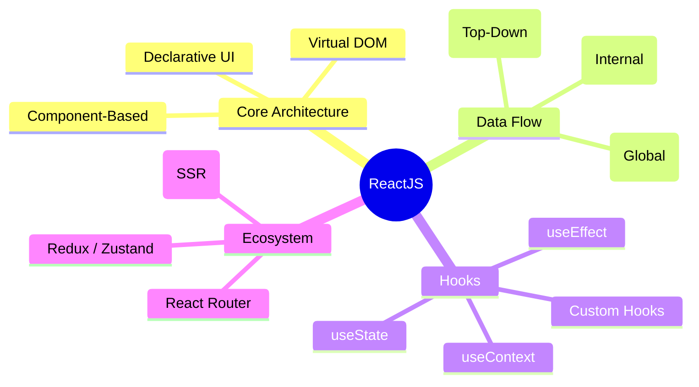

# ReactJS Learning Path

This repository contains a premium, interactive guide to learning ReactJS.

## Mind Map

## Chapters Included
1. **JSX & Components**: Building blocks of React.
2. **Props & State**: Managing data.
3. **Effects**: Handling side-effects and lifecycles.
4. **Context API**: Avoiding prop drilling.
5. **Custom Hooks**: Reusable logic.
