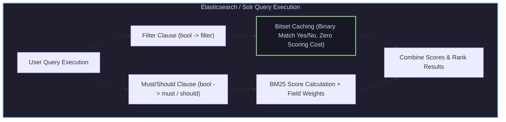

# Solr DisMax, Elasticsearch Multi-Match & Function Score Boosting

## 1. Query Clause Mechanics: Filtering vs Scoring

In Elasticsearch and Solr, query clauses serve two fundamentally distinct architectural roles:



* **Filter Clauses (`filter`, `must_not`)**: Binary YES/NO boolean checks. Bypasses scoring calculations entirely and caches result bitsets in memory.
* **Scoring Clauses (`must`, `should`)**: Computes relevance scores (BM25) and combines them to order documents.

---

## 2. Multi-Match Strategies & DisMax Tie-Breaking

When searching across multiple text fields (e.g., `title^3.0`, `overview^1.0`, `tags^1.5`), query engines resolve field score conflicts using specific multi-match strategies:

```
                                    Multi-Match Strategies
   Strategy Mode                           Scoring Calculation Logic
------------------------------------------------------------------------------------------------------
 best_fields (DisMax)        Score = Max(Field_1, Field_2, ...) + tie_breaker * (Sum of Other Fields)
 most_fields                 Score = Sum(Field_1 + Field_2 + ...)
 cross_fields                Score = Sum_per_term( IDF(term) * Max_field_tf(term) )
```

### 2.1 DisMax (Maximum Disjunction) Tie-Breaker Parameter
The `tie_breaker` parameter ($0.0 \le \text{tie\_breaker} \le 1.0$) controls how secondary field matches contribute to the overall score:
* `tie_breaker = 0.0`: Pure DisMax. Only the single highest scoring field determines document rank.
* `tie_breaker = 0.3`: Recommended balance. Highest scoring field dominates, but documents matching secondary fields receive a 30% score boost.

---

## 3. Function Score Boosting & Gaussian Decay Functions

Search relevance often depends on non-textual signals such as document freshness (recency) or popularity (view counts).

```
Score_final = Score_BM25 * Function_Score(Recency_decay, Popularity_boost)
```

### 3.1 Gaussian Recency Decay Equation
Scales document score down as age increases past a grace period (`offset`):

$$S_{\text{decay}}(t) = \exp \left( -\frac{\max(0, |t - t_0| - \text{offset})^2}{2 \sigma^2} \right)$$

where $\sigma$ is chosen so that $S_{\text{decay}} = \text{decay}$ at $|t - t_0| = \text{scale}$.

---

## 4. Production-Grade C++ Engine: DisMax & Gaussian Decay Relevance Scoring

The following C++ engine implements DisMax multi-field matching with tie-breaking and Gaussian recency decay boosting:

```cpp
#include <iostream>
#include <vector>
#include <string>
#include <unordered_map>
#include <cmath>
#include <algorithm>

struct SearchDocument {
    int id;
    std::string title;
    std::string overview;
    double timestamp_days_ago; // Recency signal
    double popularity_score;   // Popularity signal
};

class DisMaxRelevanceEngine {
private:
    double tie_breaker = 0.3;
    double title_boost = 3.0;
    double overview_boost = 1.0;

    // Decay Parameters
    double scale_days = 30.0;
    double decay_target = 0.5;

public:
    double CalculateGaussianDecay(double days_ago) const {
        double offset = 0.0;
        double delta = std::max(0.0, days_ago - offset);
        double sigma_sq = - (scale_days * scale_days) / (2.0 * std::log(decay_target));
        return std::exp(- (delta * delta) / (2.0 * sigma_sq));
    }

    double CalculateFieldBM25(const std::string& field_text, const std::string& query_term) const {
        // Simplified BM25 simulator per field
        double count = 0;
        size_t pos = 0;
        while ((pos = field_text.find(query_term, pos)) != std::string::npos) {
            count++;
            pos += query_term.length();
        }
        if (count == 0) return 0.0;
        return (count * 2.2) / (count + 1.2);
    }

    double ScoreDocument(const SearchDocument& doc, const std::string& query) const {
        double title_score = CalculateFieldBM25(doc.title, query) * title_boost;
        double overview_score = CalculateFieldBM25(doc.overview, query) * overview_boost;

        // DisMax Calculation
        double max_score = std::max(title_score, overview_score);
        double other_score = (title_score == max_score) ? overview_score : title_score;
        double base_text_score = max_score + tie_breaker * other_score;

        if (base_text_score == 0.0) return 0.0; // Filter non-matching documents

        // Function Score: Recency Decay * Popularity Boost
        double recency_multiplier = CalculateGaussianDecay(doc.timestamp_days_ago);
        double popularity_multiplier = 1.0 + std::log10(1.0 + doc.popularity_score);

        return base_text_score * recency_multiplier * popularity_multiplier;
    }
};

int main() {
    std::vector<SearchDocument> corpus = {
        {1, "distributed systems raft consensus", "deep dive into raft consensus algorithm", 5.0, 100.0},  // Recent & Popular
        {2, "distributed database engine", "raft consensus protocol in distributed storage", 120.0, 500.0}, // Old & Very Popular
        {3, "parallel computer architecture", "gpu simd vectorization", 2.0, 10.0}
    };

    DisMaxRelevanceEngine engine;
    std::string query = "raft";

    std::cout << "Searching for Query: '" << query << "' using DisMax + Gaussian Recency Decay..." << std::endl;

    std::vector<std::pair<int, double>> results;
    for (const auto& doc : corpus) {
        double score = engine.ScoreDocument(doc, query);
        if (score > 0.0) results.push_back({doc.id, score});
    }

    std::sort(results.begin(), results.end(), [](const auto& a, const auto& b) {
        return a.second > b.second;
    });

    for (const auto& [doc_id, score] : results) {
        std::cout << "  Doc ID: " << doc_id << " | Final Score: " << score << std::endl;
    }

    return 0;
}
```

---

## 5. Summary & Key Engineering Principles

1. **Filter vs Scoring Boundary**: Use non-scoring filters for exact metadata constraints to leverage bitset caching.
2. **DisMax Signal Balance**: Use DisMax `best_fields` with a `tie_breaker = 0.3` to allow multi-field matches to boost rank without swamping primary field intent.
3. **Smooth Multiplier Decay**: Gaussian decay functions adjust document relevance smoothly across numeric/date dimensions.
