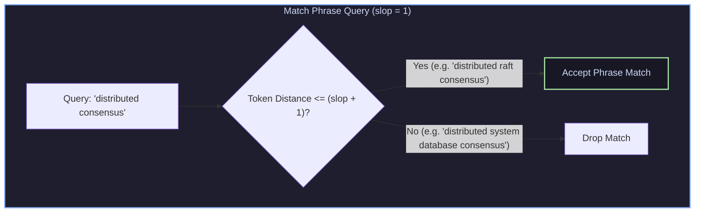
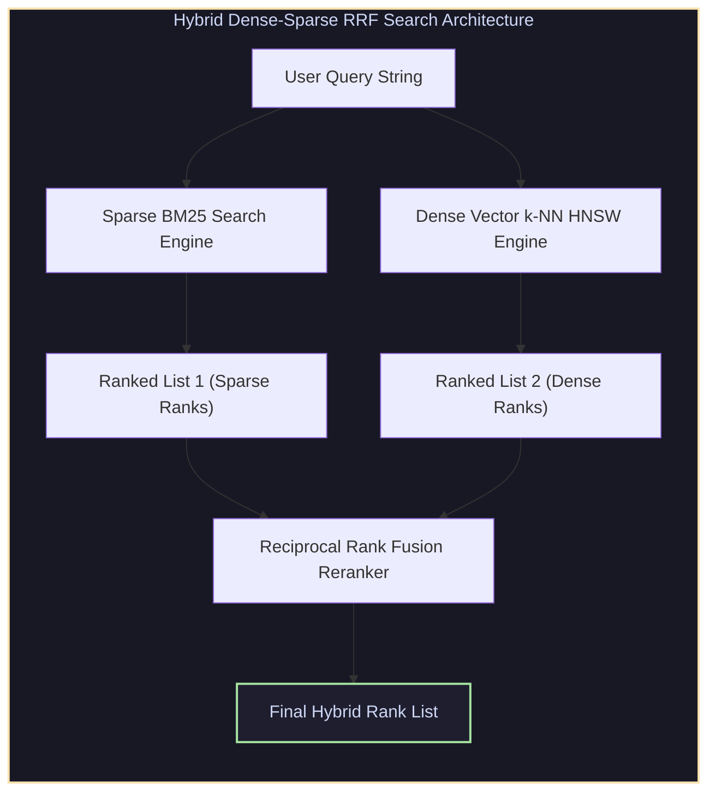

# Phrase Slop, Graph Synonyms & Hybrid Reciprocal Rank Fusion (RRF) Search

## 1. Phrase Matching, Proximity & Slop Tuning

Exact keyword matching fails to capture multi-word concept order. **Phrase Matching** enforces token order and proximity using positional postings.



* **`slop` Parameter**: Specifies allowable position movements. `slop = 0` requires exact contiguous tokens; `slop = 1` permits 1 intervening word; `slop = 2` allows out-of-order term swaps (`"consensus distributed"` $\to$ `"distributed consensus"`).

---

## 2. Synonym Expansion: Index-Time vs Graph Synonyms

Handling domain terminology requires mapping query terms to alternate expressions (e.g., `ML` $\leftrightarrow$ `machine learning`).

```
                    Synonym Expansion Architectures
1. Index-Time Synonyms (Legacy):
   Doc: "ML engineer" ---> Analyzed Tokens: ["ml", "machine", "learning", "engineer"]
   Drawback: Bloats index size; requires full re-indexing to update synonym rules!

2. Query-Time Graph Synonyms (Modern synonym_graph):
   Query: "ML engineer" ---> Graph Token Stream: [ (ml | machine learning), engineer ]
   Advantage: Zero index bloat; updates instantaneously without re-indexing!
```

---

## 3. Hybrid Vector & Keyword Search via Reciprocal Rank Fusion (RRF)

Modern enterprise search combines **Sparse BM25 Keyword Search** (exact entity & ID matching) with **Dense Vector k-NN Embeddings** (semantic concept matching).



### 3.1 Reciprocal Rank Fusion (RRF) Formulation
Because dense cosine distance scores (e.g., $0.82$) and sparse BM25 scores (e.g., $14.5$) exist on incompatible numeric scales, RRF combines them purely using **rank positions**:

$$S_{\text{RRF}}(d) = \sum_{m \in M} \frac{1}{k + r_m(d)}$$

where $r_m(d)$ is the 1-based rank index of document $d$ in result list $m$, and $k \approx 60$ is a smoothing constant.

---

## 4. Production-Grade C++ Engine: Hybrid Vector/BM25 Search with RRF Fusion

The following C++ engine implements hybrid sparse-dense retrieval and Reciprocal Rank Fusion (RRF):

```cpp
#include <iostream>
#include <vector>
#include <string>
#include <unordered_map>
#include <algorithm>
#include <cmath>

struct SearchResult {
    int doc_id;
    double raw_score;
    int rank;
};

class HybridRRFSearchEngine {
private:
    static constexpr int RRF_K = 60; // Standard RRF smoothing constant

public:
    static std::vector<std::pair<int, double>> ReciprocalRankFusion(
        const std::vector<SearchResult>& sparse_ranks,
        const std::vector<SearchResult>& dense_ranks,
        int top_k = 5) {

        std::unordered_map<int, double> rrf_scores;

        // Process Sparse BM25 Ranks
        for (const auto& item : sparse_ranks) {
            rrf_scores[item.doc_id] += 1.0 / (RRF_K + item.rank);
        }

        // Process Dense Vector Ranks
        for (const auto& item : dense_ranks) {
            rrf_scores[item.doc_id] += 1.0 / (RRF_K + item.rank);
        }

        std::vector<std::pair<int, double>> combined(rrf_scores.begin(), rrf_scores.end());
        std::sort(combined.begin(), combined.end(), [](const auto& a, const auto& b) {
            return a.second > b.second;
        });

        if (combined.size() > static_cast<size_t>(top_k)) combined.resize(top_k);
        return combined;
    }
};

int main() {
    // Simulated Sparse BM25 Search Results
    std::vector<SearchResult> sparse_results = {
        {101, 14.5, 1}, // Doc 101 ranked #1 in BM25
        {102, 11.2, 2}, // Doc 102 ranked #2 in BM25
        {103,  8.4, 3}  // Doc 103 ranked #3 in BM25
    };

    // Simulated Dense Vector k-NN Search Results
    std::vector<SearchResult> dense_results = {
        {103, 0.95, 1}, // Doc 103 ranked #1 in Dense Vector
        {101, 0.88, 2}, // Doc 101 ranked #2 in Dense Vector
        {104, 0.81, 3}  // Doc 104 ranked #3 in Dense Vector
    };

    std::cout << "Executing Hybrid Reciprocal Rank Fusion (RRF)..." << std::endl;
    auto final_reranked = HybridRRFSearchEngine::ReciprocalRankFusion(sparse_results, dense_results);

    for (const auto& [doc_id, rrf_score] : final_reranked) {
        std::cout << "  Doc ID: " << doc_id << " | RRF Combined Score: " << rrf_score << std::endl;
    }

    return 0;
}
```

---

## 5. Summary & Key Engineering Principles

1. **Query-Time Graph Synonyms**: Use `synonym_graph` at query time to prevent index bloat and enable instant synonym update propagation.
2. **Phrase Slop Control**: Use `match_phrase` with `slop = 1` for soft proximity matching without dropping relevant near-matches.
3. **Scale-Agnostic RRF Fusion**: Reciprocal Rank Fusion combines vector embeddings and BM25 keywords robustly without requiring score normalization.
