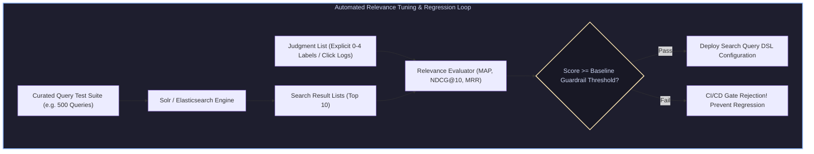

# Relevance Testing (QuePID), Click Analytics & Automated Regression Gates

## 1. Relevance Testing Frameworks & QuePID Methodology

Engineering search relevance requires moving away from anecdotal query testing toward **Automated Relevance Testing Frameworks** (such as QuePID and Splainer).



### 1.1 Judgment List Formats
A **Judgment List** maps `(Query, Document)` pairs to relevance ratings ($0 = \text{Irrelevant} \dots 4 = \text{Perfect Match}$):

```
# Query              DocID    Relevance Label
distributed raft     doc_101  4
distributed raft     doc_102  3
distributed raft     doc_500  0
```

---

## 2. Search Analytics & Click Models

While explicit human judgments are accurate, they are expensive to scale. **Search Click Models** extract implicit relevance signals from user interaction logs:

### 2.1 Position Bias Correction
Users click higher-ranked search results simply because they appear at the top of the SERP (**Position Bias**). 

The **Dynamic Bayesian Network (DBN) Click Model** decouples Examination Probability ($E_i$) from Attractiveness ($A_i$):

$$P(\text{Click}_i = 1) = P(E_i = 1) \times P(A_i = 1)$$

$$\text{Attractiveness Score } A_i \approx \frac{\text{Observed Clicks at Rank } i}{\text{Expected Examination Probability } E_i}$$

---

## 3. Automated Relevance Regression Testing in CI/CD

To prevent query tuning regressions (where fixing query $A$ degrades performance on queries $B \dots Z$), relevance tests run as automated unit test gates in CI/CD pipelines:

```cpp
TEST(SearchRelevance, NDCG_Guardrail) {
    auto test_suite = LoadQueryTestCollection("test_queries.json");
    double current_ndcg = EvaluateSearchEngine(test_suite);
    double baseline_ndcg = 0.78; // Minimum threshold
    
    EXPECT_GE(current_ndcg, baseline_ndcg) 
        << "Search Relevance Regression Detected! NDCG dropped below baseline.";
}
```

---

## 4. Production-Grade C++ Engine: Relevance Evaluation & Click Model Analytics

The following C++ engine calculates position-bias corrected click relevance scores and enforces NDCG@K regression gates:

```cpp
#include <iostream>
#include <vector>
#include <string>
#include <unordered_map>
#include <cmath>
#include <algorithm>
#include <cassert>

struct QueryJudgment {
    std::string query;
    std::unordered_map<int, int> doc_relevance; // DocID -> Label (0-4)
};

struct ClickLog {
    int doc_id;
    int rank_position;
    int clicks;
    int impressions;
};

class RelevanceAnalyticsEngine {
public:
    // 1. Position Bias Corrected Attractiveness Score
    static double CalculateCorrectedRelevance(const ClickLog& log) {
        // Examination probability estimate: E(rank) = 1.0 / sqrt(rank)
        double exam_prob = 1.0 / std::sqrt(log.rank_position);
        double ctr = static_cast<double>(log.clicks) / std::max(1, log.impressions);
        
        // Corrected Attractiveness = CTR / Examination_Probability
        return std::min(4.0, (ctr / exam_prob) * 4.0); // Scale to 0-4 label
    }

    // 2. Evaluate Query NDCG@K
    static double EvaluateNDCG(const std::vector<int>& retrieved_docs, 
                               const std::unordered_map<int, int>& judgments, 
                               int k = 5) {
        double dcg = 0.0;
        int eval_k = std::min(static_cast<int>(retrieved_docs.size()), k);

        for (int i = 0; i < eval_k; ++i) {
            int doc_id = retrieved_docs[i];
            int rel = judgments.count(doc_id) ? judgments.at(doc_id) : 0;
            dcg += (std::pow(2, rel) - 1.0) / std::log2(i + 2);
        }

        std::vector<int> ideal_rels;
        for (const auto& [doc_id, rel] : judgments) ideal_rels.push_back(rel);
        std::sort(ideal_rels.rbegin(), ideal_rels.rend());

        double idcg = 0.0;
        int ideal_k = std::min(static_cast<int>(ideal_rels.size()), k);
        for (int i = 0; i < ideal_k; ++i) {
            idcg += (std::pow(2, ideal_rels[i]) - 1.0) / std::log2(i + 2);
        }

        return (idcg > 0.0) ? (dcg / idcg) : 0.0;
    }
};

int main() {
    std::cout << "--- 1. Position Bias Click Analytics ---" << std::endl;
    ClickLog log_doc101{101, 1, 120, 1000}; // Rank 1 (High Examination)
    ClickLog log_doc102{102, 5, 80, 1000};  // Rank 5 (Low Examination)

    std::cout << "Doc 101 (Rank 1) Corrected Score: " 
              << RelevanceAnalyticsEngine::CalculateCorrectedRelevance(log_doc101) << std::endl;
    std::cout << "Doc 102 (Rank 5) Corrected Score: " 
              << RelevanceAnalyticsEngine::CalculateCorrectedRelevance(log_doc102) << std::endl;

    std::cout << "\n--- 2. Automated Relevance Regression Gate Test ---" << std::endl;
    QueryJudgment q1{"distributed consensus", {{101, 4}, {102, 3}, {103, 0}}};
    std::vector<int> current_serp = {101, 102, 103};

    double current_ndcg = RelevanceAnalyticsEngine::EvaluateNDCG(current_serp, q1.doc_relevance, 3);
    double baseline_ndcg = 0.85;

    std::cout << "Current Search NDCG@3: " << current_ndcg 
              << " | Baseline Guardrail: " << baseline_ndcg << std::endl;

    if (current_ndcg >= baseline_ndcg) {
        std::cout << "[CI/CD GATE PASS] Search Relevance Check Succeeded!" << std::endl;
    } else {
        std::cout << "[CI/CD GATE FAIL] Relevance Regression Detected!" << std::endl;
    }

    return 0;
}
```

---

## 5. Summary & Key Engineering Principles

1. **Automated Test Collections**: Replace manual ad-hoc searching with curated query-judgment test suites.
2. **Position Bias Correction**: Divide observed Click-Through Rates by examination probabilities to extract genuine document attractiveness.
3. **CI/CD Relevance Guardrails**: Enforce NDCG@K regression gates in continuous integration to catch query tuning side-effects before deployment.
