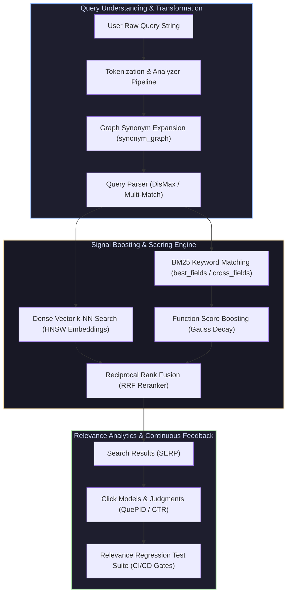

# Relevant Search: With Applications for Solr and Elasticsearch

Welcome to the **Relevant Search Masterclass Module**. This module covers search relevance engineering, Solr (DisMax/eDisMax) and Elasticsearch Query DSL tuning, multi-field matching strategies, phrase proximity slop, index/query-time graph synonyms, hybrid vector/keyword search with Reciprocal Rank Fusion (RRF), relevance judgments, and click analytics (QuePID framework).

---

## 1. Search Relevance Engineering Architecture

---

## 2. Module Navigation Map

| File | Description | Core Topics |
| :--- | :--- | :--- |
| **[`00_relevant_search_cheatsheet.md`](00_relevant_search_cheatsheet.md)** | 30-Second Relevance Cheatsheet | Multi-match modes matrix (`best_fields`, `cross_fields`), Function Score decay formulas, RRF equation, Slop proximity math, Synonym rules, QuePID formulas. |
| **[`01_solr_elasticsearch_query_tuning.md`](01_query_parsing_multi_match_and_boosting/01_solr_elasticsearch_query_tuning.md)** | Query Parsing, Multi-Match & Boosting | DisMax tie-breaker, `cross_fields` matching, Function score queries, Gaussian decay functions, Complete C++ DisMax & Decay Scoring Engine, Mermaid diagram. |
| **[`02_phrase_slop_synonyms_and_rrf_hybrid.md`](02_phrase_matching_synonyms_and_semantic_hybrid_search/02_phrase_slop_synonyms_and_rrf_hybrid.md)** | Phrase Slop, Synonyms & Hybrid RRF Search | Match phrase queries, `slop` edit distance, Graph Synonym Filters, Dense Vector k-NN + BM25 Hybrid Search via Reciprocal Rank Fusion (RRF), Complete C++ Hybrid RRF Engine, Mermaid diagram. |
| **[`03_quepid_judgments_click_models_and_regression.md`](03_relevance_testing_judgments_and_click_analytics/03_quepid_judgments_click_models_and_regression.md)** | Relevance Testing & Click Analytics | Human Judgments, QuePID test suite, Click-Through Rate (CTR) click models, Position bias correction, Continuous Relevance Regression Testing, Complete C++ Judgment Engine, Mermaid diagram. |

---

## 3. Key Relevance Engineering Rules

1. **Signal Separation**: Decouple query matches into specific signals (e.g., exact title match vs category match vs description match) rather than searching a single concatenated text field.
2. **DisMax vs Most-Fields**: Use `best_fields` (DisMax) when fields represent alternative views of the same data (title vs description) to avoid over-rewarding multi-field matches; use `most_fields` when accumulating distinct signals.
3. **Reciprocal Rank Fusion (RRF)**: Combines dense vector similarity scores and sparse keyword BM25 scores robustly without requiring scale normalization:
   $$RRF\_Score(d) = \sum_{m \in M} \frac{1}{k + r_m(d)} \quad (\text{typically } k = 60)$$
