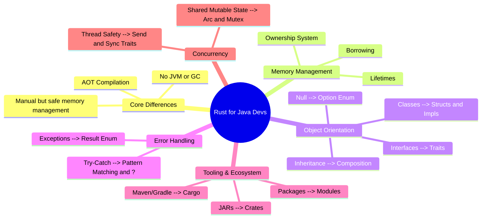

# Rust for Java Programmers: Learning Path

This guide is designed to leverage your existing Java knowledge to accelerate your Rust learning journey. It highlights the major paradigm shifts and maps familiar Java concepts to their Rust equivalents.

## Mind Map: The Paradigm Shift

Here is a visual map of how Java concepts translate to Rust:

## Quick Chapters Learning Path

Follow these chapters for a structured, fast-tracked transition to Rust.

### Chapter 1: The Build System (Maven/Gradle vs. Cargo)
*   **Java:** You use Maven or Gradle to manage dependencies (`pom.xml` / `build.gradle`) and build your project.
*   **Rust:** Meet **Cargo**. It is Rust's combined build system and package manager.
*   **Actionable:** Learn `cargo new`, `cargo build`, `cargo run`, and how to add dependencies (called **crates**) to your `Cargo.toml`.

### Chapter 2: Variables, Mutability, and Strings
*   **Java:** Variables are mutable by default. Objects are references. `String` is the standard text type.
*   **Rust:** Variables are **immutable by default** (`let`). You must explicitly use `let mut` for mutable variables.
*   **Actionable:** Understand the difference between stack and heap allocation. Learn the crucial difference between the owned `String` and the borrowed string slice `&str`.

### Chapter 3: The Big Shift - Ownership and Borrowing
*   **Java:** The Garbage Collector (GC) cleans up memory when objects are no longer referenced.
*   **Rust:** Rust has **no GC**. It uses **Ownership**. Each value has a single "owner". When the owner goes out of scope, the memory is immediately freed.
*   **Actionable:** This is the steepest learning curve. Learn the three rules of ownership. Learn how to "borrow" values using references (`&` and `&mut`) to pass data without transferring ownership, and understand the borrow checker's rules (you can have multiple immutable borrows OR one mutable borrow, but not both at the same time).

### Chapter 4: Data Structures (Classes vs. Structs & Enums)
*   **Java:** Everything revolves around `class`. Enums are simple named constants.
*   **Rust:** Data and behavior are separated. You define data layouts using **Structs**. Rust **Enums** are incredibly powerful "Algebraic Data Types" that can hold different types of data in each variant.
*   **Actionable:** Create structs. Learn to implement methods for structs using `impl` blocks. Master enums, especially the built-in `Option` (replacing `null`) and `Result` (replacing exceptions).

### Chapter 5: Control Flow and Pattern Matching
*   **Java:** `if`, `for`, `while`, and `switch`.
*   **Rust:** Rust has standard loops, but its superpower is the **`match` statement**.
*   **Actionable:** Learn how `match` forces exhaustive checking, making sure you handle every possible case of an Enum (like handling both `Some` and `None` for an `Option`).

### Chapter 6: Polymorphism (Interfaces vs. Traits)
*   **Java:** You use `interface` for abstraction and `extends` for inheritance.
*   **Rust:** Rust does not have class inheritance. Instead, it uses **Traits** (similar to interfaces) to define shared behavior. You favor composition over inheritance.
*   **Actionable:** Define traits and implement them for your structs. Learn about Trait Bounds to restrict generic types.

### Chapter 7: Error Handling (Exceptions vs. Result)
*   **Java:** You `throw` and `catch` Exceptions.
*   **Rust:** Rust doesn't use exceptions for recoverable errors. It returns a **`Result<T, E>`** enum (either `Ok(value)` or `Err(error)`).
*   **Actionable:** Learn to handle `Result` using pattern matching. Master the **`?` operator**, which cleanly propagates errors up the call stack without verbose try-catch blocks.

### Chapter 8: Fearless Concurrency
*   **Java:** Concurrency involves `Thread`, `Runnable`, `synchronized` blocks, and volatile variables. It's easy to create data races.
*   **Rust:** Rust's ownership rules apply to threads too. If code compiles, it is practically guaranteed to be free of data races.
*   **Actionable:** Learn to spawn threads. Understand how to safely share state across threads using `Arc` (Atomic Reference Counted pointer) and `Mutex` (Mutual Exclusion).

### Chapter 9: The Ecosystem and Modules
*   **Java:** Packages and imports.
*   **Rust:** Modules (`mod`), crates, and workspaces.
*   **Actionable:** Learn how to structure larger projects into multiple files and modules, manage visibility (`pub`), and explore `crates.io` for open-source libraries.
