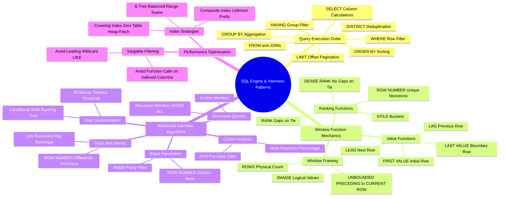

# SQL Architecture & Interview Mind Map

This document presents a structured visual and conceptual breakdown of SQL query execution, window functions, indexing, and interview problem patterns.

---

## 1. Visual Taxonomy

---

## 2. Component Reference Table

| Component | Execution Phase | Common Interview Pitfalls |
| :--- | :--- | :--- |
| **`WHERE` vs `HAVING`** | `WHERE` filters before aggregation; `HAVING` filters after. | Using `WHERE` on aggregated aliases (`COUNT(*) > 5`). |
| **`RANK()` vs `DENSE_RANK()`** | `RANK()` skips rank numbers on ties (1, 2, 2, 4); `DENSE_RANK()` does not skip (1, 2, 2, 3). | Selecting the wrong function when calculating 2nd highest salary. |
| **Window Frame `ROWS`** | Defines physical row boundaries (`ROWS BETWEEN UNBOUNDED PRECEDING AND CURRENT ROW`). | Default frame behavior without `ORDER BY` vs with `ORDER BY`. |
| **Recursive CTE** | Executes iterative union loop until no new rows are returned. | Forgetting termination condition causing infinite recursion loop. |
| **`NULL` Comparison** | Three-valued logic (`TRUE`, `FALSE`, `UNKNOWN`). `NULL = NULL` is `UNKNOWN` (evaluates to false). | Using `= NULL` instead of `IS NULL` or `IS NOT DISTINCT FROM`. |
