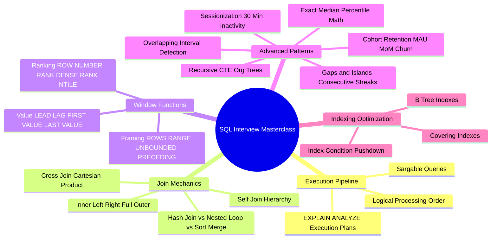

# SQL Masterclass & FAANG Interview Prep Guide

Welcome to the **SQL Masterclass & FAANG Interview Preparation Suite**. This directory contains structured SQL benchmarks, query execution order theory, window function mechanics, performance tuning guides, and complete FAANG/Staff-level SQL interview problem patterns with DDL schemas, sample data, and step-by-step CTE solutions.

---

## 1. Executive Summary & Logical Query Processing

Writing high-performance SQL requires understanding how the database query optimizer evaluates your SQL queries.

```
 Execution Order (Logical Query Processing):
 1. FROM        → Identify base tables and execute JOINs.
 2. WHERE       → Filter raw rows (executed BEFORE aggregation).
 3. GROUP BY    → Group rows into summary buckets.
 4. HAVING      → Filter aggregated groups (executed AFTER aggregation).
 5. SELECT      → Compute expressions, evaluate window functions, assign column aliases.
 6. DISTINCT    → Eliminate duplicate output rows.
 7. ORDER BY    → Sort final result set (Can use SELECT aliases).
 8. LIMIT       → Truncate result payload (Pagination).
```

---

## 2. Interactive Architecture Mind Map



---

## 3. Study Guide File Index

| File | Level | Focus Areas |
| :--- | :--- | :--- |
| **[00: Recommended Resources](00_Recommended_Books_and_Resources.md)** | Reference | Books (*SQL for Data Analysis*, *High-Performance MySQL*), LeetCode SQL 50, Stratascratch |
| **[00: Architecture Mind Map](00_SQL_MindMap.md)** | Visual | Mind map of query execution order, window framing, indexing, and interview patterns |
| **[00: Syntax Cheatsheet](00_syntax_cheatsheet.md)** | Theory | Full syntax reference, window frames (`ROWS BETWEEN`), index optimization, three-valued NULL logic |
| **[01: Easy Benchmarks](01_easy.sql)** | Easy | Basic filtering, aggregation, simple joins, string functions |
| **[02: Medium Benchmarks](02_medium.sql)** | Medium | Window functions, subqueries, self-joins, conditional aggregation (`CASE WHEN`) |
| **[03: Hard Benchmarks](03_hard.sql)** | Hard | Advanced window framing, complex multi-join CTEs, pivoting |
| **[04: Google-Level Problems](04_google_level.sql)** | Google / Meta | Real FAANG interview questions: user growth, transaction logs, streaming calculations |
| **[05: FAANG Staff Interview Patterns](05_faang_staff_interview_patterns.sql)** | Staff / Principal | **The Master Suite:** Gaps & Islands, User Sessionization, Cohort Retention, Recursive CTE Trees, Exact Medians, Overlapping Intervals |

---

## 4. Quick Links & Navigation

* Return to [Master Repository Index](../README.md)
* Next File: **[00: Syntax Cheatsheet](00_syntax_cheatsheet.md)**
