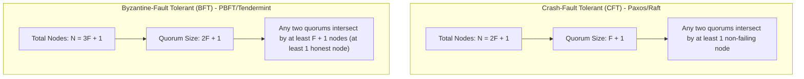

# 00. Stanford CS244B Cheatsheet & Theoretical Foundations

A high-density reference guide summarizing graduate-level distributed systems theory, consensus quorum bounds, and cryptographic primitives from Stanford CS244B.

---

## ⚖️ Distributed Consensus Protocol Taxonomy

| Protocol | Fault Model | Network Model | Quorum Requirement | Membership | Primary Advantage |
| :--- | :--- | :--- | :--- | :--- | :--- |
| **Paxos / Raft** | Crash-Stop / Crash-Recovery | Partially Synchronous | $N \ge 2F + 1$ (Quorum: $F+1$) | Closed (Statically configured) | Simple state machine replication, low overhead |
| **PBFT (Castro & Liskov)** | Byzantine (Malicious/Arbitrary) | Partially Synchronous | $N \ge 3F + 1$ (Quorum: $2F+1$) | Closed (Known node set) | Tolerates malicious nodes without Proof-of-Work |
| **Stellar (SCP / FBA)** | Federated Byzantine | Asynchronous / Open | Federated Quorum Slices | Open (Dynamic individual trust choices) | High throughput, flexible trust, low latency |
| **Nakamoto (Bitcoin)** | Byzantine | Synchronous / P2P | $> 50\%$ Hash Rate | Open (Permissionless) | Fully decentralized, resists Sybil attacks |

---

## 🧮 Quorum Math: Crash vs Byzantine Bounds

---

## 🔐 Cryptographic Primitives in CS244B

### 1. Shamir's $(k, n)$ Secret Sharing
Splits a secret integer $S$ into $n$ distinct shares such that:
- Any $k$ or more shares can reconstruct $S$ via Lagrange Polynomial Interpolation.
- Any $k - 1$ or fewer shares reveal **zero information** about $S$.

### 2. Threshold Signatures
Allows a group of $n$ nodes to generate a single joint digital signature that verifies if at least $k$ nodes participated, hiding individual signers.

### 3. Merkle Trees & Cryptographic Accumulators
Enables efficient $O(\log N)$ verification of data inclusion in P2P storage networks (Chord, BitTorrent) without transferring the full dataset.
