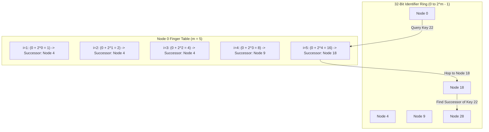
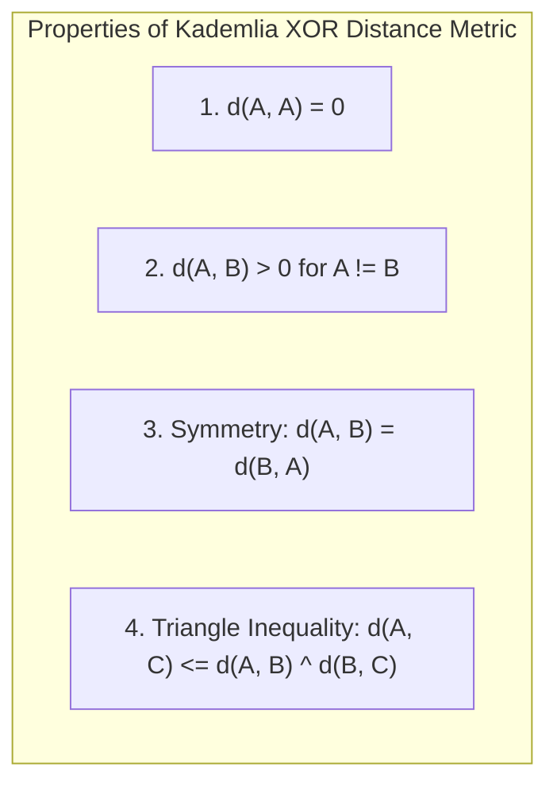

# 01. Peer-to-Peer DHTs: Chord & Kademlia

This chapter covers Peer-to-Peer Distributed Hash Tables (DHTs): the **Chord** protocol ($O(\log N)$ lookup via Finger Tables) and **Kademlia** (XOR metric distance).

---

## ⭕ Chord DHT Finger Table Routing

Chord arranges nodes in a 32-bit (or $m$-bit) identifier ring. Each node maintains a **Finger Table** with $m$ entries, where the $i$-th entry points to the first node that succeeds $\text{node.id} + 2^{i-1} \pmod{2^m}$.



---

## 🌲 Kademlia XOR Metric Distance

Kademlia measures the distance between two 160-bit identifiers $A$ and $B$ using the bitwise **XOR** operator:
$$d(A, B) = A \oplus B$$



---

## 🐹 Production Go Implementation: Chord DHT Node & Finger Table Router

```go
package chord

import (
	"fmt"
	"math"
	"sync"
)

const M = 5 // 5-bit Identifier Space (0..31)

type Finger struct {
	Start int
	Node  *ChordNode
}

type ChordNode struct {
	mu          sync.Mutex
	ID          int
	Successor   *ChordNode
	Predecessor *ChordNode
	FingerTable [M]Finger
	storage     map[int]string
}

func NewChordNode(id int) *ChordNode {
	node := &ChordNode{
		ID:      id,
		storage: make(map[int]string),
	}
	node.Successor = node
	node.Predecessor = node

	for i := 0; i < M; i++ {
		start := (id + int(math.Pow(2, float64(i)))) % int(math.Pow(2, float64(M)))
		node.FingerTable[i] = Finger{
			Start: start,
			Node:  node,
		}
	}
	return node
}

/**
 * Finds the successor node responsible for the given key ID in O(log N) hops.
 */
func (n *ChordNode) FindSuccessor(keyID int) *ChordNode {
	n.mu.Lock()
	defer n.mu.Unlock()

	// If key is between n.ID and n.Successor.ID, return n.Successor
	if isBetween(keyID, n.ID, n.Successor.ID, true) {
		return n.Successor
	}

	// Otherwise, forward request to the closest preceding finger in finger table
	closestNode := n.closestPrecedingFinger(keyID)
	if closestNode.ID == n.ID {
		return n.Successor
	}

	return closestNode.FindSuccessor(keyID)
}

func (n *ChordNode) closestPrecedingFinger(keyID int) *ChordNode {
	for i := M - 1; i >= 0; i-- {
		fingerNode := n.FingerTable[i].Node
		if fingerNode != nil && isBetween(fingerNode.ID, n.ID, keyID, false) {
			return fingerNode
		}
	}
	return n
}

/**
 * Periodically called to verify and stabilize successor and predecessor pointers.
 */
func (n *ChordNode) Stabilize() {
	n.mu.Lock()
	defer n.mu.Unlock()

	x := n.Successor.Predecessor
	if x != nil && isBetween(x.ID, n.ID, n.Successor.ID, false) {
		n.Successor = x
	}
	n.Successor.notify(n)
}

func (n *ChordNode) notify(possiblePredecessor *ChordNode) {
	if n.Predecessor == nil || isBetween(possiblePredecessor.ID, n.Predecessor.ID, n.ID, false) {
		n.Predecessor = possiblePredecessor
	}
}

// Helper function to check if val is inside (start, end) or (start, end] modulo 2^M
func isBetween(val, start, end int, inclusiveEnd bool) bool {
	if start < end {
		if inclusiveEnd {
			return val > start && val <= end
		}
		return val > start && val < end
	} else { // Wraps around ring
		if inclusiveEnd {
			return val > start || val <= end
		}
		return val > start || val < end
	}
}
```
