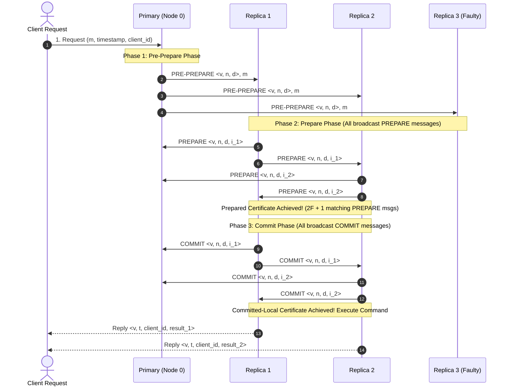
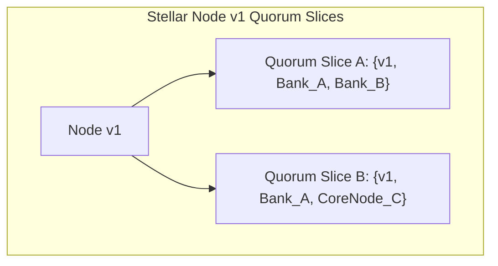

# 02. PBFT & Federated Byzantine Agreement (Stellar SCP)

This chapter covers Practical Byzantine Fault Tolerance (PBFT) and the Stellar Consensus Protocol (SCP) / Federated Byzantine Agreement (FBA).

---

## 🛡️ PBFT 3-Phase Message Protocol

Castro and Liskov's **PBFT** protocol achieves consensus in a closed network of $N \ge 3F + 1$ nodes facing up to $F$ Byzantine (arbitrary or malicious) faulty nodes.



---

## 🌟 Federated Byzantine Agreement (Stellar Consensus Protocol)

Unlike closed BFT protocols requiring a central authority to define all $N$ participants, **FBA/SCP** allows open membership where every node defines its own **Quorum Slices**.



> **Quorum Intersection Property**: Two quorum slices intersect if they share at least one honest node, preventing system-wide split-brain partitioning.

---

## 🐹 Production Go Implementation: PBFT 3-Phase State Machine

```go
package pbft

import (
	"crypto/sha256"
	"encoding/hex"
	"fmt"
	"sync"
)

type MessageType int

const (
	PrePrepare MessageType = iota
	Prepare
	Commit
)

type PBFTMessage struct {
	Type           MessageType
	View           int
	SequenceNum    int
	Digest         string
	NodeID         int
	RequestPayload string
}

type PBFTNode struct {
	mu             sync.Mutex
	NodeID         int
	F              int // Max faulty nodes tolerated
	N              int // Total nodes (N >= 3F + 1)
	View           int
	sequence       int
	prepareMsgs    map[string]map[int]bool // Digest -> NodeID -> Received
	commitMsgs     map[string]map[int]bool // Digest -> NodeID -> Received
	isPreCommitted map[string]bool
	isCommitted    map[string]bool
}

func NewPBFTNode(nodeID int, f int) *PBFTNode {
	return &PBFTNode{
		NodeID:         nodeID,
		F:              f,
		N:              3*f + 1,
		View:           0,
		prepareMsgs:    make(map[string]map[int]bool),
		commitMsgs:     make(map[string]map[int]bool),
		isPreCommitted: make(map[string]bool),
		isCommitted:    make(map[string]bool),
	}
}

func (n *PBFTNode) CalculateDigest(payload string) string {
	hash := sha256.Sum256([]byte(payload))
	return hex.EncodeToString(hash[:])
}

func (n *PBFTNode) HandlePrePrepare(msg PBFTMessage) *PBFTMessage {
	n.mu.Lock()
	defer n.mu.Unlock()

	expectedDigest := n.CalculateDigest(msg.RequestPayload)
	if msg.Digest != expectedDigest || msg.View != n.View {
		return nil // Reject invalid pre-prepare
	}

	n.isPreCommitted[msg.Digest] = true

	// Generate Prepare message to broadcast
	return &PBFTMessage{
		Type:        Prepare,
		View:        n.View,
		SequenceNum: msg.SequenceNum,
		Digest:      msg.Digest,
		NodeID:      n.NodeID,
	}
}

func (n *PBFTNode) HandlePrepare(msg PBFTMessage) *PBFTMessage {
	n.mu.Lock()
	defer n.mu.Unlock()

	if msg.View != n.View {
		return nil
	}

	if _, exists := n.prepareMsgs[msg.Digest]; !exists {
		n.prepareMsgs[msg.Digest] = make(map[int]bool)
	}
	n.prepareMsgs[msg.Digest][msg.NodeID] = true

	// Check if Prepared Certificate threshold reached: 2F matching PREPARE messages
	if len(n.prepareMsgs[msg.Digest]) >= 2*n.F && n.isPreCommitted[msg.Digest] {
		// Generate Commit message to broadcast
		return &PBFTMessage{
			Type:        Commit,
			View:        n.View,
			SequenceNum: msg.SequenceNum,
			Digest:      msg.Digest,
			NodeID:      n.NodeID,
		}
	}
	return nil
}

func (n *PBFTNode) HandleCommit(msg PBFTMessage) bool {
	n.mu.Lock()
	defer n.mu.Unlock()

	if msg.View != n.View {
		return false
	}

	if _, exists := n.commitMsgs[msg.Digest]; !exists {
		n.commitMsgs[msg.Digest] = make(map[int]bool)
	}
	n.commitMsgs[msg.Digest][msg.NodeID] = true

	// Check if Committed-Local Certificate threshold reached: 2F + 1 matching COMMIT messages
	if len(n.commitMsgs[msg.Digest]) >= 2*n.F+1 && !n.isCommitted[msg.Digest] {
		n.isCommitted[msg.Digest] = true
		fmt.Printf("[PBFT NODE %d] Command with Digest %s COMMITTED and EXECUTED!\n", n.NodeID, msg.Digest[:8])
		return true
	}
	return false
}
```
