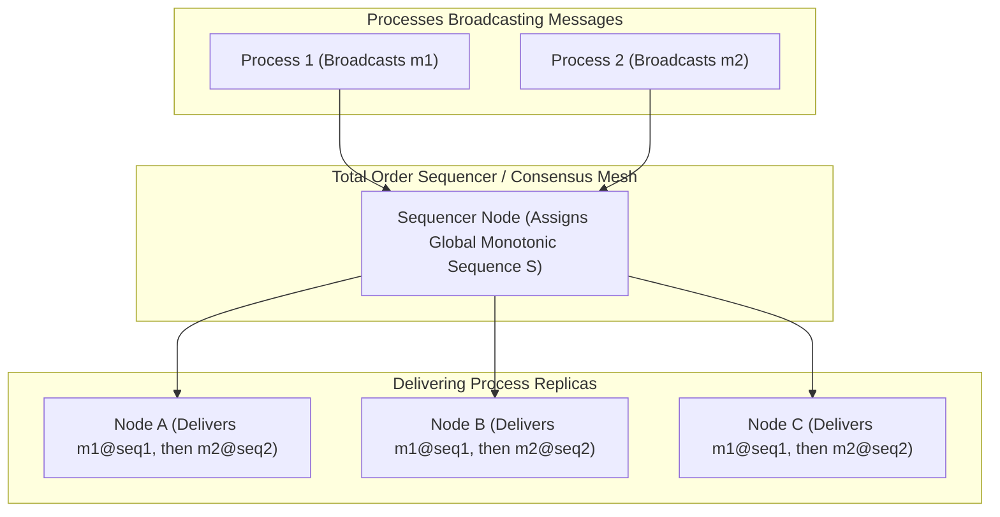
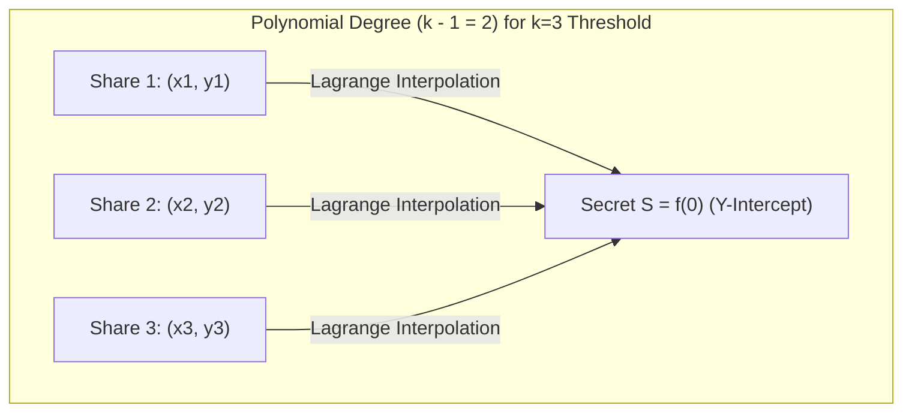

# 03. Total Order Atomic Broadcast & Shamir's Secret Sharing

This chapter covers Total Order Atomic Broadcast (equivalence to Distributed Consensus) and Threshold Cryptography via **Shamir's $(k, n)$ Secret Sharing Scheme**.

---

## 📡 Total Order Atomic Broadcast Architecture

**Atomic Broadcast** guarantees two fundamental properties across all non-faulty processes:
1. **Reliability**: If one non-faulty process delivers message $m$, every non-faulty process eventually delivers $m$.
2. **Total Order**: If process $P_1$ delivers message $m_1$ before $m_2$, no process $P_2$ delivers $m_2$ before $m_1$.



---

## 🔐 Shamir's $(k, n)$ Secret Sharing Scheme

Shamir's Secret Sharing splits a secret integer $S$ into $n$ distinct shares using a random degree $k - 1$ polynomial over a finite field $GF(p)$:

$$f(x) = S + a_1 x + a_2 x^2 + \dots + a_{k-1} x^{k-1} \pmod p$$



---

## 🐍 Production Python Implementation: Shamir's $(k, n)$ Secret Sharing Engine

```python
import random
from typing import List, Tuple

# Prime modulus p > max_secret (using 256-bit prime)
PRIME = 2**127 - 1

class ShamirSecretSharing:
    """Production implementation of Shamir's (k, n) Secret Sharing Scheme over Finite Field GF(PRIME)."""

    def __init__(self, k: int, n: int):
        if k > n:
            throw_err = ValueError("Threshold k cannot be greater than total shares n")
            raise throw_err
        self.k = k
        self.n = n

    def _eval_poly(self, poly: List[int], x: int) -> int:
        """Evaluates polynomial at x using Horner's method mod PRIME."""
        result = 0
        for coeff in reversed(poly):
            result = (result * x + coeff) % PRIME
        return result

    def split_secret(self, secret: int) -> List[Tuple[int, int]]:
        """
        Splits secret integer S into n shares (x, y) using random polynomial f(x) of degree k-1.
        """
        if secret >= PRIME:
            raise ValueError(f"Secret must be less than prime modulus {PRIME}")

        # Generate random coefficients a1, a2, ..., a_{k-1}
        poly = [secret] + [random.randint(1, PRIME - 1) for _ in range(self.k - 1)]
        
        shares = []
        for x in range(1, self.n + 1):
            y = self._eval_poly(poly, x)
            shares.append((x, y))
        return shares

    @staticmethod
    def _mod_inverse(a: int, m: int) -> int:
        """Computes modular multiplicative inverse using Extended Euclidean Algorithm."""
        def extended_gcd(a, b):
            if a == 0:
                return b, 0, 1
            gcd, x1, y1 = extended_gcd(b % a, a)
            x = y1 - (b // a) * x1
            y = x1
            return gcd, x, y

        _, x, _ = extended_gcd(a, m)
        return (x % m + m) % m

    def reconstruct_secret(self, shares: List[Tuple[int, int]]) -> int:
        """
        Reconstructs secret S = f(0) from any k or more shares using Lagrange Interpolation.
        """
        if len(shares) < self.k:
            raise ValueError(f"Need at least {self.k} shares to reconstruct secret")

        # Use first k shares
        k_shares = shares[:self.k]
        secret = 0

        for i, (xi, yi) in enumerate(k_shares):
            numerator = 1
            denominator = 1
            for j, (xj, _) in enumerate(k_shares):
                if i != j:
                    numerator = (numerator * (-xj)) % PRIME
                    denominator = (denominator * (xi - xj)) % PRIME

            lagrange_basis = (numerator * self._mod_inverse(denominator, PRIME)) % PRIME
            secret = (secret + yi * lagrange_basis) % PRIME

        return secret


# Demonstration
if __name__ == "__main__":
    sss = ShamirSecretSharing(k=3, n=5)
    original_secret = 9876543210123456789

    shares = sss.split_secret(original_secret)
    print(f"[SECRET SHARING] Generated 5 shares from secret. Threshold k=3:")
    for x, y in shares:
        print(f"  Share {x}: y={str(y)[:15]}...")

    # Reconstruct using any 3 shares (e.g. Share 1, Share 3, Share 5)
    subset_shares = [shares[0], shares[2], shares[4]]
    reconstructed = sss.reconstruct_secret(subset_shares)
    print(f"[RECONSTRUCTION] Reconstructed Secret: {reconstructed}")
    assert original_secret == reconstructed, "Secret reconstruction failed!"
```
