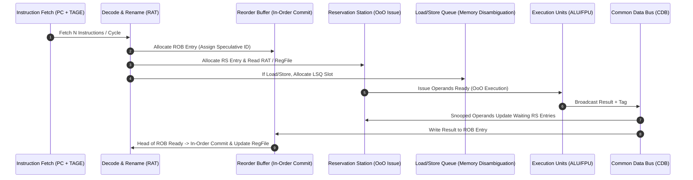

# Out-of-Order Superscalar Execution, Tomasulo with ROB & TAGE Branch Prediction

## 1. Architectural Foundations of Out-of-Order Execution

Modern high-performance microprocessors overcome in-order stall bottlenecks (e.g., RAW data hazards, cache misses) by decoupling instruction decoding from instruction execution. 



### 1.1 Tomasulo's Algorithm with Reorder Buffer (ROB)
Original Tomasulo (IBM 360/91) resolved WAR and WAW hazards via dynamic register renaming to **Reservation Station (RS)** tags. However, it allowed imprecise exceptions because registers were updated out-of-order upon execution finish. 

To support precise interrupts and speculative execution past unresolved branches, modern cores combine Tomasulo renaming with an **in-order Reorder Buffer (ROB)**:

1. **Register Alias Table (RAT)**: Maps architectural registers ($R_0 \dots R_{31}$) to either the Architectural Register File (ARF), an active ROB entry tag ($ROB_1 \dots ROB_n$), or an RS tag.
2. **Reservation Stations (RS)**: Buffer instructions waiting for operands. Each RS slot holds:
   - `Opcode`: The operation to perform.
   - `Vj`, `Vk`: Values of source operands (if ready).
   - `Qj`, `Qk`: ROB tags of pending instructions producing `Vj` or `Vk` (if not ready).
   - `Busy`: Flag indicating slot occupancy.
   - `ROB_Tag`: Pointer to the ROB entry assigned during decode.
3. **Reorder Buffer (ROB)**: A circular FIFO queue maintaining program order. Each ROB slot contains:
   - `Instruction State`: `FETCHED`, `ISSUED`, `EXECUTING`, `COMPLETE`, `COMMITTED`.
   - `Dest`: Architectural destination register.
   - `Value`: Computed result value.
   - `Exception`: Exception bit flags (e.g., page fault, divide-by-zero).

---

## 2. Memory Disambiguation: Load-Store Queue (LSQ)

Handling memory hazards (RAW, WAR, WAW through memory addresses) requires a dedicated **Load-Store Queue (LSQ)**:

* **Store Queue (SQ)**: Entries hold speculative memory addresses and store data. Stores write to L1 Data Cache **ONLY at ROB commit time** to prevent corrupting architectural memory on mispredicted paths.
* **Load Queue (LQ)**: Speculatively issues load operations to L1 cache.
* **Store-to-Load Forwarding**: When a Load executes, LQ searches older uncommitted entries in SQ:
  - **Match Found (Same Address & Value Ready)**: Forward store data directly to Load without hitting L1 cache (Latency = 1-2 cycles).
  - **Match Found (Address Matches, Data Pending)**: Stall Load until Store data is written to SQ.
  - **Address Unknown (Older Store Address Uncomputed)**: Stall Load or speculatively execute and trigger a memory order violation rollback if address conflict later occurs.

---

## 3. TAGE (TAgged GEometric History Length) Branch Predictor

TAGE (Seznec et al.) represents the state-of-the-art in directional branch prediction:

```
                          TAGE Predictor Layout
+-------------------+   +--------------------+   +--------------------+
| Base Predictor    |   | Tagged Table T1    |   | Tagged Table T2    | ...
| (Bimodal 2-bit)   |   | (History Len L1)   |   | (History Len L2)   |
+-------------------+   +--------------------+   +--------------------+
```

* **Geometric History Series**: Global Branch History lengths follow a geometric progression:
  $$L_i = \text{round}\left( L_1 \cdot \alpha^{i-1} \right) \quad \text{e.g., } L = \{0, 4, 10, 24, 58, 140, 335\}$$
* **Provider Table Matching**: Longest history length table $T_i$ that produces a tag match acts as the **Provider Component**.
* **Usefulness Counters ($u$)**: Track entry efficiency. If a provider's prediction is wrong while an alternative provider $T_{\text{alt}}$ is correct, the usefulness counter $u$ is decremented.

---

## 4. Production-Grade C++ Simulator: Tomasulo Out-of-Order Engine

The following C++ engine simulates a 4-stage Out-of-Order Tomasulo core with ROB and Register Alias Table (RAT):

```cpp
#include <iostream>
#include <vector>
#include <deque>
#include <string>
#include <iomanip>
#include <memory>
#include <algorithm>

enum class Opcode { ADD, SUB, MUL, DIV, LOAD, STORE };
enum class ROBState { ISSUED, EXECUTING, COMPLETE, COMMITTED };

struct Instruction {
    int id;
    Opcode op;
    int dest; // Architectural register ID (R0-R31)
    int src1;
    int src2;
    int immediate;
    int exec_cycles;
};

struct ROBEntry {
    int rob_id;
    Instruction inst;
    ROBState state;
    int dest_reg;
    int result_value;
    bool ready;
};

struct ReservationStation {
    int rs_id;
    bool busy;
    Opcode op;
    int vj, vk;
    int qj, qk; // ROB tags producing operands (-1 if ready)
    int rob_tag;
    int cycles_remaining;
};

class TomasuloOoOEngine {
private:
    static constexpr int NUM_REGS = 32;
    static constexpr int ROB_SIZE = 16;
    static constexpr int RS_SIZE = 8;

    std::vector<int> ARF; // Architectural Register File
    std::vector<int> RAT; // Maps Reg -> ROB tag (-1 if in ARF)
    std::deque<ROBEntry> ROB;
    std::vector<ReservationStation> RS;
    int current_cycle = 0;
    int rob_counter = 0;

public:
    TomasuloOoOEngine() : ARF(NUM_REGS, 0), RAT(NUM_REGS, -1), RS(RS_SIZE) {
        for (int i = 0; i < NUM_REGS; ++i) ARF[i] = i * 10; // Init registers
        for (int i = 0; i < RS_SIZE; ++i) {
            RS[i].rs_id = i;
            RS[i].busy = false;
        }
    }

    bool Issue(const Instruction& inst) {
        if (ROB.size() >= ROB_SIZE) return false; // ROB Full stall

        // Find free Reservation Station
        int free_rs = -1;
        for (int i = 0; i < RS_SIZE; ++i) {
            if (!RS[i].busy) { free_rs = i; break; }
        }
        if (free_rs == -1) return false; // RS Full stall

        int assigned_rob = ++rob_counter;
        ROBEntry rob_slot{assigned_rob, inst, ROBState::ISSUED, inst.dest, 0, false};
        ROB.push_back(rob_slot);

        // Setup RS entry & read RAT
        ReservationStation& station = RS[free_rs];
        station.busy = true;
        station.op = inst.op;
        station.rob_tag = assigned_rob;
        station.cycles_remaining = inst.exec_cycles;

        // Source 1 Operand Setup
        if (RAT[inst.src1] == -1) {
            station.vj = ARF[inst.src1];
            station.qj = -1;
        } else {
            station.qj = RAT[inst.src1];
        }

        // Source 2 Operand Setup
        if (RAT[inst.src2] == -1) {
            station.vk = ARF[inst.src2];
            station.qk = -1;
        } else {
            station.qk = RAT[inst.src2];
        }

        // Update RAT for destination register
        RAT[inst.dest] = assigned_rob;
        return true;
    }

    void StepCycle() {
        current_cycle++;
        std::cout << "\n=== Cycle " << current_cycle << " ===" << std::endl;

        // 1. Execute Stage
        for (auto& station : RS) {
            if (station.busy && station.qj == -1 && station.qk == -1) {
                if (station.cycles_remaining > 0) {
                    station.cycles_remaining--;
                }
            }
        }

        // 2. Writeback / CDB Broadcast Stage
        for (auto& station : RS) {
            if (station.busy && station.qj == -1 && station.qk == -1 && station.cycles_remaining == 0) {
                int computed_val = 0;
                if (station.op == Opcode::ADD) computed_val = station.vj + station.vk;
                else if (station.op == Opcode::SUB) computed_val = station.vj - station.vk;
                else if (station.op == Opcode::MUL) computed_val = station.vj * station.vk;

                std::cout << "[CDB Broadcast] ROB #" << station.rob_tag 
                          << " Result: " << computed_val << std::endl;

                // Broadcast on CDB: update waiting RS entries
                for (auto& target : RS) {
                    if (target.busy) {
                        if (target.qj == station.rob_tag) { target.vj = computed_val; target.qj = -1; }
                        if (target.qk == station.rob_tag) { target.vk = computed_val; target.qk = -1; }
                    }
                }

                // Update ROB entry
                for (auto& r_entry : ROB) {
                    if (r_entry.rob_id == station.rob_tag) {
                        r_entry.result_value = computed_val;
                        r_entry.ready = true;
                        r_entry.state = ROBState::COMPLETE;
                        break;
                    }
                }

                station.busy = false; // Free RS slot
            }
        }

        // 3. Commit Stage (In-Order via Head of ROB)
        while (!ROB.empty() && ROB.front().ready) {
            ROBEntry committed = ROB.front();
            ROB.pop_front();

            ARF[committed.dest_reg] = committed.result_value;
            if (RAT[committed.dest_reg] == committed.rob_id) {
                RAT[committed.dest_reg] = -1; // Clear RAT mapping
            }

            std::cout << "[ROB Commit] Inst ID " << committed.inst.id 
                      << " Committed -> R" << committed.dest_reg 
                      << " = " << committed.result_value << std::endl;
        }
    }

    void PrintState() const {
        std::cout << "ARF R1: " << ARF[1] << " | R2: " << ARF[2] << " | R3: " << ARF[3] << std::endl;
    }
};

int main() {
    TomasuloOoOEngine core;
    std::vector<Instruction> program = {
        {1, Opcode::ADD, 3, 1, 2, 0, 1}, // R3 = R1 + R2 (1 cycle)
        {2, Opcode::MUL, 4, 3, 1, 0, 3}, // R4 = R3 * R1 (3 cycles, depends on R3)
        {3, Opcode::ADD, 5, 1, 2, 0, 1}  // R5 = R1 + R2 (Independent)
    };

    for (const auto& inst : program) {
        while (!core.Issue(inst)) {
            core.StepCycle();
        }
    }

    for (int i = 0; i < 6; ++i) {
        core.StepCycle();
    }

    core.PrintState();
    return 0;
}
```

---

## 5. Verification & Summary

1. **Tomasulo + ROB Synergy**: Solves WAR/WAW data hazards while retaining precise exception boundaries and speculative execution capability.
2. **Store Queue Latency Barrier**: Stores update L1 Data Cache strictly during ROB commit to preserve state recovery integrity.
3. **TAGE Accuracy**: Delivers >95% directional prediction accuracy by selecting dynamic provider tables based on geometric branch history lengths.
