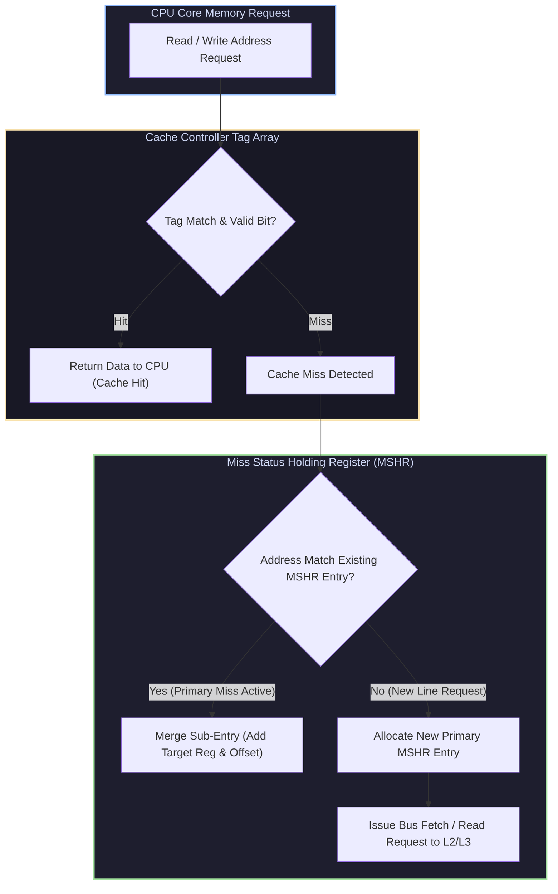
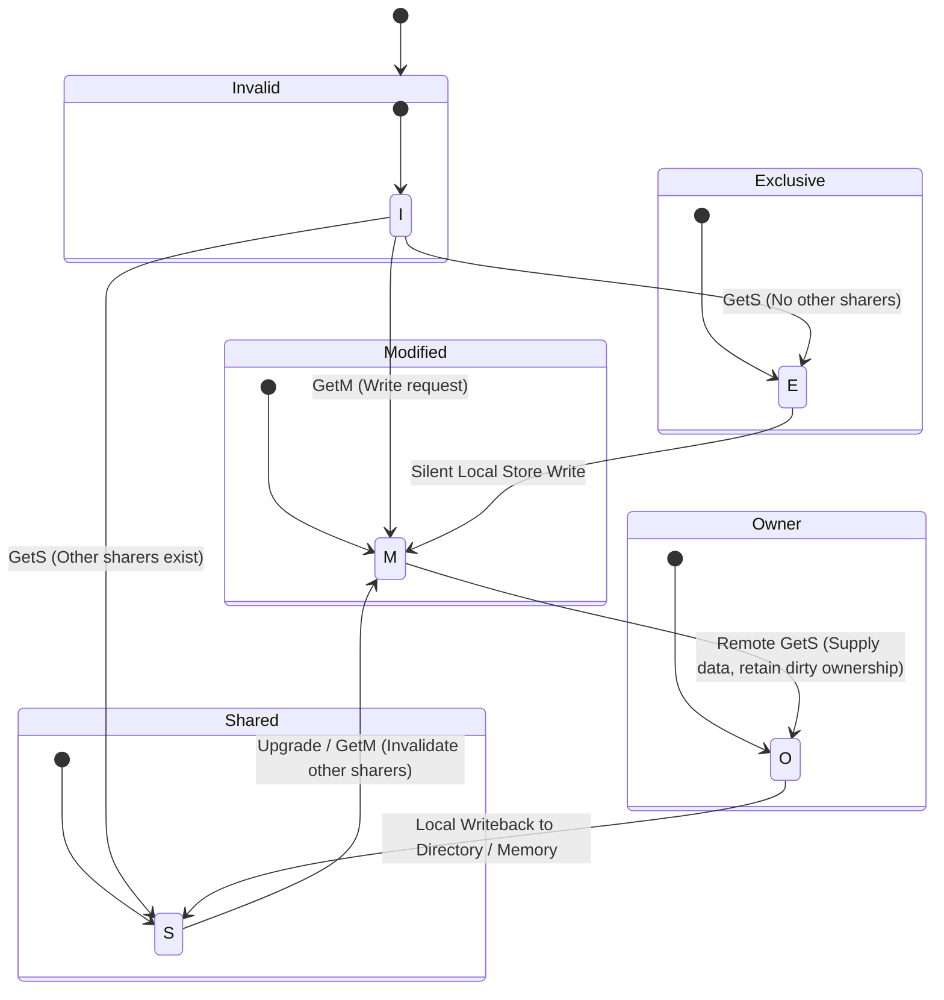

# Cache Hierarchy Microarchitecture, MSHRs & Directory-Based Coherence

## 1. Non-Blocking Cache Microarchitecture & MSHRs

Standard blocking caches stall CPU execution pipelines on a cache miss until the requested data line returns from lower memory levels. Non-blocking caches eliminate this bottleneck by servicing subsequent hit instructions (**Hit-Under-Miss**) or generating additional concurrent memory misses (**Miss-Under-Miss**).



### 1.1 MSHR Architecture & Sub-Entry Organization
An MSHR entry tracks outstanding line requests:
* **Primary Entry**: Holds the target block tag, status flags (`PUE_VALID`, `WAITING_L2_ACK`), and memory request address.
* **Secondary Entries (Sub-Entries)**: Hold CPU register destinations, byte offsets, and instruction tags for all subsequent loads hitting the same missing block. When data returns from L2/DRAM, all secondary targets are satisfied in a single cycle broadcast.

---

## 2. Hardware Prefetching Engines

Hardware prefetchers predict future memory access locations based on historical reference streams, fetching lines into the L1/L2 cache before execution core requests occur:

1. **Next-N-Line Prefetcher**: Sequential stream prefetching fetching block $A+1 \dots A+N$ on reference to block $A$.
2. **Stride Prefetcher**: Tracks access history per instruction address (PC). Detects constant strides:
   $$\text{Stride} = \text{Address}_t - \text{Address}_{t-1}$$
   Prefetched target address: $\text{Target} = \text{Address}_t + K \times \text{Stride}$.
3. **Markov Pointer Prefetcher**: Predicts irregular pointer-chasing patterns ($A \to B \to C$) using a state transition probability matrix derived from historical reference sequences.

---

## 3. Scalable Directory-Based Cache Coherence

In large multi-socket and multi-chiplet topologies, bus-snooping coherence protocols fail due to link broadcast bandwidth limits ($O(N^2)$). **Directory-Based Coherence** reduces traffic to targeted point-to-point messages ($O(N)$).

### 3.1 Directory Entry Layout
Each Memory Side Directory Entry tracks the state of every cache line:

```
+-------------------+----------------+--------------------------------------+
| Coherence State   | Owner Core ID  | Presence Bit-Vector (1 bit per Core) |
| (M, O, E, S, I)   | (If Modified)  | Core 0 | Core 1 | Core 2 | Core 3    |
+-------------------+----------------+--------------------------------------+
```

### 3.2 Directory Protocol State Transitions (MOESI)



---

## 4. Production-Grade C++ Simulator: Directory Coherence & MSHR Engine

The following C++ system simulates a Directory Coherence Controller with MSHR Non-Blocking Cache integration across a multi-core layout:

```cpp
#include <iostream>
#include <vector>
#include <unordered_map>
#include <cstdint>
#include <memory>
#include <cassert>

enum class DirectoryState { UNCACHED, SHARED, EXCLUSIVE, MODIFIED };
enum class CoherenceMsg { GETS, GETM, PUTX, INV, DATA_ACK };

struct DirectoryEntry {
    uint64_t addr;
    DirectoryState state;
    uint32_t owner_core;
    std::vector<bool> presence_vector;

    DirectoryEntry(uint32_t num_cores = 4) 
        : addr(0), state(DirectoryState::UNCACHED), owner_core(0), presence_vector(num_cores, false) {}
};

struct MSHREntry {
    uint64_t line_addr;
    bool is_write;
    uint32_t target_reg;
    bool completed;
};

class NonBlockingCacheController {
private:
    uint32_t core_id;
    std::unordered_map<uint64_t, uint64_t> cache_tags; // Addr -> Data
    std::vector<MSHREntry> mshr_table;
    static constexpr size_t MAX_MSHRS = 4;

public:
    explicit NonBlockingCacheController(uint32_t id) : core_id(id) {}

    bool AccessCache(uint64_t addr, bool is_write, uint32_t reg_dest) {
        if (cache_tags.find(addr) != cache_tags.end()) {
            std::cout << "[Core " << core_id << "] Cache HIT for Address 0x" 
                      << std::hex << addr << std::dec << std::endl;
            return true;
        }

        std::cout << "[Core " << core_id << "] Cache MISS for Address 0x" 
                  << std::hex << addr << std::dec << std::endl;

        if (mshr_table.size() >= MAX_MSHRS) {
            std::cout << "[Core " << core_id << "] MSHR Table FULL! Stalling pipeline." << std::endl;
            return false;
        }

        mshr_table.push_back({addr, is_write, reg_dest, false});
        return false;
    }

    void HandleDataReturn(uint64_t addr, uint64_t data) {
        cache_tags[addr] = data;
        for (auto& entry : mshr_table) {
            if (entry.line_addr == addr) {
                entry.completed = true;
                std::cout << "[Core " << core_id << "] MSHR Complete for Address 0x" 
                          << std::hex << addr << " -> Reg R" << std::dec << entry.target_reg << std::endl;
            }
        }
        mshr_table.erase(
            std::remove_if(mshr_table.begin(), mshr_table.end(), [](const MSHREntry& e){ return e.completed; }),
            mshr_table.end()
        );
    }
};

class DirectoryController {
private:
    uint32_t num_cores;
    std::unordered_map<uint64_t, DirectoryEntry> directory;

public:
    explicit DirectoryController(uint32_t cores) : num_cores(cores) {}

    void ProcessCoherenceRequest(uint32_t requesting_core, uint64_t addr, CoherenceMsg msg) {
        DirectoryEntry& entry = directory[addr];
        entry.addr = addr;
        if (entry.presence_vector.empty()) entry.presence_vector.resize(num_cores, false);

        std::cout << "\n[Directory Engine] Core " << requesting_core 
                  << " Request: " << (msg == CoherenceMsg::GETS ? "GETS" : "GETM") 
                  << " for Addr 0x" << std::hex << addr << std::dec << std::endl;

        if (msg == CoherenceMsg::GETS) {
            if (entry.state == DirectoryState::UNCACHED) {
                entry.state = DirectoryState::EXCLUSIVE;
                entry.owner_core = requesting_core;
                entry.presence_vector[requesting_core] = true;
            } else if (entry.state == DirectoryState::EXCLUSIVE || entry.state == DirectoryState::SHARED) {
                entry.state = DirectoryState::SHARED;
                entry.presence_vector[requesting_core] = true;
            } else if (entry.state == DirectoryState::MODIFIED) {
                std::cout << "  -> Recall/Flush from Owner Core " << entry.owner_core << std::endl;
                entry.state = DirectoryState::SHARED;
                entry.presence_vector[requesting_core] = true;
            }
        } else if (msg == CoherenceMsg::GETM) {
            if (entry.state == DirectoryState::SHARED) {
                for (uint32_t i = 0; i < num_cores; ++i) {
                    if (entry.presence_vector[i] && i != requesting_core) {
                        std::cout << "  -> Send Invalidation (INV) to Core " << i << std::endl;
                        entry.presence_vector[i] = false;
                    }
                }
            }
            entry.state = DirectoryState::MODIFIED;
            entry.owner_core = requesting_core;
            entry.presence_vector[requesting_core] = true;
        }
    }
};

int main() {
    DirectoryController directory(4);
    NonBlockingCacheController core0(0);
    NonBlockingCacheController core1(1);

    uint64_t test_addr = 0x7FFF0040;

    core0.AccessCache(test_addr, false, 1);
    directory.ProcessCoherenceRequest(0, test_addr, CoherenceMsg::GETS);
    core0.HandleDataReturn(test_addr, 0xDEADBEEF);

    core1.AccessCache(test_addr, true, 2);
    directory.ProcessCoherenceRequest(1, test_addr, CoherenceMsg::GETM);
    core1.HandleDataReturn(test_addr, 0xCAFEBABE);

    return 0;
}
```

---

## 5. Summary & Key Architecting Principles

1. **Hit-Under-Miss Concurrency**: MSHRs decouple cache pipeline lookup from memory bus round-trip latency, eliminating processor execution stalls.
2. **Directory Bandwidth Scaling**: Eliminates snoop broadcasts over inter-socket interconnect links, providing scalable $O(N)$ point-to-point coherence messaging.
3. **Invalidation vs Write-Update**: Invalidation-based directory protocols prevent excessive link bandwidth consumption on consecutive local store instructions.
