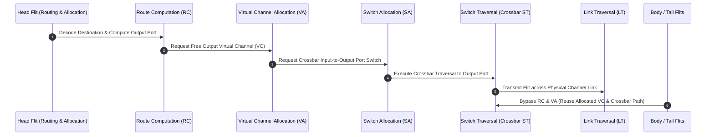
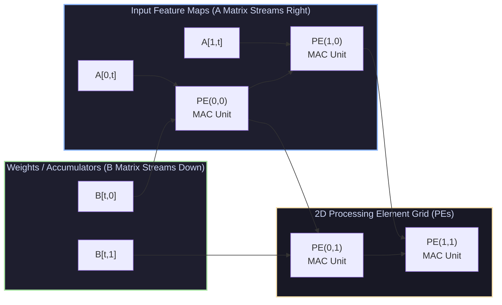

# Interconnection Networks, Wormhole Virtual Channel Routing & Systolic Array Accelerators

## 1. Interconnection Network Microarchitecture (William Dally Model)

High-performance parallel architectures require low-latency, high-bandwidth interconnection networks to connect multi-core sockets, memory controllers, and AI accelerators.



### 1.1 Flit-Level Packetization & Wormhole Routing
In **Wormhole Routing**, packets are divided into fixed-size flow control units (**flits**):
* **Head Flit**: Contains routing address headers. Allocates output Virtual Channels along the path.
* **Body Flits**: Contain payload data. Follow the path established by the Head flit.
* **Tail Flit**: Contains checksum/end-of-packet marker. Deallocates the VC and router resources upon traversal.

If a Head flit is blocked due to downstream queue saturation, the remaining Body/Tail flits stall *in place* across upstream routers like a worm, holding allocated buffer resources.

### 1.2 Virtual Channels (VCs) & Head-of-Line (HoL) Unblocking
Virtual Channels multiplex multiple logical FIFO queues over a single physical link. If a packet on $VC_0$ is blocked by downstream congestion, packets on $VC_1 \dots VC_k$ can bypass the blocked flit, completely eliminating **Head-of-Line (HoL) Blocking**.

---

## 2. Router Microarchitecture Pipeline Stages

A canonical Dally Virtual-Channel Router operates across 4 pipelined stages:

```
[ Stage 1: IB / RC ] -> [ Stage 2: VA ] -> [ Stage 3: SA ] -> [ Stage 4: ST / LT ]
   Input Buffer /         Virtual Channel      Switch Allocation     Switch / Link
   Route Computation        Allocation         (Crossbar Arbiter)      Traversal
```

1. **Input Buffering (IB) & Route Computation (RC)**: Flit arrives, is stored in a VC input queue, and destination address is decoded to select output port.
2. **Virtual Channel Allocation (VA)**: Head flit arbitrates for an available output Virtual Channel.
3. **Switch Allocation (SA)**: Flits with assigned VCs arbitrate for crossbar input/output ports (using Separable Matrix Arbiters).
4. **Switch Traversal (ST) & Link Traversal (LT)**: Flit traverses crossbar matrix and physical link wires.

---

## 3. Domain-Specific Accelerator Architecture: Systolic Arrays

Dense deep-learning matrix multiplication ($C = A \times B$) is compute-heavy ($O(N^3)$ operations on $O(N^2)$ data). **Systolic Arrays** decouple performance from DRAM memory bandwidth limits by passing data rhythmically through a 2D grid of Processing Elements (PEs).



### 3.1 Dataflow Taxonomies
* **Output-Stationary**: Partial sums remain fixed inside PEs while inputs $A$ and weights $B$ stream horizontally and vertically. Minimizes accumulator movement.
* **Weight-Stationary (Google TPU v1-v4)**: Stationary weights $B_{i,j}$ are pre-loaded into PE registers. Activation matrix $A$ streams horizontally, while partial sums $C$ accumulate vertically down the array.

---

## 4. Production-Grade C++ Simulator: Wormhole VC Router Engine

The following C++ engine simulates a Virtual Channel Wormhole Router with Credit-Based Flow Control and Crossbar Switch Allocation:

```cpp
#include <iostream>
#include <vector>
#include <queue>
#include <cstdint>
#include <memory>
#include <string>

enum class FlitType { HEAD, BODY, TAIL };

struct Flit {
    uint32_t packet_id;
    FlitType type;
    uint32_t src_node;
    uint32_t dest_node;
    uint32_t vc_id;
    uint64_t payload;
};

struct VirtualChannel {
    uint32_t vc_id;
    std::queue<Flit> buffer;
    uint32_t credits_available;
    uint32_t allocated_out_vc;
    bool is_allocated;

    VirtualChannel(uint32_t id, uint32_t init_credits) 
        : vc_id(id), credits_available(init_credits), allocated_out_vc(0), is_allocated(false) {}
};

class WormholeVCRouter {
private:
    uint32_t router_id;
    uint32_t num_ports;
    uint32_t vcs_per_port;
    uint32_t buffer_depth;

    // Port -> VC List
    std::vector<std::vector<VirtualChannel>> input_ports;
    std::vector<uint32_t> output_credits; // Out Port -> Available Credits

public:
    WormholeVCRouter(uint32_t id, uint32_t ports, uint32_t vcs, uint32_t depth)
        : router_id(id), num_ports(ports), vcs_per_port(vcs), buffer_depth(depth),
          output_credits(ports, depth) {
        
        input_ports.resize(num_ports);
        for (uint32_t p = 0; p < num_ports; ++p) {
            for (uint32_t v = 0; v < vcs_per_port; ++v) {
                input_ports[p].emplace_back(v, depth);
            }
        }
    }

    bool InjectFlit(uint32_t in_port, uint32_t vc_id, const Flit& flit) {
        if (input_ports[in_port][vc_id].buffer.size() >= buffer_depth) {
            std::cout << "[Router " << router_id << "] Port " << in_port 
                      << " VC " << vc_id << " BUFFER OVERFLOW!" << std::endl;
            return false; // Backpressure stall
        }
        input_ports[in_port][vc_id].buffer.push(flit);
        std::cout << "[Router " << router_id << "] Received " 
                  << (flit.type == FlitType::HEAD ? "HEAD" : (flit.type == FlitType::BODY ? "BODY" : "TAIL"))
                  << " Flit for Packet #" << flit.packet_id << " on InPort " << in_port << " VC " << vc_id << std::endl;
        return true;
    }

    void StepPipeline() {
        std::cout << "\n--- Router Cycle Execution ---" << std::endl;
        
        for (uint32_t in_p = 0; in_p < num_ports; ++in_p) {
            for (uint32_t vc = 0; vc < vcs_per_port; ++vc) {
                VirtualChannel& v_channel = input_ports[in_p][vc];
                if (v_channel.buffer.empty()) continue;

                Flit flit = v_channel.buffer.front();

                // Compute Output Port (Simple Dimension-Order Routing X-then-Y)
                uint32_t out_port = (flit.dest_node % num_ports);

                // Check credit flow control for downstream node
                if (output_credits[out_port] > 0) {
                    v_channel.buffer.pop();
                    output_credits[out_port]--;

                    std::cout << "[Crossbar Traversal] Transmitted Packet #" << flit.packet_id 
                              << " OutPort " << out_port << " (Remaining Credits: " 
                              << output_credits[out_port] << ")" << std::endl;

                    if (flit.type == FlitType::TAIL) {
                        v_channel.is_allocated = false; // Release VC reservation
                    }
                } else {
                    std::cout << "[Flow Control Stall] OutPort " << out_port 
                              << " Low Credits! Flit Stalled in Wormhole Buffer." << std::endl;
                }
            }
        }
    }
};

int main() {
    WormholeVCRouter router(0, 4, 2, 4);

    Flit head_flit{101, FlitType::HEAD, 0, 2, 0, 0x1234};
    Flit body_flit{101, FlitType::BODY, 0, 2, 0, 0x5678};
    Flit tail_flit{101, FlitType::TAIL, 0, 2, 0, 0x9ABC};

    router.InjectFlit(0, 0, head_flit);
    router.InjectFlit(0, 0, body_flit);
    router.InjectFlit(0, 0, tail_flit);

    router.StepPipeline();
    router.StepPipeline();
    router.StepPipeline();

    return 0;
}
```

---

## 5. Summary & Key Architecting Principles

1. **Wormhole Virtual Channels**: Eliminates Head-of-Line blocking over physical router links, maximizing network throughput under heavy multi-core traffic loads.
2. **Credit-Based Flow Control**: Prevents buffer overflow without transmitting expensive full link NACK frames.
3. **Systolic Acceleration**: Transforms matrix multiplication memory bandwidth bottlenecks into spatial compute efficiency via 2D local PE data reuse.
