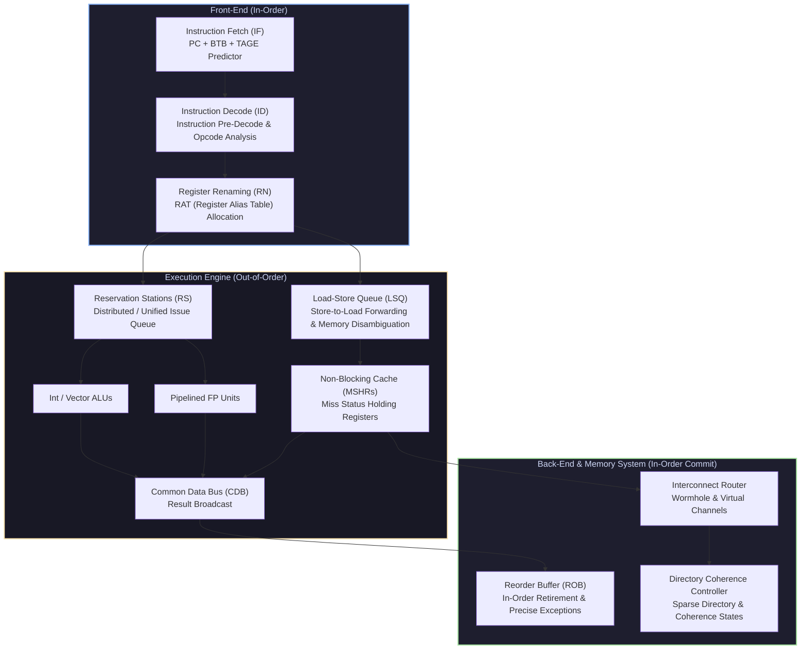

# Stanford EE382C: Advanced Computer Architecture & Parallel Microarchitecture

Welcome to the **Stanford EE382C Masterclass Module**. This module covers advanced superscalar out-of-order execution microarchitecture, memory hierarchy and non-blocking caches, directory-based cache coherence, interconnection networks (William Dally model), and domain-specific accelerator architectures (TPUs, Systolic Arrays, HBM3, CXL/NVLink).

---

## 1. High-Level Microarchitecture Pipeline

---

## 2. Module Navigation Map

| File | Description | Core Topics |
| :--- | :--- | :--- |
| **[`00_ee382c_cheatsheet.md`](00_ee382c_cheatsheet.md)** | 30-Second Microarchitecture Cheatsheet | CPI / IPC formulas, ROB/RAT sizing bounds, MSHR depth, Wormhole credit latency math, Bisection Bandwidth equations, Systolic Array MAC throughput. |
| **[`01_tomasulo_rob_and_tage_predictor.md`](01_out_of_order_superscalar_and_branch_prediction/01_tomasulo_rob_and_tage_predictor.md)** | Out-of-Order Superscalar & Branch Prediction | Tomasulo's Algorithm with RAT & ROB, Memory Disambiguation (LSQ), TAGE Branch Predictor, Complete C++ Tomasulo Engine Simulator, Mermaid sequence diagram. |
| **[`02_mshrs_prefetching_and_directory_protocols.md`](02_cache_hierarchy_mshrs_and_directory_coherence/02_mshrs_prefetching_and_directory_protocols.md)** | Cache Hierarchy, MSHRs & Directory Coherence | Non-blocking caches, MSHR allocation, Hardware Prefetchers (Stride/Stream/Markov), Scalable Directory-based Cache Coherence protocols, Complete C++ Directory Coherence & MSHR Engine, Mermaid FSM diagram. |
| **[`03_wormhole_routing_virtual_channels_and_systolic_arrays.md`](03_interconnection_networks_and_accelerator_microarchitecture/03_wormhole_routing_virtual_channels_and_systolic_arrays.md)** | Interconnection Networks & Accelerator Microarch | Wormhole Routing, Virtual Channels (VCs), Credit-based Flow Control, Crossbar allocation, Systolic Arrays (Output vs Weight Stationary), TPU units, HBM3/CXL/NVLink, Complete C++ Wormhole VC Router Simulator, Mermaid router pipeline diagram. |

---

## 3. Key Microarchitectural Principles

1. **Explicit In-Order Retirement for Precise Exceptions**: Execution happens out-of-order via Reservation Stations and Common Data Bus (CDB), but instruction completion and architectural register file updates are strictly committed in-order via the Reorder Buffer (ROB).
2. **Hit-Under-Miss & Miss-Under-Miss Memory Parallelism**: Non-blocking caches use Miss Status Holding Registers (MSHRs) to track multiple outstanding L1/L2 miss requests concurrently without stalling the execution core.
3. **Flit-Level Wormhole Virtual Channel Routing**: Interconnect routers decompose packets into Head, Body, and Tail flits, multiplexing physical link bandwidth across Virtual Channels (VCs) to eliminate Head-of-Line (HoL) blocking.
4. **Systolic Spatial Computing for Tensor Acceleration**: Dense matrix multiplication ($C = A \times B$) is decoupled from main memory bandwidth limits by streaming inputs through 2D grids of Processing Elements (PEs), reusing weights locally.
