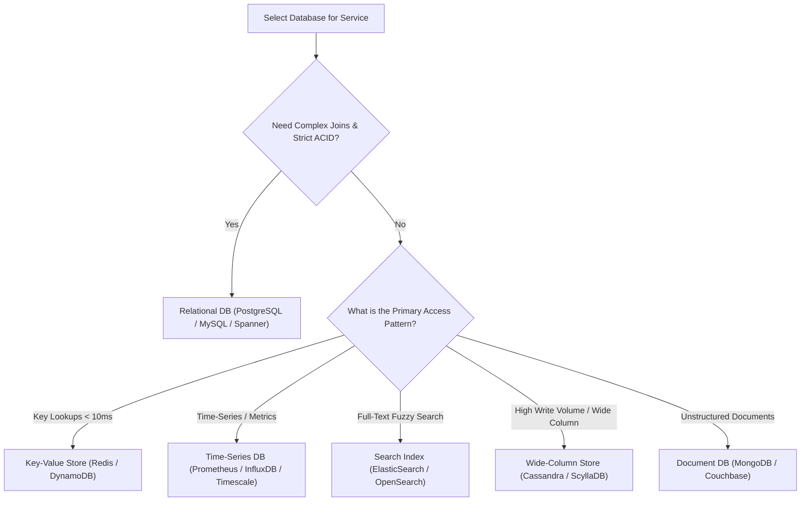

# 00. System Design Cheatsheet & 28-System Pattern Matrix

A high-density reference guide summarizing system design interview calculation shortcuts, database selection frameworks, and architectural patterns across all 28 systems from Volumes 1 & 2.

---

## 🧮 Back-of-the-Envelope Estimation Reference

### 1. Capacity & Throughput Math Shortcuts
- **Seconds in a Day**: $86,400 \approx 10^5 \text{ seconds}$.
- **QPS to Daily Request Conversion**: $100 \text{ QPS} \approx 8.64 \text{ Million requests/day}$. $10,000 \text{ QPS} \approx 864 \text{ Million requests/day}$.
- **Peak QPS**: Typically estimated as $2 \times \text{Average QPS}$.

### 2. Storage Estimation Quick Multipliers
- $1 \text{ B/s} \times 1 \text{ day} \approx 86.4 \text{ KB/day}$.
- $1 \text{ KB/s} \times 1 \text{ day} \approx 86.4 \text{ MB/day}$.
- $1 \text{ MB/s} \times 1 \text{ day} \approx 86.4 \text{ GB/day}$.
- $1 \text{ MB/s} \times 1 \text{ year} \approx 31.5 \text{ TB/year}$.

---

## 🗄️ Database Selection Decision Tree

---

## 📋 28-System Architecture Pattern Matrix (Volumes 1 & 2)

| # | System Name | Vol | Core Challenge | Key Architectural Pattern / Data Structure |
| :--- | :--- | :--- | :--- | :--- |
| 1 | **Scale 0 to Millions** | V1 Ch 1 | Handling massive concurrency & growth | Stateless Web Tier, Read Replicas, Multi-DC, CDN |
| 2 | **Rate Limiter** | V1 Ch 4 | Preventing resource abuse | Redis Sliding Window Log / Token Bucket Lua script |
| 3 | **Consistent Hashing** | V1 Ch 5 | Uniform rebalancing on cluster node changes | Hash Ring with Virtual Nodes (V-Nodes) |
| 4 | **Key-Value Store** | V1 Ch 6 | High-throughput low-latency KV storage | Dynamo-style Quorum ($R+W>N$), Vector Clocks, SSTables |
| 5 | **Unique ID Generator** | V1 Ch 7 | 64-bit globally unique monotonic IDs | Twitter Snowflake (Timestamp + Worker ID + Sequence) |
| 6 | **URL Shortener** | V1 Ch 8 | Shortening URLs with high read throughput | Base62 Encoding vs Key Generation Service (KGS) |
| 7 | **Web Crawler** | V1 Ch 9 | Crawling billions of web pages | URL Frontier (Politeness/Priority queues), SimHash |
| 8 | **Notification System** | V1 Ch 10 | Multi-channel push/SMS/email delivery | Message Queues (RabbitMQ/Kafka) + Provider Adapters |
| 9 | **News Feed System** | V1 Ch 11 | Timeline aggregation for millions of users | Push (Fan-out on Write) vs Pull (Fan-out on Read) |
| 10 | **Real-Time Chat** | V1 Ch 12 | Low-latency bi-directional messaging | WebSockets, State Servers, Cassandra history store |
| 11 | **Search Autocomplete** | V1 Ch 13 | Prefix search under 10ms latency | Trie with Top-K cached nodes, Redis prefix lookup |
| 12 | **YouTube Video Streaming** | V1 Ch 14 | Transcoding DAG & global delivery | HLS/DASH Adaptive Bitrate, Transcoding DAG, CDN |
| 13 | **Google Drive** | V1 Ch 15 | Block-level file sync & versioning | Fixed 4MB Chunking, Delta Sync, Metadata DB |
| 14 | **Proximity Service** | V2 Ch 1 | Fast spatial radius queries | Geohash (Base32), Quadtree, Google S2 cells |
| 15 | **Nearby Businesses** | V2 Ch 2 | Geospatial search with business filters | Spatial Index + Read-heavy Redis Caching |
| 16 | **Google Maps** | V2 Ch 3 | Map tile rendering & shortest path | Tile Server CDN, Segment Graph, A* Routing Algorithm |
| 17 | **Distributed Message Queue** | V2 Ch 4 | High-throughput durable streaming | Append-only Segment Logs, Zero-Copy (`sendfile`), Kafka |
| 18 | **Metrics Monitoring** | V2 Ch 5 | Ingesting millions of metric data points | Time-Series Engine, Downsampling, Prometheus pull |
| 19 | **Ad Click Aggregation** | V2 Ch 6 | Real-time accurate click accounting | Sliding Window MapReduce, Watermarking, Idempotency |
| 20 | **Hotel Reservation** | V2 Ch 7 | Preventing double bookings | Database Optimistic Locking, 2PC, Saga Orchestration |
| 21 | **Distributed Email** | V2 Ch 8 | Handling billions of emails & search | SMTP/IMAP, Object Store MIME, ElasticSearch |
| 22 | **S3 Object Storage** | V2 Ch 9 | Exabyte scale blob storage | Data Nodes, Metadata Nodes, Reed-Solomon Erasure Coding |
| 23 | **Gaming Leaderboard** | V2 Ch 10 | Real-time score ranking | Redis Sorted Sets (`ZADD`, `ZRANK`, `ZREVRANGE`) |
| 24 | **Payment System** | V2 Ch 11 | Zero loss financial processing | Double-Entry Bookkeeping, Idempotency Keys, Reconciliation |
| 25 | **Digital Wallet** | V2 Ch 12 | High-concurrency wallet transfers | In-Memory Ledger, Raft consensus, Event Sourcing |
| 26 | **Stock Exchange** | V2 Ch 13 | Sub-millisecond matching engine | In-Memory Matching Engine, LMAX Disruptor Ring Buffer |
