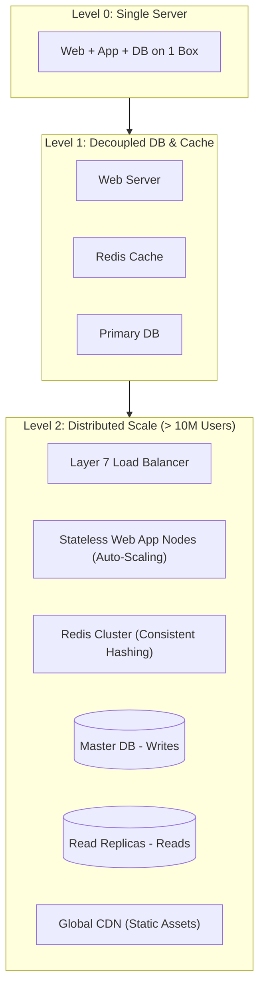
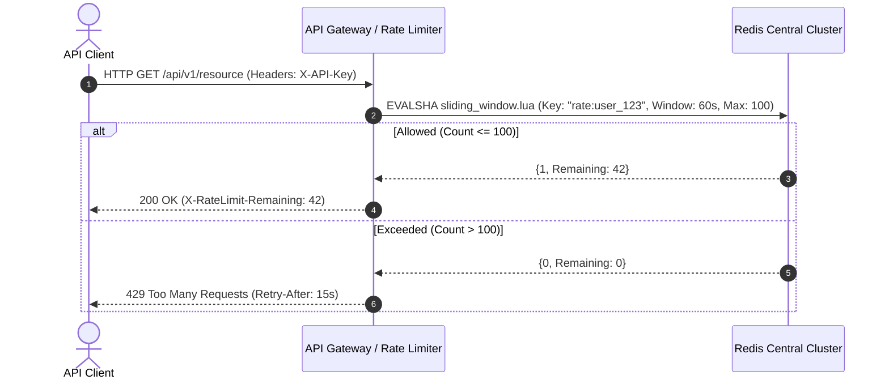
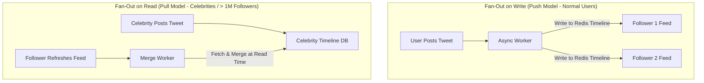

# 01. Vol 1: Foundations, Rate Limiter, KV Store & News Feeds

This chapter covers foundational concepts from Volume 1 of *System Design Interview – An Insider's Guide*: scaling applications from zero to millions of users, designing a distributed Rate Limiter, building a Dynamo-style Key-Value Store, and architecting a real-time News Feed System.

---

## 📈 Scale From Zero to Millions of Users



---

## 🛑 Distributed Rate Limiter Architecture

Prevent API abuse using a **Redis Sliding Window Counter** rate limiter.



---

## 🔑 Dynamo-Style Key-Value Store Architecture

A distributed Key-Value store (like Amazon Dynamo or Cassandra) guarantees high write availability by combining:
1. **Consistent Hashing**: For data partitioning across nodes.
2. **Quorum Consensus ($N, R, W$)**: Where $R + W > N$ guarantees linearizable reads.
3. **Vector Clocks**: For detecting concurrent update conflicts.
4. **LSM-Tree / SSTables**: For high-throughput sequential write performance.

---

## ☕ Production Java Implementation: Distributed KV Store Quorum Router

```java
package com.example.systemdesign.kvstore;

import java.util.*;
import java.util.concurrent.ConcurrentHashMap;

/**
 * Distributed Key-Value Store Quorum Router enforcing R + W > N consensus.
 */
public class QuorumKvRouter<K, V> {

    public record Record<V>(V value, long timestamp, String vectorClock) {}

    private final int N; // Total Replication Factor
    private final int R; // Read Quorum
    private final int W; // Write Quorum
    private final List<String> nodeCluster;
    private final Map<String, Map<K, Record<V>>> nodeStorage = new ConcurrentHashMap<>();

    public QuorumKvRouter(int N, int R, int W, List<String> nodeCluster) {
        if (R + W <= N) {
            throw new IllegalArgumentException("Quorum violation: R + W must be > N for strong consistency.");
        }
        this.N = N;
        this.R = R;
        this.W = W;
        this.nodeCluster = new ArrayList<>(nodeCluster);

        for (String node : nodeCluster) {
            nodeStorage.put(node, new ConcurrentHashMap<>());
        }
    }

    /**
     * Preference List helper: returns the N responsible nodes for a given key.
     */
    private List<String> getPreferenceList(K key) {
        int hash = Math.abs(key.hashCode());
        List<String> preferenceList = new ArrayList<>();
        for (int i = 0; i < N; i++) {
            int nodeIdx = (hash + i) % nodeCluster.size();
            preferenceList.add(nodeCluster.get(nodeIdx));
        }
        return preferenceList;
    }

    /**
     * Performs a Quorum Write: succeeds if at least W nodes accept the write.
     */
    public boolean put(K key, V value) {
        List<String> nodes = getPreferenceList(key);
        long now = System.currentTimeMillis();
        Record<V> record = new Record<>(value, now, "v1");

        int successfulWrites = 0;
        for (String node : nodes) {
            Map<K, Record<V>> storage = nodeStorage.get(node);
            if (storage != null) {
                storage.put(key, record);
                successfulWrites++;
            }
        }

        return successfulWrites >= W;
    }

    /**
     * Performs a Quorum Read: queries R nodes and returns the record with the latest timestamp.
     */
    public Optional<V> get(K key) {
        List<String> nodes = getPreferenceList(key);
        List<Record<V>> readResults = new ArrayList<>();

        for (String node : nodes) {
            Map<K, Record<V>> storage = nodeStorage.get(node);
            if (storage != null && storage.containsKey(key)) {
                readResults.add(storage.get(key));
            }
            if (readResults.size() >= R) {
                break;
            }
        }

        if (readResults.size() < R) {
            return Optional.empty(); // Quorum read failed (insufficient replicas)
        }

        // Return latest record based on Last-Write-Wins (LWW)
        return readResults.stream()
                .max(Comparator.comparingLong(Record::timestamp))
                .map(Record::value);
    }
}
```

---

## 📰 News Feed System: Fan-out on Write vs Fan-out on Read



### 📊 Fan-out Trade-offs

| Strategy | Write Performance | Read Performance | Best Used For |
| :--- | :--- | :--- | :--- |
| **Fan-out on Write (Push)** | Slow ($O(\text{Followers})$ writes per post) | Extremely Fast ($O(1)$ read from Redis cache) | Standard users with $< 10k$ followers |
| **Fan-out on Read (Pull)** | Fast ($O(1)$ single write) | Slower ($O(N)$ fetch and merge at read time) | Celebrities with millions of followers |
| **Hybrid Approach** | Optimized write path | Optimized read path | **Production Standard (Twitter / Instagram)** |
