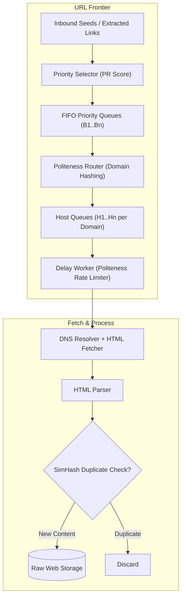
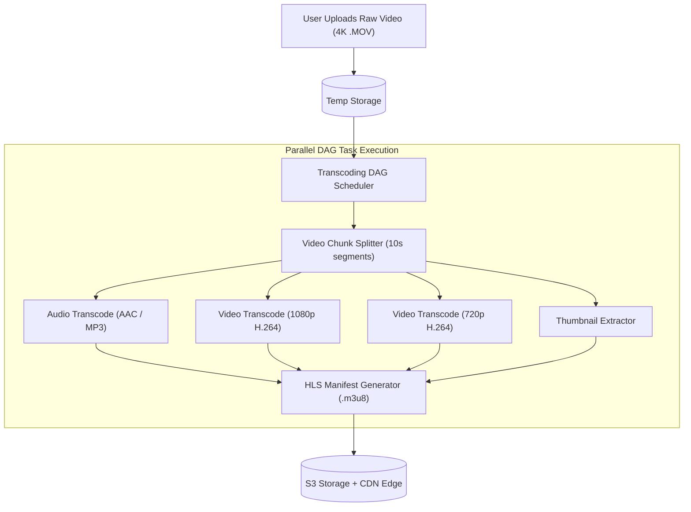
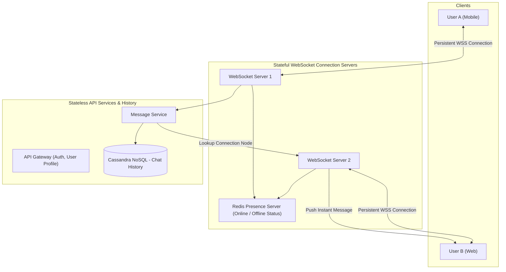

# 02. Vol 1: ID Generator, TinyURL, Web Crawler, Chat & YouTube

This chapter covers media, storage, and search system architectures from Volume 1 of *System Design Interview – An Insider's Guide*: Snowflake ID Generation, URL Shortening, Web Crawling, Real-Time Chat, Search Autocomplete, and YouTube Video Streaming.

---

## 🆔 Distributed Unique ID Generator (Twitter Snowflake)

Generating 64-bit unique, k-sortable IDs across distributed nodes without a central bottleneck.

```
 +---------------------------------------------------------------------------+
 | 1 Bit | 41 Bits: Timestamp (Millis since epoch) | 10 Bits: Worker | 12 Bits |
 | Sign  | Gives ~69 years lifetime                | ID (0-1023)     | Sequence|
 +---------------------------------------------------------------------------+
```

### ☕ Production Java Implementation: Twitter Snowflake Generator

```java
package com.example.systemdesign.idgen;

/**
 * Production Twitter Snowflake 64-bit ID Generator.
 */
public class SnowflakeIdGenerator {

    private static final long START_EPOCH = 1767225600000L; // Custom Epoch (e.g. Jan 1 2026)

    private static final long WORKER_ID_BITS = 10L;
    private static final long SEQUENCE_BITS = 12L;

    private static final long MAX_WORKER_ID = -1L ^ (-1L << WORKER_ID_BITS); // 1023
    private static final long MAX_SEQUENCE = -1L ^ (-1L << SEQUENCE_BITS);   // 4095

    private static final long WORKER_ID_SHIFT = SEQUENCE_BITS;
    private static final long TIMESTAMP_SHIFT = SEQUENCE_BITS + WORKER_ID_BITS;

    private final long workerId;
    private long lastTimestamp = -1L;
    private long sequence = 0L;

    public SnowflakeIdGenerator(long workerId) {
        if (workerId < 0 || workerId > MAX_WORKER_ID) {
            throw new IllegalArgumentException(String.format("Worker ID must be between 0 and %d", MAX_WORKER_ID));
        }
        this.workerId = workerId;
    }

    public synchronized long nextId() {
        long currentTimestamp = System.currentTimeMillis();

        if (currentTimestamp < lastTimestamp) {
            // Clock moved backwards - throw error or wait for clock to catch up
            long clockSkew = lastTimestamp - currentTimestamp;
            throw new IllegalStateException(String.format("Clock moved backwards. Refusing to generate ID for %d ms", clockSkew));
        }

        if (currentTimestamp == lastTimestamp) {
            // Same millisecond: increment sequence number
            sequence = (sequence + 1) & MAX_SEQUENCE;
            if (sequence == 0) {
                // Sequence overflow: wait for next millisecond
                currentTimestamp = waitUntilNextMillis(lastTimestamp);
            }
        } else {
            // New millisecond: reset sequence number
            sequence = 0L;
        }

        lastTimestamp = currentTimestamp;

        return ((currentTimestamp - START_EPOCH) << TIMESTAMP_SHIFT)
                | (workerId << WORKER_ID_SHIFT)
                | sequence;
    }

    private long waitUntilNextMillis(long lastTimestamp) {
        long timestamp = System.currentTimeMillis();
        while (timestamp <= lastTimestamp) {
            timestamp = System.currentTimeMillis();
        }
        return timestamp;
    }
}
```

---

## 🕸️ Web Crawler URL Frontier Architecture

A web crawler must maintain **politeness** (not overwhelming a target server) and **priority** (crawling high-quality URLs first).



---

## 🎥 YouTube Video Transcoding DAG Pipeline

Video platforms must transcode raw high-bitrate video uploads into multiple resolutions (1080p, 720p, 480p) and formats (H.264, VP9, AV1) for Adaptive Bitrate Streaming (HLS / MPEG-DASH).



---

## 💬 Real-Time Chat System Architecture (WebSockets)


