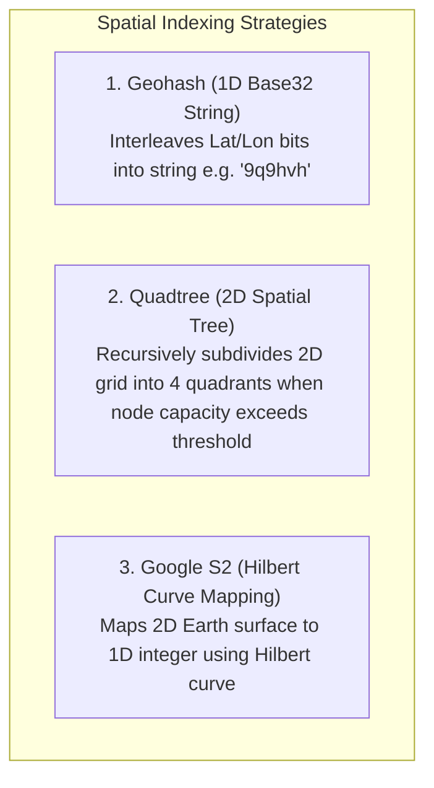
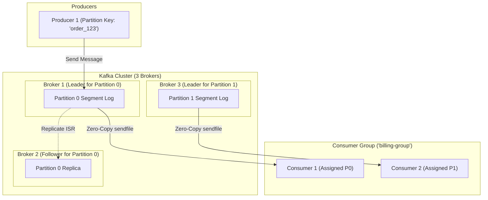
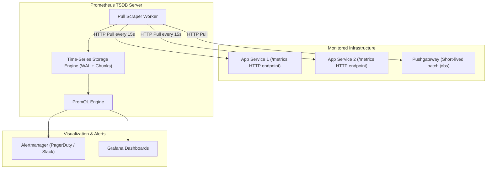

# 03. Vol 2: Geospatial Services, Maps, Message Queues & Metrics

This chapter covers high-scale infrastructure systems from Volume 2 of *System Design Interview – An Insider's Guide*: Proximity Services, Google Maps, Distributed Message Queues (Kafka), Metrics Monitoring (Prometheus), and Ad Click Aggregation.

---

## 📍 Geospatial Spatial Indexing: Geohash vs Quadtree

Searching for nearby places ($\text{latitude}, \text{longitude}$) within radius $R$ is inefficient in standard 2D relational indexes ($\text{WHERE lat BETWEEN ... AND lon BETWEEN ...}$).



---

## 🐍 Production Python Implementation: Geohash & Quadtree Spatial Index

```python
from typing import List, Optional

class GeoPoint:
    def __init__(self, lat: float, lon: float, data: str):
        self.lat = lat
        self.lon = lon
        self.data = data

    def __repr__(self):
        return f"GeoPoint({self.lat}, {self.lon}, '{self.data}')"


class BoundingBox:
    def __init__(self, min_lat: float, min_lon: float, max_lat: float, max_lon: float):
        self.min_lat = min_lat
        self.min_lon = min_lon
        self.max_lat = max_lat
        self.max_lon = max_lon

    def contains(self, point: GeoPoint) -> bool:
        return (self.min_lat <= point.lat <= self.max_lat and
                self.min_lon <= point.lon <= self.max_lon)

    def intersects(self, other: 'BoundingBox') -> bool:
        return not (other.min_lat > self.max_lat or
                    other.max_lat < self.min_lat or
                    other.min_lon > self.max_lon or
                    other.max_lon < self.min_lon)


class QuadtreeNode:
    """Production 2D Quadtree spatial indexing node."""

    def __init__(self, boundary: BoundingBox, capacity: int = 4):
        self.boundary = boundary
        self.capacity = capacity
        self.points: List[GeoPoint] = []
        self.divided = False
        
        # Subquadrants
        self.north_west: Optional[QuadtreeNode] = None
        self.north_east: Optional[QuadtreeNode] = None
        self.south_west: Optional[QuadtreeNode] = None
        self.south_east: Optional[QuadtreeNode] = None

    def subdivide(self):
        mid_lat = (self.boundary.min_lat + self.boundary.max_lat) / 2.0
        mid_lon = (self.boundary.min_lon + self.boundary.max_lon) / 2.0

        self.north_west = QuadtreeNode(BoundingBox(mid_lat, self.boundary.min_lon, self.boundary.max_lat, mid_lon), self.capacity)
        self.north_east = QuadtreeNode(BoundingBox(mid_lat, mid_lon, self.boundary.max_lat, self.boundary.max_lon), self.capacity)
        self.south_west = QuadtreeNode(BoundingBox(self.boundary.min_lat, self.boundary.min_lon, mid_lat, mid_lon), self.capacity)
        self.south_east = QuadtreeNode(BoundingBox(self.boundary.min_lat, mid_lon, mid_lat, self.boundary.max_lon), self.capacity)

        self.divided = True

    def insert(self, point: GeoPoint) -> bool:
        if not self.boundary.contains(point):
            return False

        if len(self.points) < self.capacity and not self.divided:
            self.points.append(point)
            return True

        if not self.divided:
            self.subdivide()
            # Rehouse existing points into subquadrants
            existing_points = self.points
            self.points = []
            for p in existing_points:
                self._insert_sub(p)

        return self._insert_sub(point)

    def _insert_sub(self, point: GeoPoint) -> bool:
        return (self.north_west.insert(point) or
                self.north_east.insert(point) or
                self.south_west.insert(point) or
                self.south_east.insert(point))

    def query_range(self, range_box: BoundingBox, found_points: List[GeoPoint]):
        """Finds all spatial points within range_box boundary."""
        if not self.boundary.intersects(range_box):
            return

        for p in self.points:
            if range_box.contains(p):
                found_points.append(p)

        if self.divided:
            self.north_west.query_range(range_box, found_points)
            self.north_east.query_range(range_box, found_points)
            self.south_west.query_range(range_box, found_points)
            self.south_east.query_range(range_box, found_points)
```

---

## 📨 Distributed Message Queue (Kafka Broker Architecture)



---

## 📊 Metrics Monitoring & Alerting System (Prometheus Architecture)


