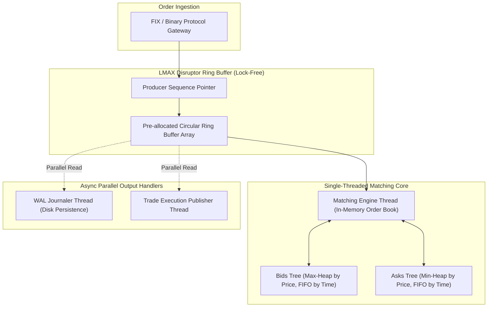

# 04. Vol 2: Financial, Payments, Hotel Reservation & Stock Exchange

This chapter covers mission-critical financial, transactional, and high-throughput systems from Volume 2 of *System Design Interview – An Insider's Guide*: Payment Systems, Double-Entry Bookkeeping, Hotel Reservation, S3 Object Storage, Gaming Leaderboards, Digital Wallets, and Stock Exchanges.

---

## 💳 Payment System Architecture & Double-Entry Ledger

Financial systems demand **exactly-once processing guarantees**, **idempotency**, and strict **double-entry ledger accounting** (where every financial transaction consists of equal debit and credit entries such that $\sum \text{Debits} = \sum \text{Credits}$).

```mermaid
flowchart TD
    subgraph PaymentFlow ["Payment Execution Flow"]
        Client["Client App"] -->|POST /payments (Idempotency-Key)| PayGW["Payment Gateway"]
        PayGW --> IdempCheck{"Idempotency Key in Redis?"}
        
        IdempCheck -->|New Request| ExecEngine["Payment Executor"]
        IdempCheck -->|Duplicate Request| ReturnCached["Return Cached Response"]
        
        ExecEngine -->|Debit Customer Account| PSP["External PSP (Stripe / PayPal)"]
        ExecEngine -->|Append Ledger Record| LedgerDB[(Double-Entry Ledger DB)]
    end

    subgraph ReconciliationPipeline ["Reconciliation Engine (Async)"]
        ReconcileWorker["Daily Reconciliation Worker"]
        PSPStatement[(PSP Settlement File)]
        
        LedgerDB --> ReconcileWorker
        PSPStatement --> ReconcileWorker
        ReconcileWorker -->|Detect Discrepancy| AlertAdmin["Audit Exception Queue"]
    end
```

---

## 📈 Stock Exchange Matching Engine (LMAX Disruptor Architecture)

A stock exchange matching engine processes limit order books with **sub-millisecond latency** and zero lock contention using single-threaded in-memory execution backed by an **LMAX Disruptor Ring Buffer**.



---

## ☕ Production Java Implementation: In-Memory Order Book Matching Engine

```java
package com.example.systemdesign.exchange;

import java.util.*;

/**
 * Single-Threaded High-Throughput In-Memory Order Book Matching Engine.
 */
public class MatchingEngine {

    public enum Side { BUY, SELL }

    public record Order(
        long orderId,
        String symbol,
        Side side,
        long price,  // Price in cents
        long quantity,
        long timestamp
    ) {}

    public record Trade(
        long buyOrderId,
        long sellOrderId,
        long price,
        long quantity,
        long timestamp
    ) {}

    // Bids sorted by price DESCENDING (highest buy price first), then timestamp ASCENDING (FIFO)
    private final TreeMap<Long, List<Order>> bids = new TreeMap<>(Collections.reverseOrder());
    
    // Asks sorted by price ASCENDING (lowest sell price first), then timestamp ASCENDING (FIFO)
    private final TreeMap<Long, List<Order>> asks = new TreeMap<>();

    private final List<Trade> tradeHistory = new ArrayList<>();

    /**
     * Processes an incoming order against the order book.
     */
    public synchronized List<Trade> processOrder(Order incomingOrder) {
        List<Trade> executedTrades = new ArrayList<>();
        long remainingQty = incomingOrder.quantity();

        if (incomingOrder.side() == Side.BUY) {
            // Match against ASKS (Lowest sell price <= buy price)
            Iterator<Map.Entry<Long, List<Order>>> askIterator = asks.entrySet().iterator();
            while (askIterator.hasNext() && remainingQty > 0) {
                Map.Entry<Long, List<Order>> entry = askIterator.next();
                long askPrice = entry.getKey();

                if (askPrice > incomingOrder.price()) {
                    break; // Price outside Limit Order match boundary
                }

                List<Order> askOrdersAtPrice = entry.getValue();
                Iterator<Order> orderIterator = askOrdersAtPrice.iterator();

                while (orderIterator.hasNext() && remainingQty > 0) {
                    Order matchingAsk = orderIterator.next();
                    long tradedQty = Math.min(remainingQty, matchingAsk.quantity());
                    
                    Trade trade = new Trade(
                        incomingOrder.orderId(),
                        matchingAsk.orderId(),
                        askPrice, // Traded at maker price
                        tradedQty,
                        System.currentTimeMillis()
                    );
                    executedTrades.add(trade);
                    tradeHistory.add(trade);

                    remainingQty -= tradedQty;

                    if (matchingAsk.quantity() == tradedQty) {
                        orderIterator.remove(); // Fully filled ask order
                    } else {
                        // Partially filled ask order - update remaining quantity
                        int idx = askOrdersAtPrice.indexOf(matchingAsk);
                        askOrdersAtPrice.set(idx, new Order(
                            matchingAsk.orderId(), matchingAsk.symbol(), matchingAsk.side(),
                            matchingAsk.price(), matchingAsk.quantity() - tradedQty, matchingAsk.timestamp()
                        ));
                    }
                }

                if (askOrdersAtPrice.isEmpty()) {
                    askIterator.remove();
                }
            }

            // If buy order remains unfilled, add remaining quantity to Bids book
            if (remainingQty > 0) {
                Order unfilledOrder = new Order(
                    incomingOrder.orderId(), incomingOrder.symbol(), incomingOrder.side(),
                    incomingOrder.price(), remainingQty, incomingOrder.timestamp()
                );
                bids.computeIfAbsent(incomingOrder.price(), k -> new ArrayList<>()).add(unfilledOrder);
            }

        } else { // Side.SELL
            // Match against BIDS (Highest buy price >= sell price)
            Iterator<Map.Entry<Long, List<Order>>> bidIterator = bids.entrySet().iterator();
            while (bidIterator.hasNext() && remainingQty > 0) {
                Map.Entry<Long, List<Order>> entry = bidIterator.next();
                long bidPrice = entry.getKey();

                if (bidPrice < incomingOrder.price()) {
                    break; // Price outside Limit Order match boundary
                }

                List<Order> bidOrdersAtPrice = entry.getValue();
                Iterator<Order> orderIterator = bidOrdersAtPrice.iterator();

                while (orderIterator.hasNext() && remainingQty > 0) {
                    Order matchingBid = orderIterator.next();
                    long tradedQty = Math.min(remainingQty, matchingBid.quantity());

                    Trade trade = new Trade(
                        matchingBid.orderId(),
                        incomingOrder.orderId(),
                        bidPrice, // Traded at maker price
                        tradedQty,
                        System.currentTimeMillis()
                    );
                    executedTrades.add(trade);
                    tradeHistory.add(trade);

                    remainingQty -= tradedQty;

                    if (matchingBid.quantity() == tradedQty) {
                        orderIterator.remove();
                    } else {
                        int idx = bidOrdersAtPrice.indexOf(matchingBid);
                        bidOrdersAtPrice.set(idx, new Order(
                            matchingBid.orderId(), matchingBid.symbol(), matchingBid.side(),
                            matchingBid.price(), matchingBid.quantity() - tradedQty, matchingBid.timestamp()
                        ));
                    }
                }

                if (bidOrdersAtPrice.isEmpty()) {
                    bidIterator.remove();
                }
            }

            // If sell order remains unfilled, add remaining quantity to Asks book
            if (remainingQty > 0) {
                Order unfilledOrder = new Order(
                    incomingOrder.orderId(), incomingOrder.symbol(), incomingOrder.side(),
                    incomingOrder.price(), remainingQty, incomingOrder.timestamp()
                );
                asks.computeIfAbsent(incomingOrder.price(), k -> new ArrayList<>()).add(unfilledOrder);
            }
        }

        return executedTrades;
    }

    public List<Trade> getTradeHistory() {
        return Collections.unmodifiableList(tradeHistory);
    }
}
```

---

## 🏨 Hotel Reservation System: Overbooking Prevention

To prevent double bookings without lock contention, combine database optimistic locking with versioning:

```java
package com.example.systemdesign.hotel;

import jakarta.persistence.*;

@Entity
@Table(name = "room_inventory")
public class RoomInventory {

    @Id
    private Long id;

    private Long hotelId;
    private String roomType;
    private String date; // YYYY-MM-DD
    private int totalRooms;
    private int reservedRooms;

    @Version // Optimistic Lock Version Counter
    private Long version;

    public void reserveRoom() {
        if (reservedRooms >= totalRooms) {
            throw new IllegalStateException("No rooms available for reservation.");
        }
        this.reservedRooms++;
    }

    // Getters and Setters omitted for brevity
}
```
