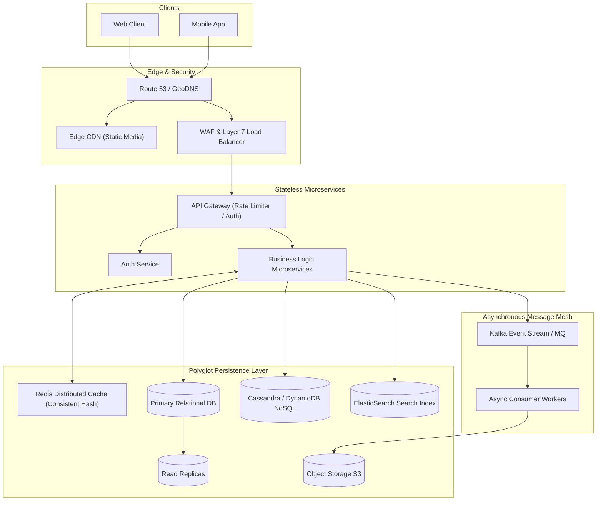

# System Design Interview – An Insider's Guide (Volume 1 + Volume 2)

A masterclass on large-scale distributed system design, based on Alex Xu's landmark books *System Design Interview – An Insider's Guide (Volume 1)* and *Volume 2*. Synthesizes all 28 system design chapters into deep architectural blueprints, back-of-the-envelope calculations, production code implementations, and trade-off analyses.

---

## 📐 Table of Contents

| Section | Subject | Chapters Covered & Key Concepts |
| :--- | :--- | :--- |
| **00. Cheatsheet** | [System Design Cheatsheet](00_system_design_cheatsheet.md) | Latency Numbers Every Programmer Should Know, Database Selection Decision Tree, 28-System Architecture Pattern Matrix |
| **01. Vol 1: Foundations & Core Systems** | [Rate Limiter, KV Store & Feeds](01_volume_1_foundations_and_core_systems/01_vol1_foundations_rate_limiter_kv_and_feeds.md) | Scale 0 to Millions, 4-Step Framework, Token Bucket Rate Limiter, Dynamo-style Distributed KV Store (Vector Clocks, Quorum $R+W>N$, SSTables), News Feed Fan-Out |
| **02. Vol 1: Storage, Search & Media** | [ID Gen, TinyURL, Crawler, Chat, YouTube](02_volume_1_storage_search_and_media/02_vol1_id_generator_tinyurl_crawler_chat_youtube.md) | Snowflake 64-bit ID, TinyURL (KGS / Base62), Web Crawler (URL Frontier & SimHash), Trie Autocomplete, WebSocket Chat, YouTube ABR Transcoding DAG, Google Drive Chunking |
| **03. Vol 2: Geospatial, Metrics & Queues** | [Proximity, Maps, Kafka & Metrics](03_volume_2_geospatial_metrics_and_queues/03_vol2_proximity_maps_message_queues_metrics.md) | Proximity Geohash / Quadtree / S2, Google Maps Routing A*, Distributed Message Queue (Kafka Broker Zero-Copy), Prometheus TSDB Metrics, Ad Click MapReduce Aggregation |
| **04. Vol 2: Financial, Payments & Trading** | [Payments, Hotel Reservation & Exchange](04_volume_2_financial_payments_and_high_throughput/04_vol2_payment_system_hotel_reservation_stock_exchange.md) | Hotel Reservation (Optimistic Locks / 2PC / Saga), Email SMTP/IMAP, S3 Erasure Coding, Redis Leaderboard, Payment Double-Entry Ledger, Digital Wallet, Stock Exchange LMAX Matching Engine |

---

## 📊 Latency Numbers Every Programmer Should Know (Reference)

```
  L1 Cache Reference:              0.5 ns
  Branch Mispredict:               5   ns
  L2 Cache Reference:              7   ns
  Mutex Lock/Unlock:              25   ns
  Main Memory (RAM) Reference:   100   ns
  Compress 1K bytes (Snappy):  3,000   ns  (3 µs)
  Send 2K bytes over 1 Gbps:  20,000   ns (20 µs)
  Read 1 MB sequentially (RAM): 250,000 ns (250 µs)
  Read 1 MB sequentially (SSD): 1,000,000 ns (1 ms)
  Read 1 MB sequentially (HDD): 20,000,000 ns (20 ms)
  Send Packet CA to Netherlands: 150,000,000 ns (150 ms)
```

---

## 🏗️ Generic High-Scalability Distributed Architecture



---

## 📋 The 4-Step System Design Interview Framework

1. **Step 1: Understand the Problem and Establish Design Scope** (3-5 minutes)
   - Ask clarifying questions: What features? Who are the users? What scale? SLA / Availability requirements?
2. **Step 2: Propose High-Level Design and Get Buy-In** (10-15 minutes)
   - Outline key components (API, Gateway, Database, Caching, Storage).
   - Perform back-of-the-envelope calculations (QPS, Bandwidth, Storage capacity).
3. **Step 3: Design Deep Dive** (15-25 minutes)
   - Dive into critical bottlenecks (e.g. data partitioning, concurrency locking, caching strategy, failover).
4. **Step 4: Wrap Up** (3-5 minutes)
   - Discuss single points of failure (SPOF), monitoring, metrics, and future scaling bottlenecks.
