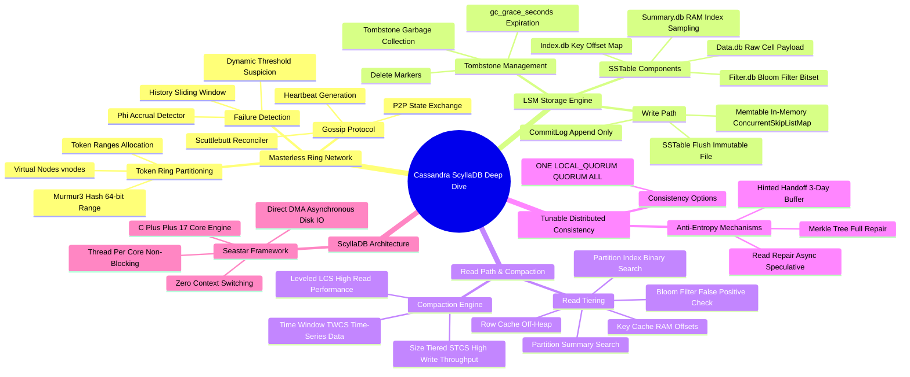

# Cassandra & ScyllaDB Architecture Mind Map

This document presents a structured visual and conceptual breakdown of Apache Cassandra and ScyllaDB internal architecture.

---

## 1. Visual Taxonomy

---

## 2. Component Reference Table

| Component | Functionality | Key Bottlenecks / Failures |
| :--- | :--- | :--- |
| **CommitLog** | Durability WAL append-only disk log | Slow disk writes blocking all incoming node mutation requests |
| **Memtable** | In-memory write buffer before SSTable flush | JVM GC allocation pressure during high write spikes |
| **Bloom Filter** | Probabilistic bitset checking key existence in SSTable | High false-positive rate ($> 1\%$) causing excessive disk reads |
| **Tombstones** | Special markers recording record deletions | Accumulation causing `TombstoneOverwhelmingException` during scans |
| **Gossip Thread** | Exposes node state and schema versions across peers | CPU starvation delaying failure detection during heavy GC pauses |
| **Compaction Executor** | Merges SSTables and purges tombstoned records | Excessive disk read/write amplification starving operational queries |
