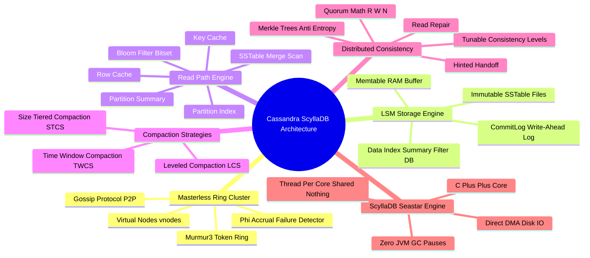

# Apache Cassandra & ScyllaDB Technical Study Guide

Welcome to the **Apache Cassandra & ScyllaDB Technical Study Guide**. This repository contains staff-engineer level chapters detailing masterless distributed architecture, LSM-tree storage engine internals, SSTable files, Bloom Filters, partitioning & consistent hashing (Murmur3), tunable consistency & quorum math ($R + W > N$), CQL query-first data modeling, and ScyllaDB Seastar C++ asynchronous engine performance tuning.

---

## 1. Executive Summary & Core Mechanics

Apache Cassandra and ScyllaDB are distributed wide-column NoSQL database systems engineered for high-throughput write scalability, linear fault tolerance, and zero single-point-of-failure (SPOF) operations.

Key Architectural Highlights:
* **Masterless Ring Architecture:** Every node in the cluster plays an identical role. Nodes communicate via the **Gossip Protocol** and detect failures using the **$\Phi$ Accrual Failure Detector**.
* **LSM-Tree Storage Engine:** Writes are sequentially appended to a **CommitLog** on disk and an in-memory **Memtable**. Flushed Memtables form immutable **SSTable** disk files (`Data.db`, `Index.db`, `Summary.db`, `Filter.db`).
* **Consistent Hashing & Token Ring:** Partitions data across nodes using the **Murmur3 Partitioner** hash ring and virtual nodes (**vnodes**).
* **Tunable Consistency & Quorums:** Developers configure consistency levels per query (`ONE`, `QUORUM`, `LOCAL_QUORUM`, `ALL`). Strong consistency is achieved when:
  $$R + W > N$$
* **ScyllaDB (Seastar Engine):** C++ drop-in replacement for Cassandra that eliminates JVM Garbage Collection pauses through a thread-per-core non-blocking asynchronous event loop architecture.

---

## 2. Interactive Architecture Mind Map

---

## 3. Study Guide Chapter Index

| Chapter | Title | Focus Areas |
| :--- | :--- | :--- |
| **[00: Recommended Resources](00_Recommended_Books_and_Resources.md)** | Reading List & Reference Material | Books (*Cassandra: The Definitive Guide*, *Designing Data-Intensive Applications*), C++ Seastar docs |
| **[00: Architecture Mind Map](00_Cassandra_MindMap.md)** | Interactive Taxonomy | Complete component diagram of Masterless Ring, LSM Write/Read paths, Compaction, and ScyllaDB |
| **[Chapter 1](ch01_masterless_architecture_gossip.md)** | Masterless P2P Architecture & Gossip | Gossip Protocol, $\Phi$ Accrual Failure Detector, Node states (`JOINING`, `NORMAL`, `LEAVING`), ScyllaDB Seastar |
| **[Chapter 2](ch02_lsm_storage_engine_sstables.md)** | LSM Storage Engine & SSTables | CommitLog append, Memtable skip lists, SSTable file structure (`Data.db`, `Index.db`, `Summary.db`), Tombstones |
| **[Chapter 3](ch03_read_path_bloom_filters_compaction.md)** | Read Path Execution & Compaction | Row Cache, Key Cache, Bloom Filters, Partition Index, STCS vs LCS vs TWCS compaction algorithms |
| **[Chapter 4](ch04_partitioning_consistent_hashing.md)** | Partitioning & Consistent Hashing | Murmur3 partitioner, Token Ring, Virtual Nodes (vnodes), Primary Partition Key vs Clustering Columns |
| **[Chapter 5](ch05_tunable_consistency_quorums.md)** | Tunable Consistency & Quorums | Quorum math ($R + W > N$), Hinted Handoff, Read Repair, Merkle Trees anti-entropy repair (`nodetool repair`) |
| **[Chapter 6](ch06_cql_modeling_antipatterns.md)** | CQL Data Modeling & Anti-Patterns | Query-First data modeling, denormalization, partition size limits ($< 100\text{MB}$), Secondary index traps, ALLOW FILTERING hazard |
| **[Chapter 7](ch07_scylladb_seastar_performance_tuning.md)** | ScyllaDB C++ & Performance Diagnostics | ScyllaDB Seastar thread-per-core, DMA disk I/O, `nodetool tpstats/status`, JVM GC tuning, latency metrics |

---

## 4. Quick Links & Navigation

* Return to [Master Tech-Stack Directory](../README.md)
* Next Chapter: **[Chapter 1: Masterless P2P Architecture & Gossip Protocol](ch01_masterless_architecture_gossip.md)**
