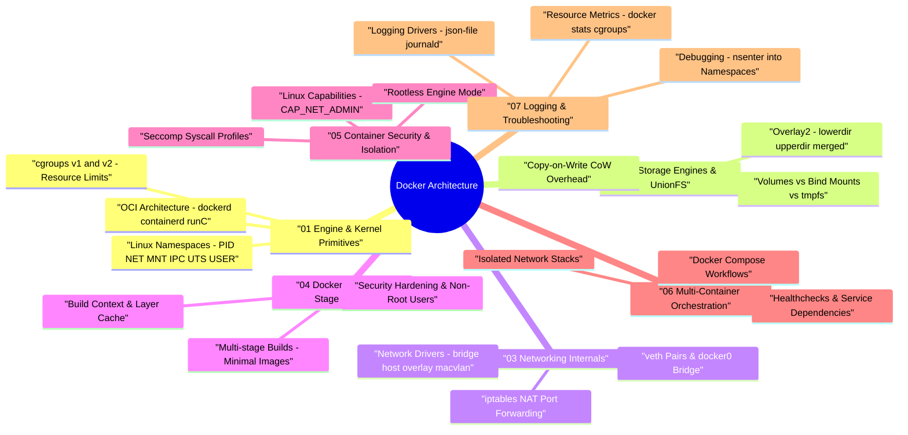

# Docker Architecture & Containerization Internals — Deep Dive Study Guide

> **Goal:** Master Docker engine internals, OCI runtime architecture, Linux kernel primitives (Namespaces & cgroups), OverlayFS storage drivers, virtual ethernet networking (`veth` & `iptables`), container security, and troubleshooting for Staff Software Engineering system design.

---

## 🧠 Interactive Docker Architecture Mind Map

👉 **Full Mind Map & Taxonomy:** [`00_Docker_MindMap.md`](00_Docker_MindMap.md)  
📚 **Recommended Books & References:** [`00_Recommended_Books_and_Resources.md`](00_Recommended_Books_and_Resources.md)

---

## 📖 Chapter Index

1. **[Ch 1: Engine Architecture & Linux Kernel Primitives](ch01_architecture_namespaces_cgroups.md)** — Containers vs VMs, `dockerd` $\to$ `containerd` $\to$ `runC`, Linux Namespaces & cgroups.
2. **[Ch 2: Storage Engines & Union File Systems (OverlayFS)](ch02_storage_overlayfs_volumes.md)** — Overlay2 (`lowerdir`/`upperdir`/`merged`), Copy-on-Write, Named Volumes vs Bind Mounts.
3. **[Ch 3: Docker Networking Internals](ch03_networking_internals.md)** — `veth` pairs, `docker0` bridge, `iptables` NAT port mapping, embedded DNS (`127.0.0.11`).
4. **[Ch 4: Dockerfile Optimization & Multi-Stage Builds](ch04_dockerfile_optimization_multistage.md)** — Layer caching, multi-stage builds, Distroless/Alpine images, non-root users.
5. **[Ch 5: Container Security, Seccomp & Capabilities](ch05_container_security_capabilities.md)** — Linux Capabilities (`CAP_SYS_ADMIN`), Seccomp profiles, AppArmor, Rootless Docker.
6. **[Ch 6: Docker Compose & Multi-Container Orchestration](ch06_docker_compose_orchestration.md)** — `docker-compose.yml` specs, healthchecks, service ordering, network isolation.
7. **[Ch 7: Logging, Resource Monitoring & Low-Level Troubleshooting](ch07_monitoring_logging_troubleshooting.md)** — Logging drivers, `docker stats`, cgroups inspection, `nsenter` namespace debugging.
