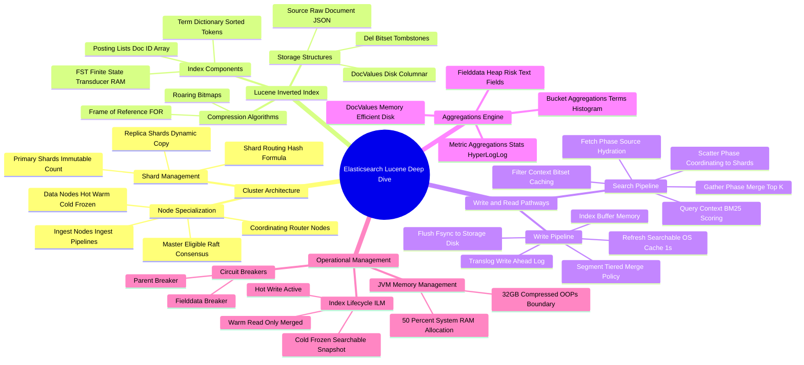

# Elasticsearch & Apache Lucene Architecture Mind Map

This document presents a structured visual breakdown of Elasticsearch and Apache Lucene distributed search internals.

---

## 1. Visual Taxonomy

---

## 2. Component Reference Table

| Component | Responsibility | Failure Modes / Hazards |
| :--- | :--- | :--- |
| **Master Node** | Manages cluster state publishing & index metadata | Master node GC pauses causing split-brain or cluster stalls |
| **Coordinating Node** | Scatter-gather query routing & response aggregation | OutOfMemory (OOM) during large result set aggregation merges |
| **Lucene Segment** | Immutable mini-inverted index file on disk | High segment count causing file descriptor exhaustion |
| **Translog** | Write-ahead durability log replayed on crash | Unflushed translog data loss on power failure if `index.translog.durability = async` |
| **FST (Term Index)** | Off-heap/RAM prefix tree for fast term lookup | Extremely high unique term count consuming node RAM |
| **Fielddata** | Heap-based un-inverted data structure for `text` aggs | Triggers `CircuitBreakingException` or JVM Heap OOM crash |
